# Edifício 1

## - Requisitos:

- Contém 2 andares.
- Dimensões: 20 x 20 metros.
- Já existe uma vala técnica subterrânea com eletrodutos para a passagem de cabos.
- Piso 0 tem uma altura de 4 metros
- Piso 1 tem uma altura de 3 metros, sendo parte desta (0,5 metros) um teto falso para instalar cabos e pontos de acesso
  sem
- Informações adicionais sobre Piso 1: 
    - O datacentre (sala 1.1.3) não contém outlets.

## - Piso 0:

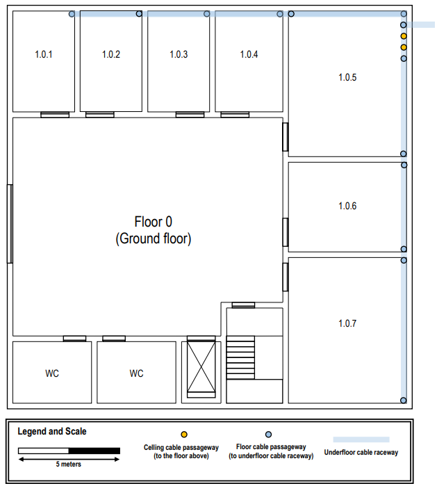

## - Piso 1:

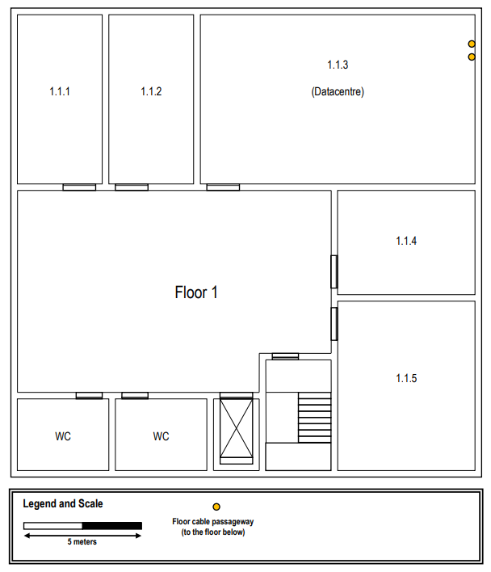

## Medições (Piso 0)

| Sala  | Comprimento (m) | Largura (m) | Área (m^2) |
|:-----:|:---------------:|:-----------:|:----------:|
| 1.0.1 |      2,93       |    4,83     |   14,15    |
| 1.0.2 |      2,93       |    4,83     |   14,15    |
| 1.0.3 |      2,93       |    4,83     |   14,15    |
| 1.0.4 |      3,28       |    4,83     |   15,84    |
| 1.0.5 |      5,69       |    7,07     |   40,23    |
| 1.0.6 |      5,69       |    4,31     |   24,52    |
| 1.0.7 |      5,69       |    7,07     |   40,23    |

## Medições (Piso 1)

| Sala  | Comprimento (m) | Largura (m) | Área (m^2) |
|:-----:|:---------------:|:-----------:|:----------:|
| 1.1.1 |      3,62       |    7,07     |    25,6    |
| 1.1.2 |      3,62       |    7,07     |    25,6    |
| 1.1.3 |      11,55      |    7,07     |   81,66    |
| 1.1.4 |      5,69       |    4,31     |   24,52    |
| 1.1.5 |      5,69       |    7,07     |   40,23    |

## Access Points:

Para garantir uma cobertura ideal em cada andar, foi instalado um access point, pois cada um tem um alcance médio de 30 metros e este edificio tem 20 x 20, o que permite que apenas um router alcance todo o andar.  

### Piso 0

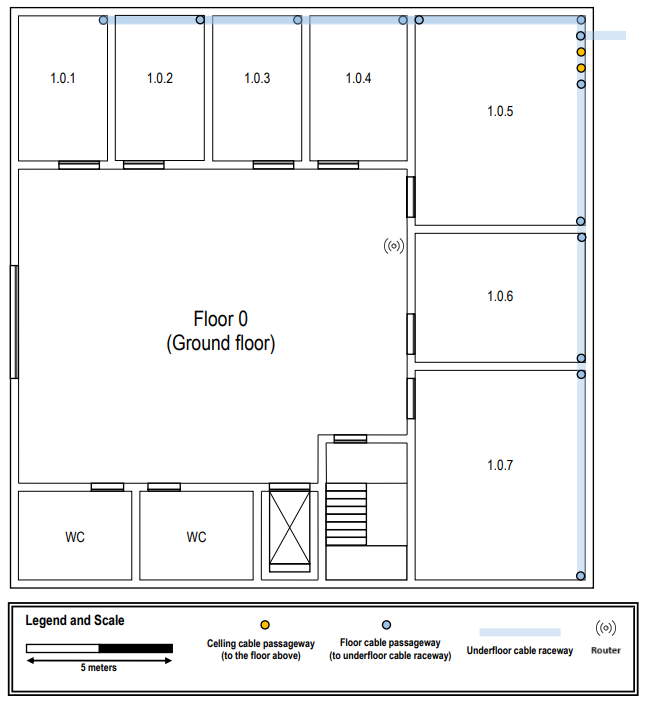

### Piso 1

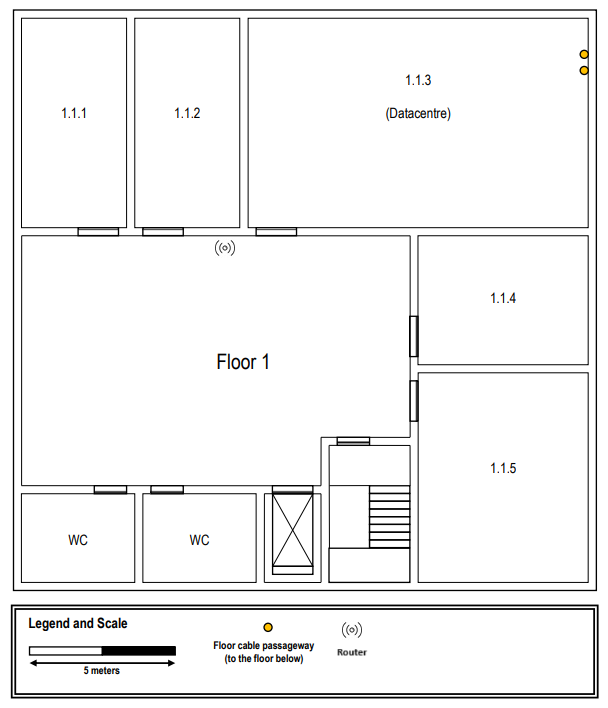

## Network Outlets:

Foi mantida a proporção de duas tomadas a cada 10 metros quadrados de área. 
Nenhuma tomada foi instalada atrás de portas, assegurando praticidade e facilidade de uso. 
A distribuição das tomadas foi planejada de forma eficiente, levando em consideração o tamanho e a funcionalidade de
cada sala.

### Piso 0

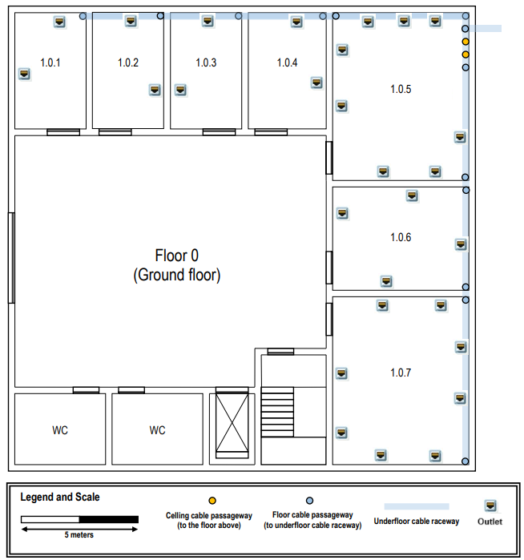

### Piso 1

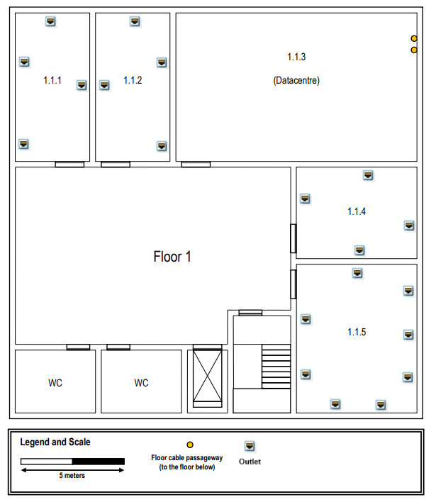

## Locais de cross-connect:

Foi instalado um main cross-connect (MC) no Datacentre (sala 1.1.3) do piso 1.
Foi instalado um intermediate cross-connect (IC) na sala 1.0.5 do piso 0. 
Este IC está diretamente conectado a dois horizontal cross-connect (HC), localizados um em cada piso (salas 1.0.5 e
1.1.3, correspondendo aos pisos 0 e 1, respetivamente). 
A colocação dos HCs foi realizada de forma a garantir que o comprimento total de cada cabo não ultrapasse os 90 metros e
que nenhum outlet esteja a mais de 80 metros de distância em linha reta do HC. 
Além disso, foram colocados 2 consolidation points (CP) por piso, estrategicamente distribuídos, para otimizar a rede de
cabeamento horizontal, fortalecer o sinal e minimizar a perda de qualidade ao longo do percurso.

### Piso 0

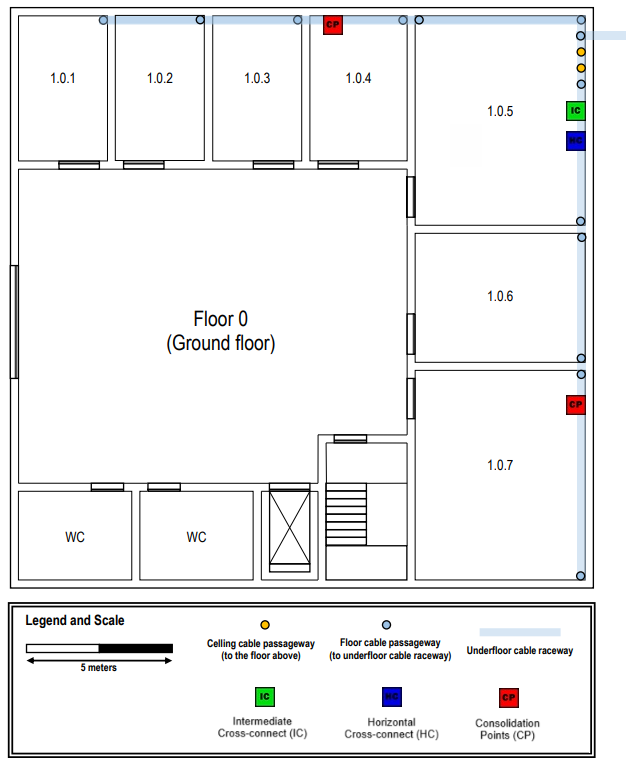

### Piso 1

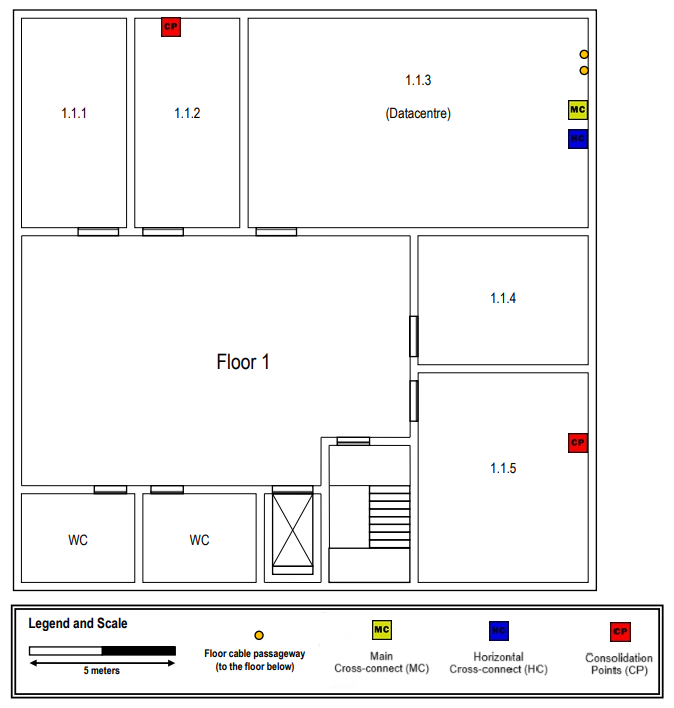

## Disposição dos cabos:

Os caminhos dos cabos foram planejados para otimizar o uso de trajetos compartilhados, reduzindo interferências e
aproveitando melhor o espaço disponível.  Sempre que possível, foi assegurado que vários cabos seguissem o mesmo
percurso, minimizando redundâncias e facilitando manutenções futuras.

### Piso 0

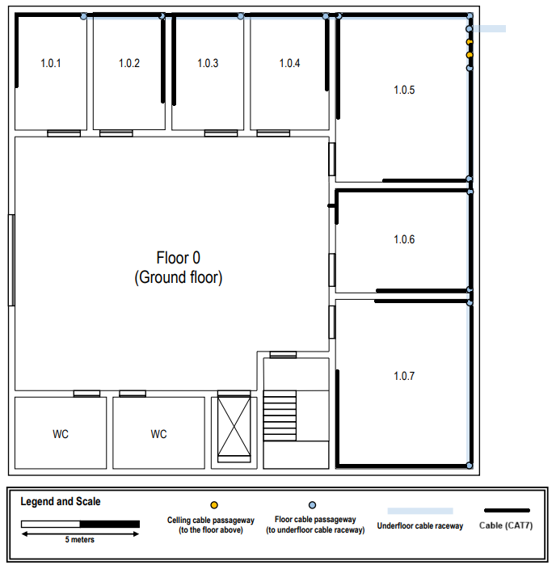

### Piso 1

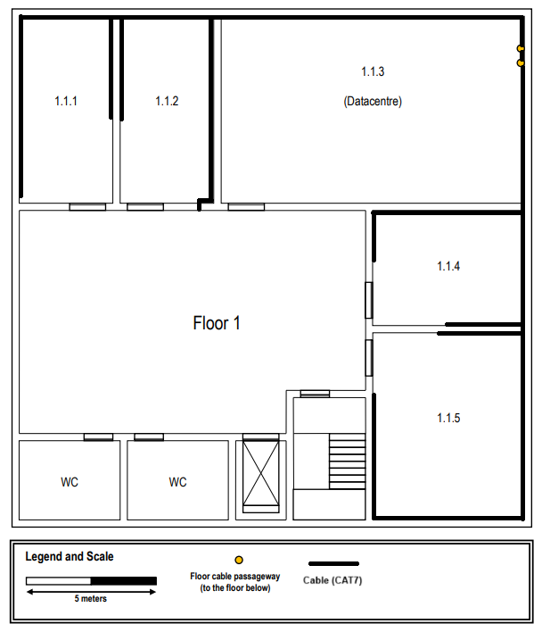

## Inventários de Hardware e Esquema completo:

Comprimento total dos cabos: 
- 381,56 m + 387,69 m = 769,25 m  

O tipo de cabo usado é o CAT7 uma vez que o comprimento de cada um destes é reduzido (menor que 90 m).  

A distribuição das conexões dos pontos de rede (network outlets) e access points (APs) nos CPs foi realizada de forma a
otimizar a eficiência do tráfego de rede.  

### Piso 0:

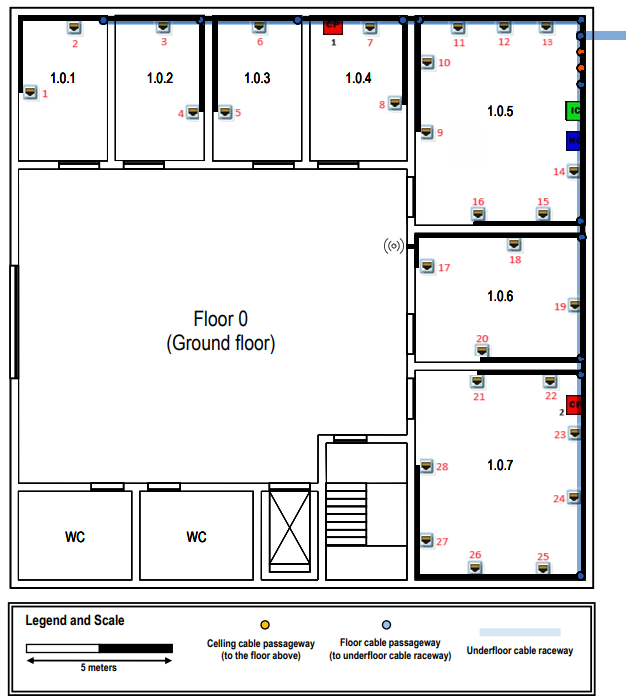

- 28 network outlets;
- 2 CPs;
- 1 AP;
- 1 HC;
- 1 IC.

#### Sala 1.0.1:

| Outlet | Comprimento (m) | Consolidation Point (Nº) | Tipo Cabo |
|:------:|:---------------:|:------------------------:|:---------:|
|   1    |      25,64      |           CP1            |   CAT7    |
|   2    |      20,64      |           CP1            |   CAT7    |

#### Sala 1.0.2:

| Outlet | Comprimento (m) | Consolidation Point (Nº) | Tipo Cabo |
|:------:|:---------------:|:------------------------:|:---------:|
|   3    |      18,21      |           CP1            |   CAT7    |
|   4    |      20,13      |           CP1            |   CAT7    |

#### Sala 1.0.3:

| Outlet | Comprimento (m) | Consolidation Point (Nº) | Tipo Cabo |
|:------:|:---------------:|:------------------------:|:---------:|
|   5    |      19,74      |           CP1            |   CAT7    |
|   6    |       15        |           CP1            |   CAT7    |

#### Sala 1.0.4:

| Outlet | Comprimento (m) | Consolidation Point (Nº) | Tipo Cabo |
|:------:|:---------------:|:------------------------:|:---------:|
|   7    |      11,15      |           CP1            |   CAT7    |
|   8    |      13,08      |           CP1            |   CAT7    |

#### Sala 1.0.5:

- Como estes outlets estão muito próximos do HC, são conectados diretamente ao mesmo!

| Outlet | Comprimento (m) | Tipo Cabo |
|:------:|:---------------:|:---------:|
|   9    |      13,59      |   CAT7    |
|   10   |      11,15      |   CAT7    |
|   11   |      8,21       |   CAT7    |
|   12   |      6,67       |   CAT7    |
|   13   |      5,13       |   CAT7    |
|   14   |      0,51       |   CAT7    |
|   15   |      3,97       |   CAT7    |
|   16   |      6,41       |   CAT7    |

#### Sala 1.0.6:

| Outlet | Comprimento (m) | Consolidation Point (Nº) | Tipo Cabo |
|:------:|:---------------:|:------------------------:|:---------:|
|   17   |      9,87       |           CP2            |   CAT7    |
|   18   |      5,26       |           CP2            |   CAT7    |
|   19   |      5,26       |           CP2            |   CAT7    |
|   20   |      10,64      |           CP2            |   CAT7    |

#### Sala 1.0.7:

| Outlet | Comprimento (m) | Consolidation Point (Nº) | Tipo Cabo |
|:------:|:---------------:|:------------------------:|:---------:|
|   21   |      11,28      |           CP2            |   CAT7    |
|   22   |      8,72       |           CP2            |   CAT7    |
|   23   |      9,49       |           CP2            |   CAT7    |
|   24   |      11,67      |           CP2            |   CAT7    |
|   25   |      15,9       |           CP2            |   CAT7    |
|   26   |      18,21      |           CP2            |   CAT7    |
|   27   |      21,54      |           CP2            |   CAT7    |
|   28   |      24,10      |           CP2            |   CAT7    |

#### Consolidation Points (CPs):

| Consolidation Point | Comprimento (m) | Número de portas do CP |  Número de portas a ser usadas   | Tipo Cabo |
|:-------------------:|:---------------:|:----------------------:|:--------------------------------:|:---------:|
|         CP1         |      12,44      |           24           |          8 (8 outlets)           |   CAT7    |
|         CP2         |      8,59       |           24           | 13 (12 outlets e 1 access point) |   CAT7    |

#### Access Point (AP):

| Access Point | Comprimento (m) | Consolidation Point (Nº) | Tipo Cabo |
|:------------:|:---------------:|:------------------------:|:---------:|
|      AP      |      9,36       |           CP2            |   CAT7    |

### Piso 1:

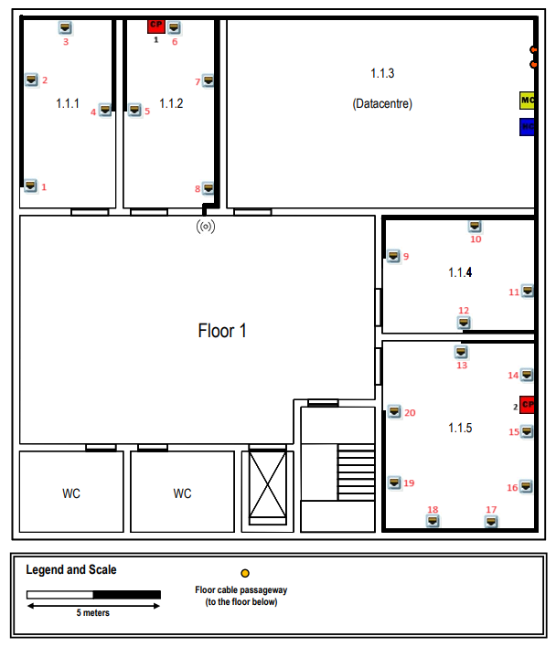

- 20 network outlets;
- 2 CP;
- 1 AP;
- 1 MC;
- 1 HC.

#### Sala 1.1.1:

| Outlet | Comprimento (m) | Consolidation Point (Nº) | Tipo Cabo |
|:------:|:---------------:|:------------------------:|:---------:|
|   1    |      29,23      |           CP1            |   CAT7    |
|   2    |      25,38      |           CP1            |   CAT7    |
|   3    |      21,28      |           CP1            |   CAT7    |
|   4    |      23,08      |           CP1            |   CAT7    |

#### Sala 1.1.2:

| Outlet | Comprimento (m) | Consolidation Point (Nº) | Tipo Cabo |
|:------:|:---------------:|:------------------------:|:---------:|
|   5    |      22,69      |           CP1            |   CAT7    |
|   6    |      17,31      |           CP1            |   CAT7    |
|   7    |      18,08      |           CP1            |   CAT7    |
|   8    |      22,18      |           CP1            |   CAT7    |

#### Sala 1.1.3:

- A Datacentre não necessita apresentar network outlets!

#### Sala 1.1.4:

| Outlet | Comprimento (m) | Consolidation Point (Nº) | Tipo Cabo |
|:------:|:---------------:|:------------------------:|:---------:|
|   9    |      10,38      |           CP2            |   CAT7    |
|   10   |      6,15       |           CP2            |   CAT7    |
|   11   |      5,64       |           CP2            |   CAT7    |
|   12   |      10,13      |           CP2            |   CAT7    |

#### Sala 1.1.5:

| Outlet | Comprimento (m) | Consolidation Point (Nº) | Tipo Cabo |
|:------:|:---------------:|:------------------------:|:---------:|
|   13   |      10,51      |           CP2            |   CAT7    |
|   14   |      8,72       |           CP2            |   CAT7    |
|   15   |      10,9       |           CP2            |   CAT7    |
|   16   |      12,95      |           CP2            |   CAT7    |
|   17   |      15,77      |           CP2            |   CAT7    |
|   18   |      18,59      |           CP2            |   CAT7    |
|   19   |      22,18      |           CP2            |   CAT7    |
|   20   |      24,74      |           CP2            |   CAT7    |

#### Consolidation Points (CPs):

| Consolidation Point | Comprimento (m) | Número de portas do CP | Número de portas a ser usadas  | Tipo Cabo |
|:-------------------:|:---------------:|:----------------------:|:------------------------------:|:---------:|
|         CP1         |      17,95      |           24           | 9 (8 outlets e 1 access point) |   CAT7    |
|         CP2         |       10        |           24           |        12 (12 outlets)         |   CAT7    |

#### Access Point (AP):

| Access Point | Comprimento (m) | Consolidation Point (Nº) | Tipo Cabo |
|:------------:|:---------------:|:------------------------:|:---------:|
|      AP      |      23,85      |           CP1            |   CAT7    |

## Patch Panels and Telecommunication enclosures:

Em nenhum piso foi adicionado tanto telecommunication enclosure como patch panel aos CPs, visto que a sua função é apenas distribuir o cabeamento de forma direta e eficiente, sem precisar de uma estrutura adicional para gerenciar múltiplas conexões. 
Nos HC decidiu-se manter as network outlets e o resto dos equipamentos (CPs, IC e APs) em patch panels separados, para ser mais fácil a gestão e possível manutenção.

### Piso 0:

- IC:
  - 1 telecommunication enclosure;
  - 1 patch panel com 24 portas para as ligações com os HCs de ambos os pisos.
- HC:
  - 1 telecommunication enclosure;
  - 2 patch panels com 24 portas para as ligações com as network outlets;
  - 1 patch panel com 24 portas para as ligações com os CPs, IC e AP.

### Piso 1:

- MC:
  - 1 telecommunication enclosure;
  - 1 patch panel com 24 portas para as ligações com os IC dos 4 edifícios.
- HC:
  - 1 telecommunication enclosure;
  - 1 patch panel com 24 portas para as ligações com as network outlets;
  - 1 patch panel com 24 portas para as ligações com os CPs, IC e AP.

## Inventário:

- 57 cabos;
- 48 network outlets;
- 1 MC;
- 2 APs;
- 4 CPs;
- 2 HCs;
- 1 IC;
- 4 telecommunication enclosures;
- 7 patch panels com 24 portas - 24 ISO 8877.