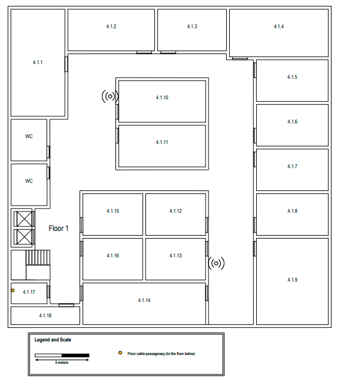
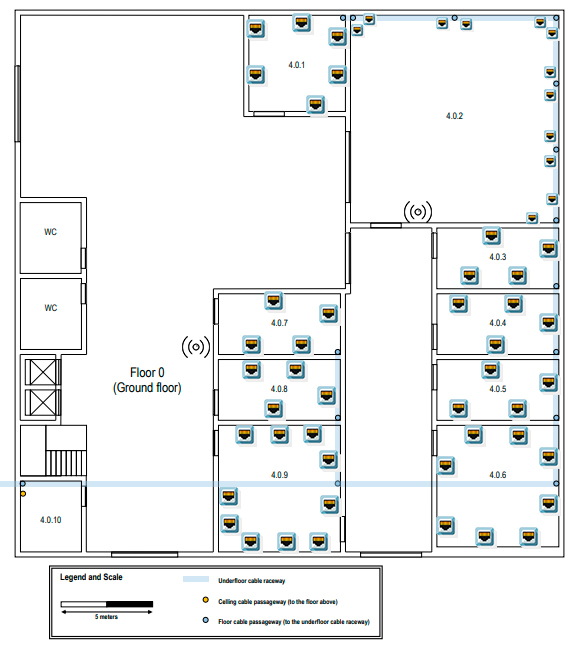
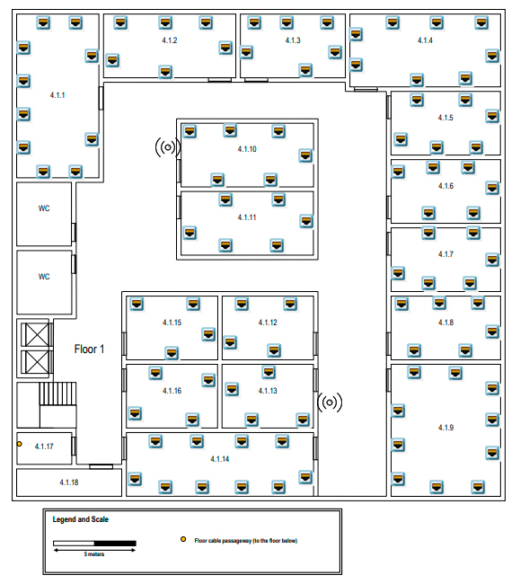
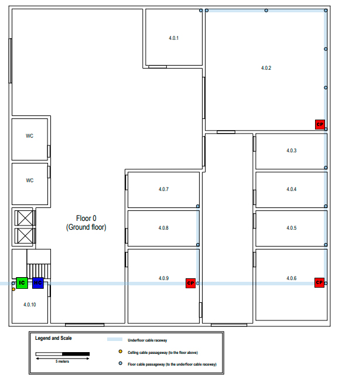
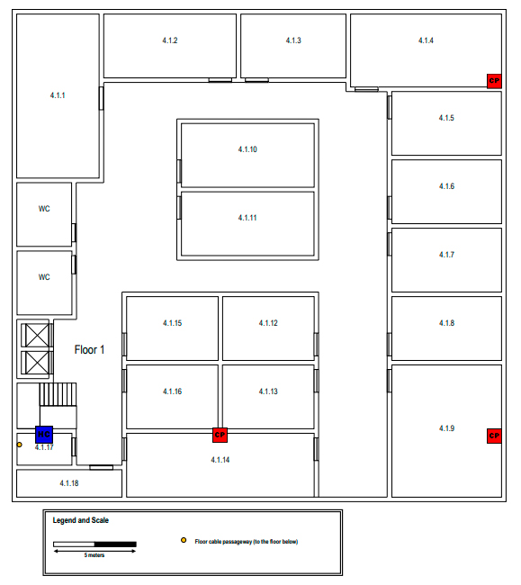
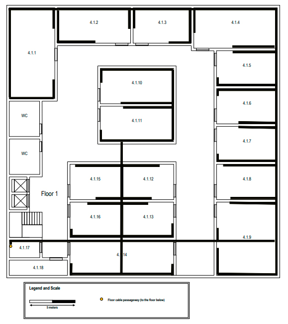
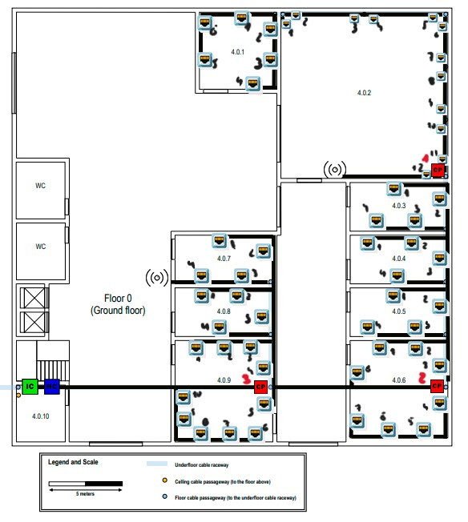

# Edifício 4

## - Requisitos:

- Contém dois andares
- Dimensões: 30 x 30 metros
- Já existe uma vala técnica subterrânea com eletrodutos para a passagem de cabos
- Piso 0 tem uma altura de 4 metros
- Piso 1 tem uma altura de 3 metros, sendo parte desta (0,5 metros) um teto falso para instalar cabos e pontos de acesso sem fio
- Informações adicionais sobre Piso 0: 
A sala 4.0.10 é uma área de armazenamento que pode ser usada para abrigar um hardware de infraestrutura de rede e conexão 
cruzada, nenhuma tomada de rede é necessária nesta sala, e o mesmo se aplica a banheiros e áreas compartilhadas como o hall de entrada e corredores. As salas 4.0.2 têm um propósito específico e as únicas tomadas de rede necessárias são duas perto de cada passagem de cabos do andar. Em outros lugares, o número padrão de tomadas de rede por proporção de área deve ser aplicado
- Informações adicionais sobre Piso 1: 
As salas 4.1.17 e 4.1.18 são áreas de armazenamento que podem ser usadas para abrigar um cross-connect e outro hardware de 
infraestrutura de rede, nenhuma tomada de rede é necessária lá, o mesmo vale para banheiros e áreas compartilhadas como 
halls e corredores. Outras salas identificadas devem ser fornecidas com o número padrão de tomadas de rede por proporção de área.

### - Piso 0:

### - Piso 1:

## Medições (Piso 0)

|   Sala    |  Comprimento (m)  |  Largura (m)   |  Área (m^2)  |
|:---------:|:-----------------:|:--------------:|:------------:|
|   4.0.1   |       5,19        |      5,19      |    26,94     |
|   4.0.2   |       11,35       |     11,35      |    128,82    |
|   4.0.3   |       6,37        |      3,17      |    20,19     |
|   4.0.4   |       6,37        |      3,17      |    20,19     |
|   4.0.5   |       6,37        |      3,17      |    20,19     |
|   4.0.6   |       6,37        |      6,37      |    40,58     |
|   4.0.7   |       6,37        |      3,17      |    20,19     |
|   4.0.8   |       6,37        |      3,17      |    20,19     |
|   4.0.9   |       6,92        |      6,37      |    44,08     |
|  4.0.10   |       3,85        |      3,17      |    12,59     |

## Medições (Piso 1)

|   Sala   | Comprimento (m)  | Largura (m)  | Área (m^2)  |
|:--------:|:----------------:|:------------:|:-----------:|
|  4.1.1   |      10,00       |     5,00     |    50,00    |
|  4.1.2   |       8,08       |     3,75     |    30,30    |
|  4.1.3   |       6,35       |     3,75     |    23,81    |
|  4.1.4   |       9,23       |     4,42     |    40,80    |
|  4.1.5   |       6,35       |     3,75     |    23,81    |
|  4.1.6   |       6,35       |     3,75     |    23,81    |
|  4.1.7   |       6,35       |     3,75     |    23,81    |
|  4.1.8   |       6,35       |     3,75     |    23,81    |
|  4.1.9   |       6,35       |     7,88     |    50,04    |
|  4.1.10  |       8,08       |     3,75     |    30,30    |
|  4.1.11  |       8,08       |     3,75     |    30,30    |
|  4.1.12  |       5,58       |     3,75     |    20,93    |
|  4.1.13  |       5,58       |     3,75     |    20,93    |
|  4.1.14  |      11,64       |     3,75     |    43,65    |
|  4.1.15  |       5,58       |     3,75     |    20,93    |
|  4.1.16  |       5,58       |     3,75     |    20,93    |
|  4.1.17  |       3,27       |     1,92     |    6,28     |
|  4.1.18  |       6,35       |     1,54     |    9,78     |

## Access points:

Foram colocados 2 access points em cada piso deste edifício 4, sendo colocados em zonas estratégicas para garantir uma cobertura eficiente e um sinal estável em todas as áreas. 
Além disso, os access points não estão exatamente na mesma posição em ambos os pisos, de forma a reduzir a sobreposição direta das células Wi-Fi entre pisos.  
Estas decisões foram tomadas com o objeto de melhorar a qualidade do sinal e evitar interferências desnecessárias.

### Piso 0:

### Piso 1:

## Disposição das outlets:

Foi respeitada a proporção de duas outlets para cada 10 metros quadrados de área.  
Nenhuma outlet foi colocada atrás de portas, garantindo praticidade e funcionalidade.  
Foi garantido uma distribuição eficiente consoante a área de cada uma das salas.

### Piso 0:

### Piso 1:

## Locais de cross-connect

Uma vez que é necessário uma intermediate cross-connect (IC) em cada edificio, então este foi colocado na sala 4.0.10 do piso 0.  
Por sua vez, esse IC é conectado a cada uma das 2 horizontal cross-connect (HC) que estão presentes uma por andar (na sala 4.0.10 e 4.1.17 respetivamente).  
Cada uma das HC levam às tomadas sendo o ponto de partida para o cabeamento horizontal.  
Foi garantido que, nos subsistemas de cabeamento horizontal, nenhuma tomada se distanciasse mais de 80 metros da conexão horizontal em linha reta, e que o comprimento total do cabo não ultrapassasse 90 metros. Para tal, foram colocados 3 Consolidation Points (CP) para otimizar a distribuição em cada um dos pisos, essencialmente nos locais de grande densidade de tomadas.

### Piso 0:

### Piso 1:

## Disposição dos cabos:

A organização dos caminhos dos cabos foi feita de modo a maximizar o uso de trajetos compartilhados, minimizando interferências e otimizando o espaço.  
Sempre que possível, foi garantido que um maior número de cabos compartilhasse o mesmo percurso, reduzindo redundâncias desnecessárias e facilitando futuras manutenções.

### Piso 0:

### Piso 1:

## Esquema completo:

### Piso 0:

### Piso 1:

## Inventários de Hardware:

O tipo de cabo usado é o CAT7 uma vez que o comprimento de cada um destes é reduzido (menor que 90 m).   

Comprimento total dos cabos: 6945,92 m  

Explicação das tabelas:  
Distância Outlet -> Consolidation Point + Distância Consolidation Point -> Horizontal Cross-Connect (HC) 

### Piso 0:

#### SALA: 4.0.1

| Outlet  | Comprimento (m) | Consolidation Point (Nº) |  Tipo Cabo  |
|:-------:|:---------------:|:------------------------:|:-----------:|
|    1    |      25.77      |           CP 1           |    CAT7     |
|    2    |      24.61      |           CP 1           |    CAT7     |
|    3    |      26.54      |           CP 1           |    CAT7     |
|    4    |      29.62      |           CP 1           |    CAT7     |
|    5    |      28.27      |           CP 1           |    CAT7     |
|    6    |      31.54      |           CP 1           |    CAT7     |

#### SALA: 4.0.2

| Outlet  | Comprimento (m) | Consolidation Point (Nº) |  Tipo Cabo  |
|:-------:|:---------------:|:------------------------:|:-----------:|
|    1    |      24.04      |           CP 1           |    CAT7     |
|    2    |      22.11      |           CP 1           |    CAT7     |
|    3    |      17.69      |           CP 1           |    CAT7     |
|    4    |      16.73      |           CP 1           |    CAT7     |
|    5    |      12.30      |           CP 1           |    CAT7     |
|    6    |      11.35      |           CP 1           |    CAT7     |
|    7    |      8.27       |           CP 1           |    CAT7     |
|    8    |      7.30       |           CP 1           |    CAT7     |
|    9    |      4.42       |           CP 1           |    CAT7     |
|   10    |      3.46       |           CP 1           |    CAT7     |
|   11    |      0.96       |           CP 1           |    CAT7     |
|   12    |      0.96       |           CP 1           |    CAT7     |

#### SALA: 4.0.3

| Outlet  | Comprimento (m) | Consolidation Point (Nº) |  Tipo Cabo  |
|:-------:|:---------------:|:------------------------:|:-----------:|
|    1    |      17.50      |           CP 2           |    CAT7     |
|    2    |      12.11      |           CP 2           |    CAT7     |
|    3    |      11.73      |           CP 2           |    CAT7     |
|    4    |      14.81      |           CP 2           |    CAT7     |

#### SALA: 4.0.4

| Outlet  | Comprimento (m) | Consolidation Point (Nº) |  Tipo Cabo  |
|:-------:|:---------------:|:------------------------:|:-----------:|
|    1    |      15.77      |           CP 2           |    CAT7     |
|    2    |      12.50      |           CP 2           |    CAT7     |
|    3    |      8.07       |           CP 2           |    CAT7     |
|    4    |      10.19      |           CP 2           |    CAT7     |

#### SALA: 4.0.5

| Outlet  | Comprimento (m) | Consolidation Point (Nº) |  Tipo Cabo  |
|:-------:|:---------------:|:------------------------:|:-----------:|
|    1    |      10.38      |           CP 2           |    CAT7     |
|    2    |      5.19       |           CP 2           |    CAT7     |
|    3    |      5.38       |           CP 2           |    CAT7     |
|    4    |      8.85       |           CP 2           |    CAT7     |

#### SALA: 4.0.6

| Outlet  | Comprimento (m) | Consolidation Point (Nº) |  Tipo Cabo  |
|:-------:|:---------------:|:------------------------:|:-----------:|
|    1    |      5.58       |           CP 2           |    CAT7     |
|    2    |      8.27       |           CP 2           |    CAT7     |
|    3    |      1.73       |           CP 2           |    CAT7     |
|    4    |      1.53       |           CP 2           |    CAT7     |
|    5    |      5.38       |           CP 2           |    CAT7     |
|    6    |      7.69       |           CP 2           |    CAT7     |
|    7    |      10.77      |           CP 2           |    CAT7     |
|    8    |      6.35       |           CP 3           |    CAT7     |

#### SALA: 4.0.7

| Outlet  | Comprimento (m) | Consolidation Point (Nº) |  Tipo Cabo  |
|:-------:|:---------------:|:------------------------:|:-----------:|
|    1    |      13.27      |           CP 3           |    CAT7     |
|    2    |      8.46       |           CP 3           |    CAT7     |
|    3    |      7.88       |           CP 3           |    CAT7     |
|    4    |      10.58      |           CP 3           |    CAT7     |

#### SALA: 4.0.8

| Outlet  | Comprimento (m) | Consolidation Point (Nº) |  Tipo Cabo  |
|:-------:|:---------------:|:------------------------:|:-----------:|
|    1    |      10.77      |           CP 3           |    CAT7     |
|    2    |      8.07       |           CP 3           |    CAT7     |
|    3    |      4.62       |           CP 3           |    CAT7     |
|    4    |      6.73       |           CP 3           |    CAT7     |

#### SALA: 4.0.9

| Outlet  | Comprimento (m) | Consolidation Point (Nº) |  Tipo Cabo  |
|:-------:|:---------------:|:------------------------:|:-----------:|
|    1    |      7.69       |           CP 3           |    CAT7     |
|    2    |      6.73       |           CP 3           |    CAT7     |
|    3    |      4.80       |           CP 3           |    CAT7     |
|    4    |      2.50       |           CP 3           |    CAT7     |
|    5    |      0.96       |           CP 3           |    CAT7     |
|    6    |      5.00       |           CP 3           |    CAT7     |
|    7    |      7.12       |           CP 3           |    CAT7     |
|    8    |      8.46       |           CP 3           |    CAT7     |
|    9    |      11.15      |           CP 3           |    CAT7     |
|   10    |      12.69      |           CP 3           |    CAT7     |

#### SALA: 4.0.10

- Não contém outlets.

#### Consolidation Point (CPs):

| Consolidation Point | Length (m) |
|:-------------------:|:----------:|
|        CP 1         |   44.61    |
|        CP 2         |   29.23    |
|        CP 3         |   17.30    |

#### Access Point (APs):

|     Access Point     | Length (m) |
|:--------------------:|:----------:|
|          1           |    7.30    |
|          2           |    6.73    |

### Piso 1:

#### SALA: 4.1.1

| Outlet  | Comprimento (m) | Consolidation Point (Nº) |  Tipo Cabo  |
|:-------:|:---------------:|:------------------------:|:-----------:|
|    1    |      32.69      |           CP 1           |    CAT7     |
|    2    |      30.76      |           CP 1           |    CAT7     |
|    3    |      31.15      |           CP 1           |    CAT7     |
|    4    |      51.53      |           CP 1           |    CAT7     |
|    5    |      47.69      |           CP 1           |    CAT7     |
|    6    |      45.76      |           CP 1           |    CAT7     |
|    7    |      42.30      |           CP 1           |    CAT7     |
|    8    |      40.38      |           CP 1           |    CAT7     |
|    9    |      37.88      |           CP 1           |    CAT7     |
|   10    |      35.96      |           CP 1           |    CAT7     |

#### SALA: 4.1.2

|  Outlet  | Comprimento (m) | Consolidation Point (Nº) |  Tipo Cabo  |
|:--------:|:---------------:|:------------------------:|:-----------:|
|    1     |      28.26      |           CP 1           |    CAT7     |
|    2     |      25.00      |           CP 1           |    CAT7     |
|    3     |      22.50      |           CP 1           |    CAT7     |
|    4     |      22.69      |           CP 1           |    CAT7     |
|    5     |      32.30      |           CP 1           |    CAT7     |
|    6     |      35.96      |           CP 1           |    CAT7     |

#### SALA: 4.1.3

| Outlet  | Comprimento (m) | Consolidation Point (Nº) |  Tipo Cabo  |
|:-------:|:---------------:|:------------------------:|:-----------:|
|    1    |      19.42      |           CP 1           |    CAT7     |
|    2    |      17.50      |           CP 1           |    CAT7     |
|    3    |      15.57      |           CP 1           |    CAT7     |
|    4    |      16.34      |           CP 1           |    CAT7     |
|    5    |      20.19      |           CP 1           |    CAT7     |
|    6    |      23.07      |           CP 1           |    CAT7     |

#### SALA: 4.1.4

| Outlet  | Comprimento (m) | Consolidation Point (Nº) |  Tipo Cabo  |
|:-------:|:---------------:|:------------------------:|:-----------:|
|    1    |      11.53      |           CP 1           |    CAT7     |
|    2    |      9.61       |           CP 1           |    CAT7     |
|    3    |      7.11       |           CP 1           |    CAT7     |
|    4    |      2.30       |           CP 1           |    CAT7     |
|    5    |      2.30       |           CP 1           |    CAT7     |
|    6    |      4.80       |           CP 1           |    CAT7     |
|    7    |      17.30      |           CP 1           |    CAT7     |
|    8    |      15.38      |           CP 1           |    CAT7     |

#### SALA: 4.1.5

| Outlet  | Comprimento (m) | Consolidation Point (Nº) |  Tipo Cabo  |
|:-------:|:---------------:|:------------------------:|:-----------:|
|    1    |      28.84      |           CP 2           |    CAT7     |
|    2    |      26.34      |           CP 2           |    CAT7     |
|    3    |      21.15      |           CP 2           |    CAT7     |
|    4    |      21.15      |           CP 2           |    CAT7     |
|    5    |      23.07      |           CP 2           |    CAT7     |
|    6    |      26.92      |           CP 2           |    CAT7     |

#### SALA: 4.1.6

| Outlet  | Comprimento (m) | Consolidation Point (Nº) |  Tipo Cabo  |
|:-------:|:---------------:|:------------------------:|:-----------:|
|    1    |      26.92      |           CP 2           |    CAT7     |
|    2    |      23.07      |           CP 2           |    CAT7     |
|    3    |      21.15      |           CP 2           |    CAT7     |
|    4    |      16.34      |           CP 2           |    CAT7     |
|    5    |      16.73      |           CP 2           |    CAT7     |
|    6    |      18.65      |           CP 2           |    CAT7     |

#### SALA: 4.1.7

| Outlet  | Comprimento (m) | Consolidation Point (Nº) |  Tipo Cabo  |
|:-------:|:---------------:|:------------------------:|:-----------:|
|    1    |      18.65      |           CP 2           |    CAT7     |
|    2    |      16.73      |           CP 2           |    CAT7     |
|    3    |      11.73      |           CP 2           |    CAT7     |
|    4    |      13.07      |           CP 2           |    CAT7     |
|    5    |      14.42      |           CP 2           |    CAT7     |
|    6    |      17.30      |           CP 2           |    CAT7     |

#### SALA: 4.1.8

| Outlet  | Comprimento (m) | Consolidation Point (Nº) |  Tipo Cabo  |
|:-------:|:---------------:|:------------------------:|:-----------:|
|    1    |      15.96      |           CP 2           |    CAT7     |
|    2    |      13.65      |           CP 2           |    CAT7     |
|    3    |      11.53      |           CP 2           |    CAT7     |
|    4    |      5.77       |           CP 2           |    CAT7     |
|    5    |      7.30       |           CP 2           |    CAT7     |
|    6    |      10.57      |           CP 2           |    CAT7     |

#### SALA: 4.1.9

| Outlet | Comprimento (m) | Consolidation Point (Nº) |  Tipo Cabo  |
|:------:|:---------------:|:------------------------:|:-----------:|
|   1    |      10.00      |           CP 2           |    CAT7     |
|   2    |      8.07       |           CP 2           |    CAT7     |
|   3    |      2.88       |           CP 2           |    CAT7     |
|   4    |      0.96       |           CP 2           |    CAT7     |
|   5    |      0.96       |           CP 2           |    CAT7     |
|   6    |      6.73       |           CP 2           |    CAT7     |
|   7    |      9.42       |           CP 2           |    CAT7     |
|   8    |      12.88      |           CP 2           |    CAT7     |
|   9    |      14.80      |           CP 2           |    CAT7     |
|   10   |      11.54      |           CP 3           |    CAT7     |

#### SALA: 4.1.10

| Outlet | Comprimento (m) | Consolidation Point (Nº) |  Tipo Cabo  |
|:------:|:---------------:|:------------------------:|:-----------:|
|   1    |      32.11      |           CP 3           |    CAT7     |
|   2    |      28.84      |           CP 3           |    CAT7     |
|   3    |      25.57      |           CP 3           |    CAT7     |
|   4    |      21.73      |           CP 3           |    CAT7     |
|   5    |      23.07      |           CP 3           |    CAT7     |
|   6    |      25.96      |           CP 3           |    CAT7     |

#### SALA: 4.1.11

| Outlet | Comprimento (m) | Consolidation Point (Nº) |  Tipo Cabo  |
|:------:|:---------------:|:------------------------:|:-----------:|
|   1    |      26.92      |           CP 3           |    CAT7     |
|   2    |      22.12      |           CP 3           |    CAT7     |
|   3    |      17.69      |           CP 3           |    CAT7     |
|   4    |      14.04      |           CP 3           |    CAT7     |
|   5    |      11.15      |           CP 3           |    CAT7     |
|   6    |      13.65      |           CP 3           |    CAT7     |

#### SALA: 4.1.12

| Outlet  | Comprimento (m) | Consolidation Point (Nº) |  Tipo Cabo  |
|:-------:|:---------------:|:------------------------:|:-----------:|
|    1    |      9.62       |           CP 3           |    CAT7     |
|    2    |      12.50      |           CP 3           |    CAT7     |
|    3    |      6.54       |           CP 3           |    CAT7     |
|    4    |      4.61       |           CP 3           |    CAT7     |

#### SALA: 4.1.13

| Outlet | Comprimento (m) | Consolidation Point (Nº) | Tipo Cabo |
|:------:|:---------------:|:------------------------:|:---------:|
|   1    |      7.69       |           CP 3           |   CAT7    |
|   2    |      5,77       |           CP 3           |   CAT7    |
|   3    |      1.73       |           CP 3           |   CAT7    |
|   4    |      1.92       |           CP 3           |   CAT7    |

#### SALA: 4.1.14

| Outlet  | Comprimento (m)   | Consolidation Point (Nº)  | Tipo Cabo   |
|:-------:|:-----------------:|:-------------------------:|:-----------:|
|    1    |       4.42        |           CP 3            |    CAT7     |
|    2    |       1.73        |           CP 3            |    CAT7     |
|    3    |       1.73        |           CP 3            |    CAT7     |
|    4    |       4.42        |           CP 3            |    CAT7     |
|    5    |       10.57       |           CP 3            |    CAT7     |
|    6    |       7.11        |           CP 3            |    CAT7     |
|    7    |       5.57        |           CP 3            |    CAT7     |
|    8    |       5.57        |           CP 3            |    CAT7     |
|    9    |       7.11        |           CP 3            |    CAT7     |
|   10    |       10.57       |           CP 3            |    CAT7     |

#### SALA: 4.1.15

| Outlet   | Comprimento (m)   | Consolidation Point (Nº)  | Tipo Cabo   |
|:--------:|:-----------------:|:-------------------------:|:-----------:|
|    1     |       12.50       |           CP 3            |    CAT7     |
|    2     |       9.62        |           CP 3            |    CAT7     |
|    3     |       5.38        |           CP 3            |    CAT7     |
|    4     |       6.54        |           CP 3            |    CAT7     |

#### SALA: 4.1.16

| Outlet  | Comprimento (m)   | Consolidation Point (Nº)   | Tipo Cabo   |
|:-------:|:-----------------:|:--------------------------:|:-----------:|
|    1    |       7.69        |            CP 3            |    CAT7     |
|    2    |       3.27        |            CP 3            |    CAT7     |
|    3    |       1.73        |            CP 3            |    CAT7     |
|    4    |       6,73        |            CP 3            |    CAT7     |

#### SALA: 4.1.17 

- Não contém outlets.
 
#### SALA: 4.1.18

- Não contém outlets.

#### Consolidation Point (CPs):

| Consolidation Point | Length (m) |
|:-------------------:|:----------:|
|        CP 1         |   49.96    |
|        CP 2         |   29.80    |
|        CP 3         |   12.50    |

#### Access Point (APs):

| Access Point | Length (m) |
|:------------:|:----------:|
|      1       |   34.61    |
|      2       |    6.73    |

## Patch Panels and Telecommunication enclosures:

- Piso 0:  
A sala 4.0.10 contém 2 gabinetes (TL1 / TL2).
Uma vez que neste piso temos 56 outlets e 2 access points, então usaremos 2 patch panels.
Das 2 patch panels, uma delas é de 48 conexões e a outra de 24 conexões.

- Piso 1:  
A sala 4.1.17 contém 1 gabinete (TL3).
Uma vez que neste piso temos 102 outlets e 2 access points, então usaremos 3 patch panels.
Das 3 patch panels, duas delas é de 48 conexões e a outra de 24 conexões.

Todos seguem a mesma lógica de 1 Patch Panel (1U/2U) + 1 Switch (1U/2U) + reserva → mínimo 6U de tamanho, dependendo se é necessário 24 ou 48 conexões.

## Inventário:
- Outlets: 158
- Copper Cables: 168
- Access Point: 4 
- Horizontal Cross-connect: 2
- Intermediate Cross-connect: 1
- Patch Pannels (48 ISO 8877): 3
- Patch Pannels (24 ISO 8877): 2