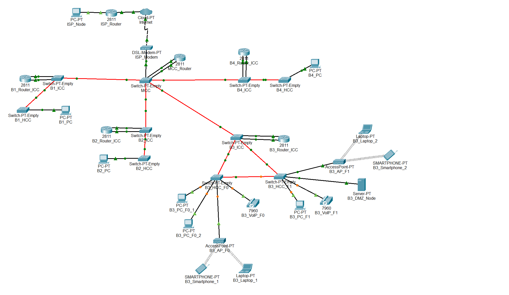

# Edifício 3

## ⚙️ Estrutura Packet Tracer

 

## 🧩 Subtarefas

| **Tarefa** | **Descrição da tarefa**                                                                                         |
|:----------:|-----------------------------------------------------------------------------------------------------------------|
| **2.3.1**  | Coloque os dispositivos no Edifício 3: PCs, computadores portáteis, servidores, telefones IP, switches, routers |
| **2.3.2**  | Nomeie os dispositivos no Edifício 3 utilizando as convenções de equipa                                         |
| **2.3.3**  | Configurar o domínio VTP (`r2425ddg2`) no switch principal do Edifício 3 (modo servidor)                        |
| **2.3.4**  | Adicionar 4 VLANs de construção (F0, F1, WiFi, DMZ, VoIP) + VLAN de backbone ao switch principal                |
| **2.3.5**  | Ligue os switches do Edifício 3 com fibra/cobre de acordo com o projeto de cablagem                             |
| **2.3.6**  | Defina todas as ligações entre switches para o modo trunk (todas as VLAN permitidas)                            |
| **2.3.7**  | Configurar os switches não principais no Edifício 3 como clientes VTP                                           |
| **2.3.8**  | Atribuir portas de acesso: VLANs F0/F1 para PCs, VLAN WiFi para AP, VLAN VoIP para telefones                    |
| **2.3.9**  | Atribuir endereços IPv3 estáticos aos dispositivos do Edifício 3                                                |
| **2.3.10** | Configurar subinterfaces do router para cada VLAN                                                               |
| **2.3.11** | Ligue o router do Edifício 3 à VLAN do backbone e atribua um IP                                                 |
| **2.3.12** | Adicionar rotas estáticas no router do Edifício 4 para o backbone e outros edifícios                            |
| **2.3.13** | Simular ligações de backbone para outros edifícios (modo trunk)                                                 |
| **2.3.14** | Validar os caminhos de redundância entre os switches do Edifício 3                                              |
| **2.3.15** | Documento Building 3 especificações: IDs de VLAN, intervalos de IP, tabelas de encaminhamento em `planning.md`  |

 

## 🔌 VLANs

- **Piso 0**: VLAN para todas as tomadas.
- **Piso 1**: VLAN para todas as tomadas.
- **Rede Wi-Fi**: VLAN para todas as tomadas de APs dentro do edifício.
- **DMZ**: VLAN para servidores, estações de trabalho de administração e dispositivos de rede da infraestrutura.
- **VoIP**: VLAN para todos os telefones IP dentro do edifício.

 

| VLAN ID | nome VLAN       | descrição VLAN                                                |
|---------|-----------------|---------------------------------------------------------------|
| 372     | B3_floor0       | Building 3 - Floor 0 (outlets)                                |
| 373     | B3_floor1       | Building 3 - Floor 1 (outlets)                                |
| 374     | B3_wifi_network | Building 3 - Wifi Network (access points)                     |
| 375     | B3_DMZ          | Building 3 - DMZ (Servers, administration and infrastructure) |
| 376     | B3_VoIP         | Building 3 - VoIP (IP-phones)                                 |

## 🌐 Requisitos de Endereçamento

Os endereços de rede IPv4 para cada VLAN devem ser atribuídos de acordo com os seguintes requisitos de número de nós do Building 3:

- **Pontos de acesso - Piso 0**: 115 nós
- **Pontos de acesso - Piso 1**: 135 nós
- **Wi-Fi**: 220 nós
- **DMZ (Servidores, estações de trabalho administrativas e dispositivos de infraestrutura de rede)**: 50 nós
- **VoIP (Telefones IP)**: 170 nós
- **B3**: 690 nós

 

## 🔧 Espaço de Endereços IPv4

| **Subnet address**  |   **Netmask**    |     **Range of addresses**     |        **Useable IPs**         | **Hosts**  | **VLAN**  |
|:-------------------:|:----------------:|:------------------------------:|:------------------------------:|:----------:|:---------:|
|   10.22.104.0/24    |  255.255.255.0   |  10.22.104.0 - 10.22.104.255   |  10.22.104.1 - 10.22.104.254   |    254     |   WIFI    |
|   10.22.105.0/24    |  255.255.255.0   |  10.22.105.0 - 10.22.105.255   |  10.22.105.1 - 10.22.105.254   |    254     |   VoIP    |
|   10.22.106.0/24    |  255.255.255.0   |  10.22.106.0 - 10.22.106.255   |  10.22.106.1 - 10.22.106.254   |    254     |    F1     |
|   10.22.107.0/25    | 255.255.255.128  |  10.22.107.0 - 10.22.107.127   |  10.22.107.1 - 10.22.107.126   |    126     |    F0     |
|  10.22.107.128/26   | 255.255.255.192  | 10.22.107.128 - 10.22.107.191  | 10.22.107.129 - 10.22.107.190  |     62     |    DMZ    |
|  10.22.107.192/26   | 255.255.255.192  | 10.22.107.192 - 10.22.107.255  | 10.22.107.193 - 10.22.107.254  |     62     |     -     |

 

## 💻 Dispositivos Finais na Simulação

- PCs (piso 0)
- PC (piso 1)
- Laptops
- Smartphones
- Servidor (DMZ)
- Telefones VoIP modelo **7960**