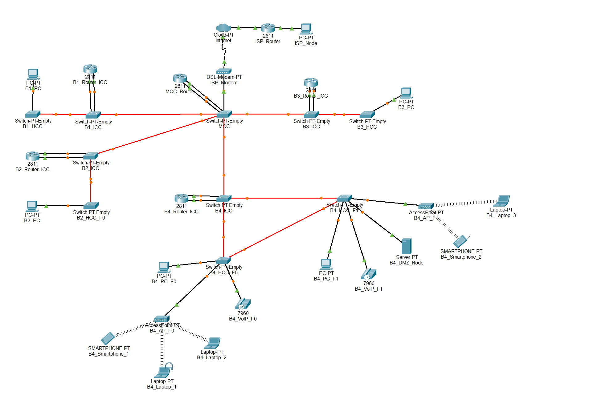

# Edifício 4

## ⚙️ Estrutura Packet Tracer

 

## 🧩 Subtarefas

| **Tarefa** | **Descrição da tarefa**                                                                                         |
|:----------:|-----------------------------------------------------------------------------------------------------------------|
| **2.4.1**  | Coloque os dispositivos no Edifício 4: PCs, computadores portáteis, servidores, telefones IP, switches, routers |
| **2.4.2**  | Nomeie os dispositivos no Edifício 4 utilizando as convenções de equipa                                         |
| **2.4.3**  | Configurar o domínio VTP (`r2425ddg2`) no switch principal do Edifício 4 (modo servidor)                        |
| **2.4.4**  | Adicionar 4 VLANs de construção (F0, F1, WiFi, DMZ, VoIP) + VLAN de backbone ao switch principal                |
| **2.4.5**  | Ligue os switches do Edifício 4 com fibra/cobre de acordo com o projeto de cablagem                             |
| **2.4.6**  | Defina todas as ligações entre switches para o modo trunk (todas as VLAN permitidas)                            |
| **2.4.7**  | Configurar os switches não principais no Edifício 4 como clientes VTP                                           |
| **2.4.8**  | Atribuir portas de acesso: VLANs F0/F1 para PCs, VLAN WiFi para AP, VLAN VoIP para telefones                    |
| **2.4.9**  | Atribuir endereços IPv4 estáticos aos dispositivos do Edifício 4                                                |
| **2.4.10** | Configurar subinterfaces do router para cada VLAN                                                               |
| **2.4.11** | Ligue o router do Edifício 4 à VLAN do backbone e atribua um IP                                                 |
| **2.4.12** | Adicionar rotas estáticas no router do Edifício 4 para o backbone e outros edifícios                            |
| **2.4.13** | Simular ligações de backbone para outros edifícios (modo trunk)                                                 |
| **2.4.14** | Validar os caminhos de redundância entre os switches do Edifício 4                                              |
| **2.4.15** | Documento Building 4 especificações: IDs de VLAN, intervalos de IP, tabelas de encaminhamento em `planning.md`  |

 

## 🔌 VLANs

- **Piso 0**: VLAN para todas as tomadas.
- **Piso 1**: VLAN para todas as tomadas.
- **Rede Wi-Fi**: VLAN para todas as tomadas de APs dentro do edifício.
- **DMZ**: VLAN para servidores, estações de trabalho de administração e dispositivos de rede da infraestrutura.
- **VoIP**: VLAN para todos os telefones IP dentro do edifício.

 

| VLAN ID | nome VLAN       | descrição VLAN                                                |
|---------|-----------------|---------------------------------------------------------------|
| 377     | B4_floor0       | Building 4 - Floor 0 (outlets)                                |
| 378     | B4_floor1       | Building 4 - Floor 1 (outlets)                                |
| 379     | B4_wifi_network | Building 4 - Wifi Network (access points)                     |
| 380     | B4_DMZ          | Building 4 - DMZ (Servers, administration and infrastructure) |
| 381     | B4_VoIP         | Building 4 - VoIP (IP-phones)                                 |

 

## 🌐 Requisitos de Endereçamento

Os endereços de rede IPv4 para cada VLAN devem ser atribuídos de acordo com os seguintes requisitos de número de nós do Building 4:

- **Pontos de acesso - Piso 0**: 125 nós
- **Pontos de acesso - Piso 1**: 170 nós
- **Wi-Fi**: 200 nós
- **DMZ (Servidores, estações de trabalho administrativas e dispositivos de infraestrutura de rede)**: 45 nós
- **VoIP (Telefones IP)**: 160 nós
- **B4**: 700 nós

 

## 🔧 Espaço de Endereços IPv4

| **Subnet address**  |   **Netmask**    |     **Range of addresses**     |        **Useable IPs**         | **Hosts**  | **VLAN**  |
|:-------------------:|:----------------:|:------------------------------:|:------------------------------:|:----------:|:---------:|
|   10.22.108.0/24    |  255.255.255.0   |  10.22.108.0 - 10.22.108.255   |  10.22.108.1 - 10.22.108.254   |    254     |   WIFI    |
|   10.22.109.0/24    |  255.255.255.0   |  10.22.109.0 - 10.22.109.255   |  10.22.109.1 - 10.22.109.254   |    254     |   VoIP    |
|   10.22.110.0/24    |  255.255.255.0   |  10.22.110.0 - 10.22.110.255   |  10.22.110.1 - 10.22.110.254   |    254     |    F1     |
|   10.22.111.0/25    | 255.255.255.128  |  10.22.111.0 - 10.22.111.127   |  10.22.111.1 - 10.22.111.126   |    126     |    F0     |
|  10.22.111.128/26   | 255.255.255.192  | 10.22.111.128 - 10.22.111.191  | 10.22.111.129 - 10.22.111.190  |     62     |    DMZ    |
|  10.22.111.192/26   | 255.255.255.192  | 10.22.111.192 - 10.22.111.255  | 10.22.111.193 - 10.22.111.254  |     62     |     -     |

 

## 💻 Dispositivos Finais na Simulação

- PC (piso 0)
- PC (piso 1)
- Laptops
- Smartphones
- Servidor (DMZ)
- Telefones VoIP modelo **7960**