# Building 2

## - Requirements:

- Contains 2 floors.
- Dimensions: 20 x 40 meters.
- There is already an underground technical trench with conduits for cable passage.
- Floor 0 has a height of 4 meters.
- Floor 1 has a height of 3 meters, with part of this (0.5 meters) being a false ceiling to install cables and wireless access points.
- Additional information about Floor 0:
  - Rooms 2.0.6 and 2.0.7 have a special use and the only required network outlets are along the underground cable duct, five outlets in each room.
  - Room 2.0.11 is a storage area and can be used to house a cross-connect; no network outlets are required in this space, as is the case with bathrooms, the entrance hall, and other common areas. In the remaining locations, the standard ratio of network outlets per area should be applied.

- Additional information about Floor 1: 
  - Room 2.1.12 is a storage area and can be used to house a cross-connect; no network outlets are required in this space, as in bathrooms, halls, and corridors. For the remaining rooms, the standard ratio of network outlets per area should be applied.

## - FLOOR 0:

- Height: 4 meters.
- Dimensions: 20 x 40 meters.
- Total area: 800 square meters.

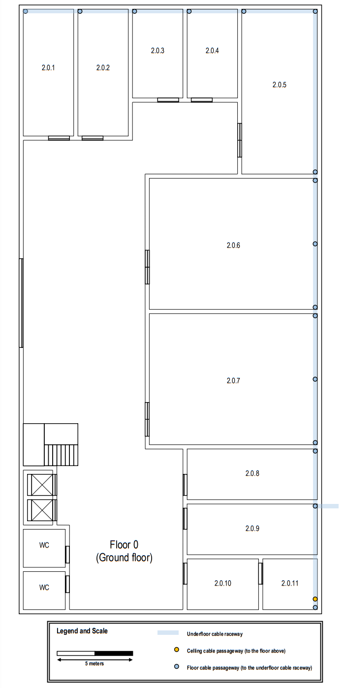

## - FLOOR 1:

- Height: 3 meters, with a 0.5 meter false ceiling.
- Dimensions: 20 x 40 meters.
- Total area: 800 square meters.

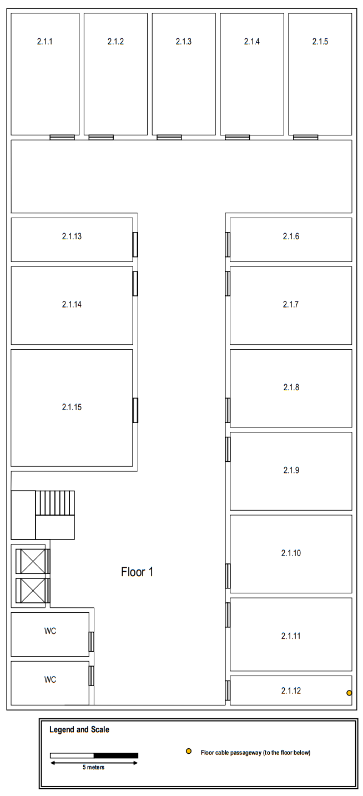

## Measurements (Floor 0)

|  Room  | Length (m) | Width (m) | Area (m^2) |
|:------:|:----------:|:---------:|:----------:|
| 2.0.1  |    8.34    |   3.33    |   27.77    |
| 2.0.2  |    8.34    |   3.33    |   27.77    |
| 2.0.3  |    5.84    |   3.33    |   19.45    |
| 2.0.4  |    5.84    |   3.33    |   19.45    |
| 2.0.5  |   10.83    |   4.98    |   53.93    |
| 2.0.6  |    8.62    |   11.06   |   95.34    |
| 2.0.7  |    8.62    |   11.06   |   95.34    |
| 2.0.8  |    3.34    |   8.58    |   28.66    |
| 2.0.9  |    3.34    |   8.58    |   28.66    |
| 2.0.10 |    3.34    |   4.71    |   15.73    |
| 2.0.11 |    3.34    |   3.60    |   12.02    |

## Measurements (Floor 1)

|  Room  | Length (m) | Width (m) | Area (m^2) |
|:------:|:----------:|:---------:|:----------:|
| 2.1.1  |    6.95    |   3.89    |   27.04    |
| 2.1.2  |    6.95    |   3.62    |   25.16    |
| 2.1.3  |    6.95    |   3.62    |   25.16    |
| 2.1.4  |    6.95    |   3.62    |   25.16    |
| 2.1.5  |    6.95    |   3.62    |   25.16    |
| 2.1.6  |    2.51    |   6.94    |   17.42    |
| 2.1.7  |    4.45    |   6.94    |   30.88    |
| 2.1.8  |    4.45    |   6.94    |   30.88    |
| 2.1.9  |    4.45    |   6.94    |   30.88    |
| 2.1.10 |    4.45    |   6.94    |   30.88    |
| 2.1.11 |    4.18    |   6.94    |   29.01    |
| 2.1.12 |    1.68    |   6.94    |   11.66    |
| 2.1.13 |    2.51    |   6.94    |   17.42    |
| 2.1.14 |    4.45    |   6.94    |   30.88    |
| 2.1.15 |    6.68    |   6.94    |   46.36    |

## Number of network outlets per room:

- According to structured cabling standards, there should be at least two outlets for every 10m².
- However, it is important to consider some points:
  - As rooms 2.0.6 and 2.0.7 on floor 0 have specific needs, only five outlets are required in each room.
  - Rooms 2.0.11 on floor 0 and 2.1.12 on floor 1 do not require outlets.

### Floor 0:

|  Room  | Calculation (area * 2 / 10) | Nº of outlets |
|:------:|:---------------------------:|:-------------:|
| 2.0.1  |             5.6             |       6       |
| 2.0.2  |             5.6             |       6       |
| 2.0.3  |             3.9             |       4       |
| 2.0.4  |             3.9             |       4       |
| 2.0.5  |            10.8             |      11       |
| 2.0.6  |              x              |       5       |
| 2.0.7  |              x              |       5       |
| 2.0.8  |             5.7             |       6       |
| 2.0.9  |             5.7             |       6       |
| 2.0.10 |             3.1             |       4       |
| 2.0.11 |              x              |       0       |

### Floor 1:

|  Room  | Calculation (area * 2 / 10) | Nº of outlets |
|:------:|:---------------------------:|:-------------:|
| 2.1.1  |             5.4             |       6       |
| 2.1.2  |              5              |       5       |
| 2.1.3  |              5              |       5       |
| 2.1.4  |              5              |       5       |
| 2.1.5  |              5              |       5       |
| 2.1.6  |             3.5             |       4       |
| 2.1.7  |             6.2             |       7       |
| 2.1.8  |             6.2             |       7       |
| 2.1.9  |             6.2             |       7       |
| 2.1.10 |             6.2             |       7       |
| 2.1.11 |             5.8             |       6       |
| 2.1.12 |              x              |       0       |
| 2.1.13 |             3.5             |       4       |
| 2.1.14 |             6.2             |       7       |
| 2.1.15 |             9.3             |      10       |

## Outlet layout:

- It is essential to ensure that, regardless of the user's location in the room, there is an outlet within easy reach. This principle was considered in the schematic planning of the outlet distribution.
- No outlet was placed behind doors, ensuring practicality and functionality.  
- The outlets were efficiently distributed, taking into account the area of each room.

### Floor 0:

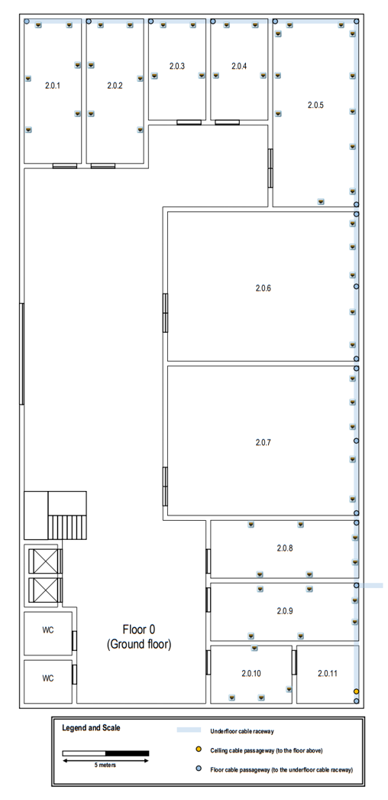

### Floor 1: 

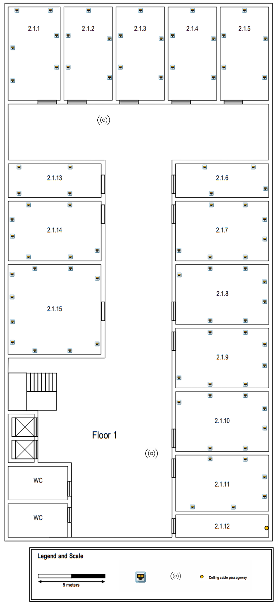

## Access points:

2 access points were installed on each floor, strategically positioned to
ensure total coverage of the LAN network and a robust connection. Each access point covers
a corner of the building, with each floor responsible for one diagonal, thus ensuring a
better signal quality and avoiding unnecessary interference.

### Floor 0: 

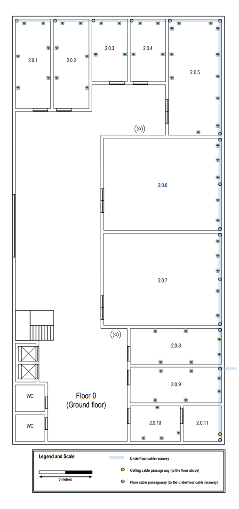

### Floor 1:

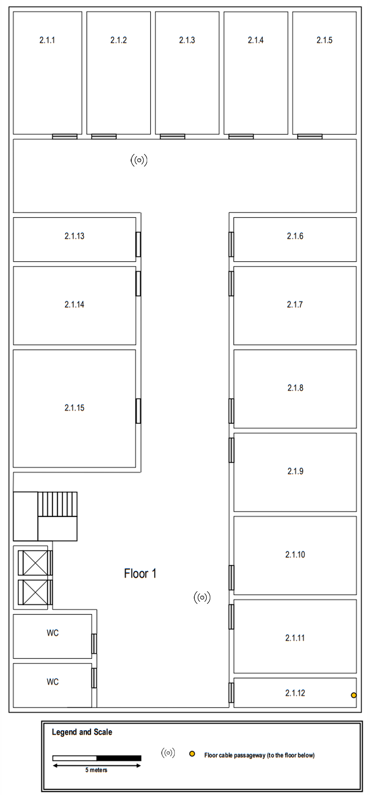

## Cross-connect locations

As an intermediate cross-connect (IC) is required in each building, it was installed
in room 2.0.11, on floor 0. 
Subsequently, the IC was connected to each of the 2 horizontal cross-connects (HC), one on each
floor (in rooms 2.0.11 and 2.1.12 respectively).  
Each HC leads to the outlets, being the starting point for the horizontal cabling.  
It was ensured that, in the horizontal cabling subsystems, no outlet was more than 80 meters away from the horizontal connection in a straight line, and that the total cable length did not exceed 90 meters. For this, 3 Consolidation Points (CP) with a capacity of 12 and one with a capacity of 24 were placed on floor 0 and 
2 with a capacity of 24, one with a capacity of 12 and another with a capacity of 36 on floor 1, to optimize the distribution on each of the floors, especially in high-density areas of outlets.

### Floor 0: 
  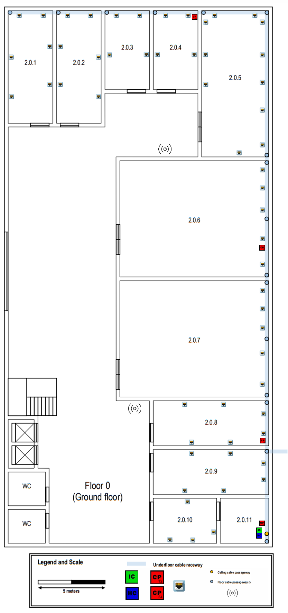

### Floor 1:
  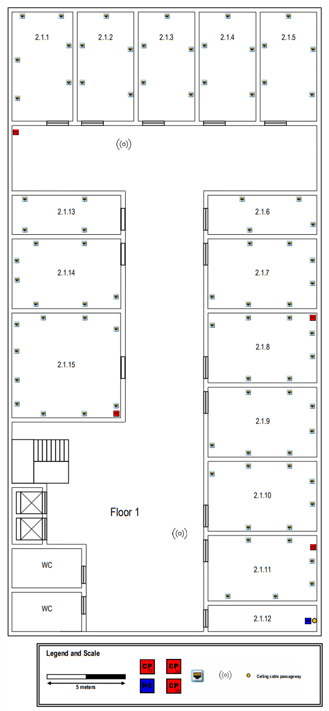

## Cable routing:

The organization of the cable paths was done to maximize the use of shared routes,
minimizing interference and optimizing space.  
Whenever possible, it was ensured that more cables shared the same route,
reducing unnecessary redundancies and facilitating future maintenance.

###  Floor 0: 

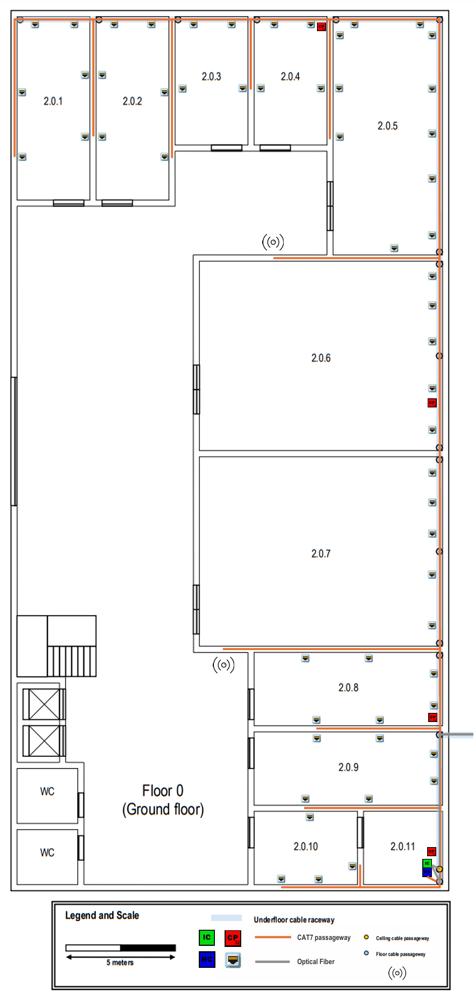

### Floor 1: 

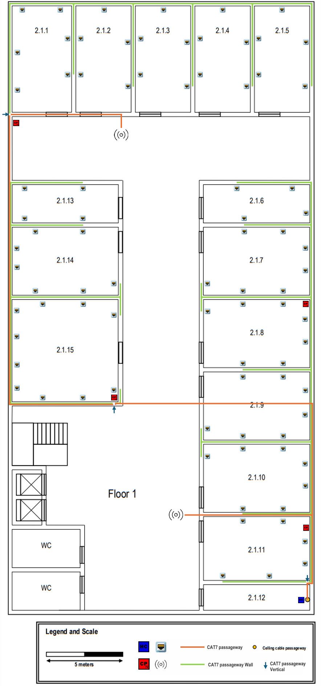

## Complete scheme:

### Floor 0: 

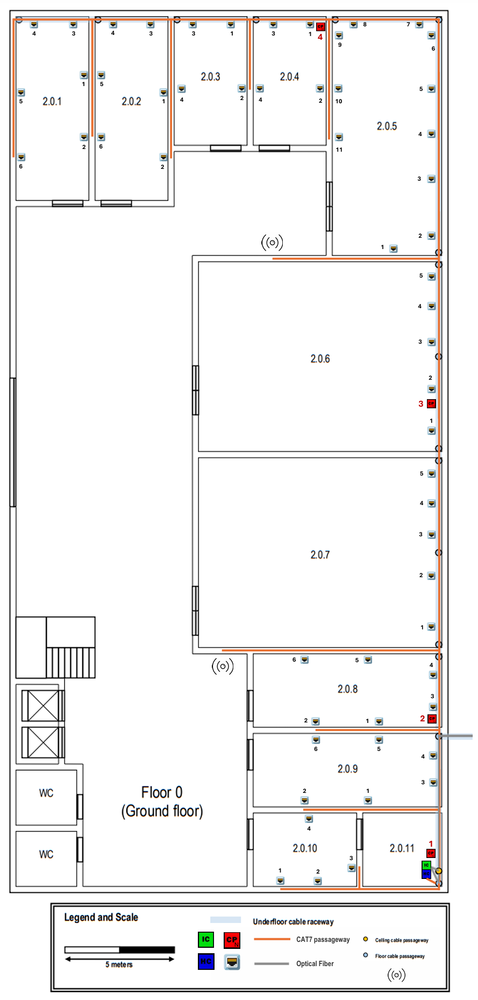

### Floor 1: 

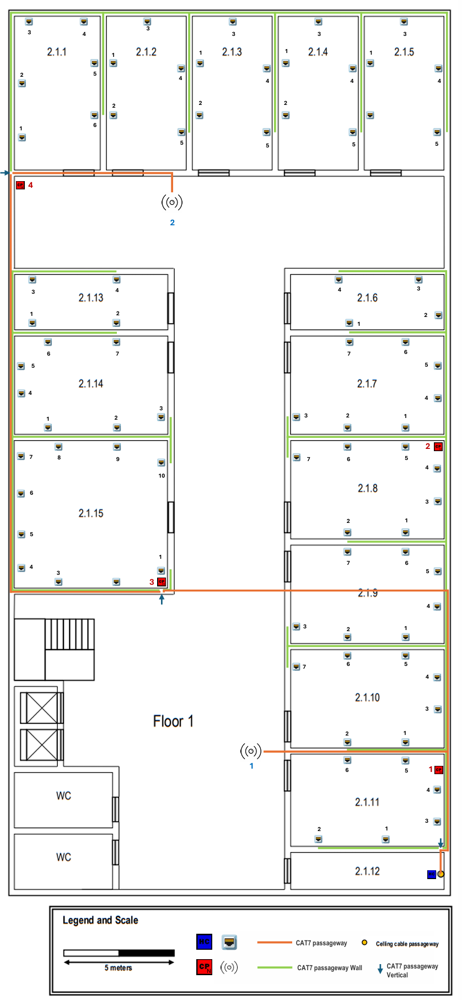

## Hardware Inventories:

Total cable length:
- CAT7: 1,820.85 meters
- Fiber: 12.85 meters

The type of cable used is CAT7 as the length of each of these is reduced (less than 90 m).    

### Floor 0:

#### ROOM: 2.0.1

| Outlet | Length (m) | Consolidation Point (No.) |
|:------:|:----------:|:-------------------------:|
|   1    |   12.84    |           CP 4            |
|   2    |   15.60    |           CP 4            |
|   3    |   11.19    |           CP 4            |
|   4    |   12.99    |           CP 4            |
|   5    |   17.25    |           CP 4            |
|   6    |   20.14    |           CP 4            |

#### ROOM: 2.0.2

| Outlet | Length (m) | Consolidation Point (No.) |
|:------:|:----------:|:-------------------------:|
|   1    |   10.12    |           CP 4            |
|   2    |   13.00    |           CP 4            |
|   3    |    7.70    |           CP 4            |
|   4    |    9.38    |           CP 4            |
|   5    |   12.84    |           CP 4            |
|   6    |     x      |           CP 4            |

#### ROOM: 2.0.3

| Outlet | Length (m) | Consolidation Point (No.) |
|:------:|:----------:|:-------------------------:|
|   1    |    4.07    |           CP 4            |
|   2    |    6.33    |           CP 4            |
|   3    |    5.79    |           CP 4            |
|   4    |    9.93    |           CP 4            |

#### ROOM: 2.0.4

| Outlet | Length (m) | Consolidation Point (No.) |
|:------:|:----------:|:-------------------------:|
|   1    |    0.47    |           CP 4            |
|   2    |    2.98    |           CP 4            |
|   3    |    2.13    |           CP 4            |
|   4    |    6.32    |           CP 4            |

#### ROOM: 2.0.5

| Outlet | Length (m) | Consolidation Point (No.) |
|:------:|:----------:|:-------------------------:|
|   1    |    8.66    |           CP 3            |
|   2    |    7.64    |           CP 3            |
|   3    |   10.24    |           CP 3            |
|   4    |   12.28    |           CP 3            |
|   5    |   14.31    |           CP 3            |
|   6    |   16.72    |           CP 3            |
|   7    |   18.35    |           CP 3            |
|   8    |    1.51    |           CP 4            |
|   9    |    0.62    |           CP 4            |
|   10   |    2.97    |           CP 4            |
|   11   |    5.25    |           CP 4            |

#### ROOM: 2.0.6

| Outlet | Length (m) | Consolidation Point (No.) |
|:------:|:----------:|:-------------------------:|
|   1    |   13.10    |           CP 2            |
|   2    |    0.69    |           CP 3            |
|   3    |    2.83    |           CP 3            |
|   4    |    4.42    |           CP 3            |
|   5    |    5.80    |           CP 3            |

#### ROOM: 2.0.7

| Outlet | Length (m) | Consolidation Point (No.) |
|:------:|:----------:|:-------------------------:|
|   1    |    4.20    |           CP 2            |
|   2    |    6.53    |           CP 2            |
|   3    |    8.37    |           CP 2            |
|   4    |    9.79    |           CP 2            |
|   5    |   11.12    |           CP 2            |

#### ROOM: 2.0.8

| Outlet | Length (m) | Consolidation Point (No.) |
|:------:|:----------:|:-------------------------:|
|   1    |    8.36    |           CP 1            |
|   2    |    5.68    |           CP 2            |
|   3    |    0.57    |           CP 2            |
|   4    |    2.00    |           CP 2            |
|   5    |    6.37    |           CP 2            |
|   6    |    9.28    |           CP 2            |

#### ROOM: 2.0.9

| Outlet | Length (m) | Consolidation Point (No.) |
|:------:|:----------:|:-------------------------:|
|   1    |    5.26    |           CP 1            |
|   2    |    8.15    |           CP 1            |
|   3    |    3.22    |           CP 1            |
|   4    |    4.46    |           CP 1            |
|   5    |    8.36    |           CP 1            |
|   6    |   11.21    |           CP 1            |

#### ROOM: 2.0.10

| Outlet | Length (m) | Consolidation Point (No.) |
|:------:|:----------:|:-------------------------:|
|   1    |    5.92    |           CP 1            |
|   2    |    4.23    |           CP 1            |
|   3    |    3.31    |           CP 1            |
|   4    |    7.95    |           CP 1            |

#### ROOM: 2.0.11 

- Does not contain outlets.

#### Consolidation Points (CPs):

| Consolidation Point |    Length (m)    | Number of CP ports |       Number of ports to be used        | Cable Type |
|:-------------------:|:----------------:|:------------------:|:---------------------------------------:|:----------:|
|        CP 1         |       1.75       |         12         | 12 (11 outlets + 1 consolidation point) |    CAT7    |
|        CP 2         | 6.06 (up to CP1) |         12         |    12 (11 outlets + 1 access point)     |    CAT7    |
|        CP 3         |      22.09       |         12         |    12 (11 outlets + 1 access point)     |    CAT7    |
|        CP 4         |      44.91       |         24         |             24 (24 outlets)             |    CAT7    |

#### Access Points (APs):

| Access Point | Length (m) | Consolidation Point (No.) | Cable Type |
|:------------:|:----------:|:-------------------------:|:----------:|
|     AP 1     |   14.71    |           CP 2            |    CAT7    |
|     AP 2     |   14.20    |           CP 3            |    CAT7    |

### Floor 1:

#### ROOM: 2.1.1

| Outlet | Length (m) | Consolidation Point (No.) |
|:------:|:----------:|:-------------------------:|
|   1    |    2.36    |           CP 4            |
|   2    |    4.79    |           CP 4            |
|   3    |    8.76    |           CP 4            |
|   4    |   11.22    |           CP 4            |
|   5    |   14.36    |           CP 4            |
|   6    |   16.70    |           CP 4            |

#### ROOM: 2.1.2

| Outlet | Length (m) | Consolidation Point (No.) |
|:------:|:----------:|:-------------------------:|
|   1    |   14.36    |           CP 4            |
|   2    |   16.70    |           CP 4            |
|   3    |   14.08    |           CP 4            |
|   4    |   18.50    |           CP 4            |
|   5    |   21.38    |           CP 4            |

#### ROOM: 2.1.3

| Outlet | Length (m) | Consolidation Point (No.) |
|:------:|:----------:|:-------------------------:|
|   1    |   18.25    |           CP 4            |
|   2    |   20.63    |           CP 4            |
|   3    |   17.97    |           CP 4            |
|   4    |   22.37    |           CP 4            |
|   5    |   25.19    |           CP 4            |

#### ROOM: 2.1.4

| Outlet | Length (m) | Consolidation Point (No.) |
|:------:|:----------:|:-------------------------:|
|   1    |   22.09    |           CP 4            |
|   2    |   24.85    |           CP 4            |
|   3    |   21.83    |           CP 4            |
|   4    |   26.24    |           CP 4            |
|   5    |   29.10    |           CP 4            |

#### ROOM: 2.1.5

| Outlet | Length (m) | Consolidation Point (No.) |
|:------:|:----------:|:-------------------------:|
|   1    |   25.95    |           CP 4            |
|   2    |   28.32    |           CP 4            |
|   3    |   25.62    |           CP 4            |
|   4    |   29.86    |           CP 4            |
|   5    |   32.61    |           CP 4            |

#### ROOM: 2.1.6

| Outlet | Length (m) | Consolidation Point (No.) |
|:------:|:----------:|:-------------------------:|
|   1    |    9.48    |           CP 2            |
|   2    |    5.90    |           CP 2            |
|   3    |    9.12    |           CP 2            |
|   4    |   12.71    |           CP 2            |

#### ROOM: 2.1.7

| Outlet | Length (m) | Consolidation Point (No.) |
|:------:|:----------:|:-------------------------:|
|   1    |    2.25    |           CP 2            |
|   2    |    4.84    |           CP 2            |
|   3    |    8.43    |           CP 2            |
|   4    |    2.14    |           CP 2            |
|   5    |    3.62    |           CP 2            |
|   6    |    6.96    |           CP 2            |
|   7    |    9.48    |           CP 2            |

#### ROOM: 2.1.8

| Outlet | Length (m) | Consolidation Point (No.) |
|:------:|:----------:|:-------------------------:|
|   1    |   12.15    |           CP 1            |
|   2    |   14.75    |           CP 1            |
|   3    |   12.13    |           CP 1            |
|   4    |   13.63    |           CP 1            |
|   5    |   16.88    |           CP 1            |
|   6    |   19.47    |           CP 1            |
|   7    |   23.10    |           CP 1            |

#### ROOM: 2.1.9

| Outlet | Length (m) | Consolidation Point (No.) |
|:------:|:----------:|:-------------------------:|
|   1    |    7.41    |           CP 1            |
|   2    |   10.03    |           CP 1            |
|   3    |   13.59    |           CP 1            |
|   4    |    7.36    |           CP 1            |
|   5    |    8.98    |           CP 1            |
|   6    |   12.15    |           CP 1            |
|   7    |     x      |           CP 1            |

#### ROOM: 2.1.10

| Outlet | Length (m) | Consolidation Point (No.) |
|:------:|:----------:|:-------------------------:|
|   1    |    2.70    |           CP 1            |
|   2    |    5.37    |           CP 1            |
|   3    |    2.75    |           CP 1            |
|   4    |    4.19    |           CP 1            |
|   5    |    7.42    |           CP 1            |
|   6    |   10.03    |           CP 1            |
|   7    |   13.68    |           CP 1            |

#### ROOM: 2.1.11

| Outlet | Length (m) | Consolidation Point (No.) |
|:------:|:----------:|:-------------------------:|
|   1    |    3.56    |          x (HC)           |
|   2    |    6.59    |          x (HC)           |
|   3    |    2.52    |          x (HC)           |
|   4    |    3.96    |          x (HC)           |
|   5    |    2.71    |           CP 1            |
|   6    |    5.39    |           CP 1            |

#### ROOM: 2.1.12 

- Does not contain outlets.

#### ROOM: 2.1.13

| Outlet | Length (m) | Consolidation Point (No.) |
|:------:|:----------:|:-------------------------:|
|   1    |   20.88    |           CP 3            |
|   2    |   24.68    |           CP 3            |
|   3    |   23.67    |           CP 3            |
|   4    |   27.45    |           CP 3            |

#### ROOM: 2.1.14

| Outlet | Length (m) | Consolidation Point (No.) |
|:------:|:----------:|:-------------------------:|
|   1    |   15.25    |           CP 3            |
|   2    |   18.37    |           CP 3            |
|   3    |   22.53    |           CP 3            |
|   4    |   17.27    |           CP 3            |
|   5    |   18.52    |           CP 3            |
|   6    |   21.59    |           CP 3            |
|   7    |   24.67    |           CP 3            |

#### ROOM: 2.1.15

| Outlet | Length (m) | Consolidation Point (No.) |
|:------:|:----------:|:-------------------------:|
|   1    |    1.25    |           CP 3            |
|   2    |    4.65    |           CP 3            |
|   3    |    7.77    |           CP 3            |
|   4    |    9.25    |           CP 3            |
|   5    |   11.09    |           CP 3            |
|   6    |   12.79    |           CP 3            |
|   7    |   14.47    |           CP 3            |
|   8    |   15.73    |           CP 3            |
|   9    |   18.37    |           CP 3            |
|   10   |   22.78    |           CP 3            |

#### Consolidation Points (CPs):

| Consolidation Point |    Length (m)     | Number of CP ports |       Number of ports to be used        | Cable Type |
|:-------------------:|:-----------------:|:------------------:|:---------------------------------------:|:----------:|
|        CP 1         |       4.84        |         24         | 24 (23 outlets + 1 consolidation point) |    CAT7    |
|        CP 2         | 14.63 (up to CP1) |         12         |             11 (11 outlets)             |    CAT7    |
|        CP 3         |       25.98       |         24         | 22 (21 outlets + 1 consolidation point) |    CAT7    |
|        CP 4         | 26.49 (up to CP3) |         36         |    27 (26 outlets + 1 access point)     |    CAT7    |

#### Access Points (APs):

| Access Point | Length (m) | Consolidation Point (No.) | Cable Type |
|:------------:|:----------:|:-------------------------:|:----------:|
|     AP 1     |   13.99    |          x (HC)           |    CAT7    |
|     AP 2     |    8.85    |           CP 4            |    CAT7    |

## Patch Panels and Telecommunication enclosures:

Telecommunications enclosures were placed in room 2.0.11 and another in 2.1.12, to provide
a secure and organized physical space for network equipment and termination points for cabling for both floors.

In the IC, a fiber optic patch panel was installed with enough capacity to distribute the fiber optic connections to the HCs of floors 0 and 1, ensuring connectivity between the floors.

**Floor 0 ->** 

In room 2.0.11 was installed: 
  - 1 patch panel with 48 ports to connect the network cables coming to the HC.  
  - 1 fiber optic patch panel to receive the fiber optic cables coming from the IC.  

**Floor 1 ->** 

In room 2.1.12 was installed: 
  - 2 patch panels with 48 ports to connect the network cables coming to the HC.  
  - 1 fiber optic patch panel to receive the fiber optic cables coming from the IC.  

## Inventory:

- Outlets: 142
- Copper Cables: 152
- Access Point: 4
- Intermediate Cross-connect: 1
- Horizontal Cross-connect: 2
- Consolidation Points: 8
- Patch Panels (48 ISO 8877): 3
- Patch Panels de fibra ótica: 3

## Tools used:

Tools used to carry out the project:

- Adobe Acrobat Reader - to take measurements from the building plans:
  - [PDF - Measurements](https://acrobat.adobe.com/id/urn:aaid:sc:EU:b0543f0b-3f7f-44bd-922c-eee67886ba88)

- Excel - for calculations and tables:
  - [Excel - Tabelas (cálculos)](calculation_tables.xlsx)

