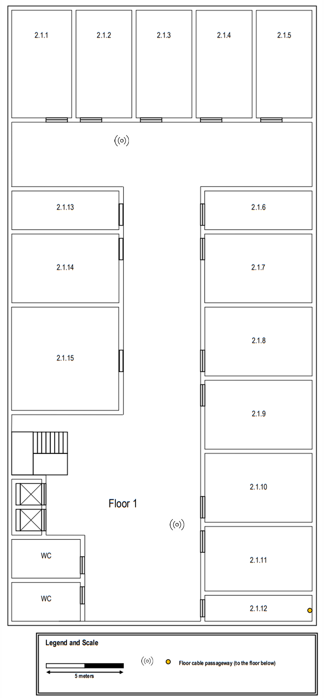
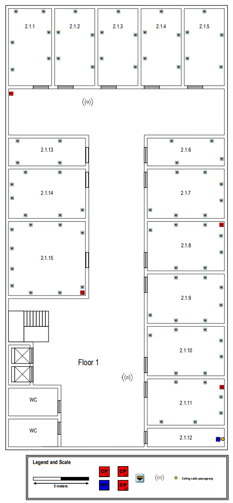
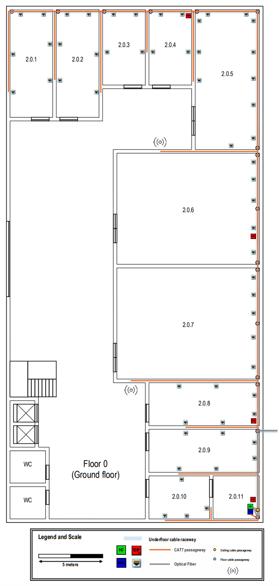

# Edifício 2

## - Requisitos:

- Contém 2 andares.
- Dimensões: 20 x 40 metros.
- Já existe uma vala técnica subterrânea com eletrodutos para a passagem de cabos.
- Piso 0 tem uma altura de 4 metros.
- Piso 1 tem uma altura de 3 metros, sendo parte desta (0,5 metros) um teto falso para instalar cabos e pontos de acesso sem fio.
- Informações adicionais sobre Piso 0:
  - As salas 2.0.6 e 2.0.7 têm um uso especial e as únicas tomadas de rede necessárias estão ao longo do duto de cabos subterrâneo, cinco tomadas em cada sala.
  - A sala 2.0.11 é uma área de armazenamento e pode ser utilizada para alojar uma cross-connect; não são necessárias tomadas de rede nesse espaço, tal como acontece com as casas de banho, o hall de entrada e outras áreas comuns. Nos restantes locais, deve ser aplicada a proporção padrão de tomadas de rede por área.

- Informações adicionais sobre Piso 1: 
  - A sala 2.1.12 é uma área de armazenamento e pode ser utilizada para alojar uma cross-connect; não são necessárias tomadas de rede nesse espaço, tal como nas casas de banho, halls e corredores. Para as restantes salas, deve ser aplicada a proporção padrão de tomadas de rede por área.

## - PISO 0:

- Tem uma altura de 4 metros.
- Dimensões 20 x 40 metros.
- A área total é de 800 metros quadrados.

## - PISO 1:

- Tem uma altura de 3 metros, com um teto falso de 0,5 metros.
- Dimensões 20x40 (metros).
- A área total é de 800 metros quadrados.

## Medições (Piso 0)

|  Sala  | Comprimento (m) | Largura (m) | Área (m^2) |
|:------:|:---------------:|:-----------:|:----------:|
| 2.0.1  |      8,34       |    3,33     |   27,77    |
| 2.0.2  |      8,34       |    3,33     |   27,77    |
| 2.0.3  |      5,84       |    3,33     |   19,45    |
| 2.0.4  |      5,84       |    3,33     |   19,45    |
| 2.0.5  |      10,83      |    4,98     |   53,93    |
| 2.0.6  |      8,62       |    11,06    |   95,34    |
| 2.0.7  |      8,62       |    11,06    |   95,34    |
| 2.0.8  |      3,34       |    8,58     |   28,66    |
| 2.0.9  |      3,34       |    8,58     |   28,66    |
| 2.0.10 |      3,34       |    4,71     |   15,73    |
| 2.0.11 |      3,34       |    3,60     |   12,02    |

## Medições (Piso 1)

|  Sala  | Comprimento (m) | Largura (m) | Área (m^2) |
|:------:|:---------------:|:-----------:|:----------:|
| 2.1.1  |      6,95       |    3,89     |   27,04    |
| 2.1.2  |      6,95       |    3,62     |   25,16    |
| 2.1.3  |      6,95       |    3,62     |   25,16    |
| 2.1.4  |      6,95       |    3,62     |   25,16    |
| 2.1.5  |      6,95       |    3,62     |   25,16    |
| 2.1.6  |      2,51       |    6,94     |   17,42    |
| 2.1.7  |      4,45       |    6,94     |   30,88    |
| 2.1.8  |      4,45       |    6,94     |   30,88    |
| 2.1.9  |      4,45       |    6,94     |   30,88    |
| 2.1.10 |      4,45       |    6,94     |   30,88    |
| 2.1.11 |      4,18       |    6,94     |   29,01    |
| 2.1.12 |      1,68       |    6,94     |   11,66    |
| 2.1.13 |      2,51       |    6,94     |   17,42    |
| 2.1.14 |      4,45       |    6,94     |   30,88    |
| 2.1.15 |      6,68       |    6,94     |   46,36    |

## Número de network outlets por sala:

- Conforme as normas de cablagem estruturada, deve haver pelo menos duas tomadas por cada 10m².
- No entanto, é importante ter em conta algumas considerações:
  - Como as salas 2.0.6 e 2.0.7 do piso 0 têm necessidades específicas, são apenas necessárias cinco tomadas em cada sala.
  - As salas 2.0.11 do piso 0 e 2.1.12 do piso 1 não necessitam de tomadas.

### Piso 0:

|  Sala  | Cálculo (área * 2 / 10) | Nº de tomadas |
|:------:|:-----------------------:|:-------------:|
| 2.0.1  |           5,6           |       6       |
| 2.0.2  |           5,6           |       6       |
| 2.0.3  |           3,9           |       4       |
| 2.0.4  |           3,9           |       4       |
| 2.0.5  |          10,8           |      11       |
| 2.0.6  |            x            |       5       |
| 2.0.7  |            x            |       5       |
| 2.0.8  |           5,7           |       6       |
| 2.0.9  |           5,7           |       6       |
| 2.0.10 |           3,1           |       4       |
| 2.0.11 |            x            |       0       |

### Piso 1:

|  Sala  | Cálculo (área * 2 / 10) | Nº de tomadas |
|:------:|:-----------------------:|:-------------:|
| 2.1.1  |           5,4           |       6       |
| 2.1.2  |            5            |       5       |
| 2.1.3  |            5            |       5       |
| 2.1.4  |            5            |       5       |
| 2.1.5  |            5            |       5       |
| 2.1.6  |           3,5           |       4       |
| 2.1.7  |           6,2           |       7       |
| 2.1.8  |           6,2           |       7       |
| 2.1.9  |           6,2           |       7       |
| 2.1.10 |           6,2           |       7       |
| 2.1.11 |           5,8           |       6       |
| 2.1.12 |            x            |       0       |
| 2.1.13 |           3,5           |       4       |
| 2.1.14 |           6,2           |       7       |
| 2.1.15 |           9,3           |      10       |

## Disposição das outlets:

- É essencial garantir que, independentemente da localização do utilizador na sala, exista uma tomada a curta distância. Este princípio foi considerado no planeamento esquemático da distribuição das tomadas.
- Nenhuma tomada foi colocada atrás de portas, garantindo praticidade e funcionalidade.  
- As tomadas foram distribuídas de forma eficiente, tendo em conta a área de cada sala.

### Piso 0:

### Piso 1: 

## Access points:

Foram instalados 2 access points em cada piso, estrategicamente posicionados para
garantir uma cobertura total da rede LAN e uma ligação robusta. Cada ponto de acesso cobre
um canto do edifício, com cada piso responsável por uma diagonal, assegurando assim uma
melhor qualidade do sinal e evitando interferências desnecessárias.

### Piso 0: 

### Piso 1:

## Locais de cross-connect

Como é necessário um intermediate cross-connect (IC) em cada edifício, este foi instalado
na sala 2.0.11, no piso 0. 
Posteriormente, o IC foi conectado a cada uma das 2 horizontal cross-connects (HC), uma em cada
piso (nas salas 2.0.11 e 2.1.12 respetivamente).  
Cada uma das HC levam às tomadas sendo o ponto de partida para o cabeamento horizontal.  
Foi garantido que, nos subsistemas de cabeamento horizontal, nenhuma tomada se
distanciasse mais de 80 metros da conexão horizontal em linha reta, e que o comprimento
total do cabo não ultrapassasse 90 metros. Para tal, foram colocados 3 Consolidation Points (CP) de capacidade 12 e um de 24 no piso 0 e 2 de capacidade 24, um de 12 e outro de 36 no piso 1, 
para otimizar a distribuição em cada um dos pisos, essencialmente nos locais de grande densidade
de tomadas.

### Piso 0: 
  

### Piso 1:
  

## Disposição dos cabos:

A organização dos caminhos dos cabos foi feita de modo a maximizar o uso de trajetos compartilhados,
minimizando interferências e otimizando o espaço.  
Sempre que possível, foi garantido que mais cabos compartilhasse o mesmo percurso,
reduzindo redundâncias desnecessárias e facilitando futuras manutenções.

###  Piso 0: 

### Piso 1: 

## Esquema completo:

### Piso 0: 

### Piso 1: 

## Inventários de Hardware:

Comprimento total dos cabos:
- CAT7: 1 820,85 metros
- Fibra: 12,85 metros

O tipo de cabo usado é o CAT7 uma vez que o comprimento de cada um destes é reduzido (menor que 90 m).    

### Piso 0:

#### SALA: 2.0.1

| Outlet | Comprimento (m) | Consolidation Point (Nº) |
|:------:|:---------------:|:------------------------:|
|   1    |      12.84      |           CP 4           |
|   2    |      15.60      |           CP 4           |
|   3    |      11.19      |           CP 4           |
|   4    |      12.99      |           CP 4           |
|   5    |      17.25      |           CP 4           |
|   6    |      20.14      |           CP 4           |

#### SALA: 2.0.2

| Outlet | Comprimento (m) | Consolidation Point (Nº) |
|:------:|:---------------:|:------------------------:|
|   1    |      10.12      |           CP 4           |
|   2    |      13.00      |           CP 4           |
|   3    |      7.70       |           CP 4           |
|   4    |      9.38       |           CP 4           |
|   5    |      12.84      |           CP 4           |
|   6    |        x        |           CP 4           |

#### SALA: 2.0.3

| Outlet | Comprimento (m) | Consolidation Point (Nº) |
|:------:|:---------------:|:------------------------:|
|   1    |      4.07       |           CP 4           |
|   2    |      6.33       |           CP 4           |
|   3    |      5.79       |           CP 4           |
|   4    |      9.93       |           CP 4           |

#### SALA: 2.0.4

| Outlet | Comprimento (m) | Consolidation Point (Nº) |
|:------:|:---------------:|:------------------------:|
|   1    |      0.47       |           CP 4           |
|   2    |      2.98       |           CP 4           |
|   3    |      2.13       |           CP 4           |
|   4    |      6.32       |           CP 4           |

#### SALA: 2.0.5

| Outlet | Comprimento (m) | Consolidation Point (Nº) |
|:------:|:---------------:|:------------------------:|
|   1    |      8,66       |           CP 3           |
|   2    |      7,64       |           CP 3           |
|   3    |      10,24      |           CP 3           |
|   4    |      12,28      |           CP 3           |
|   5    |      14,31      |           CP 3           |
|   6    |      16,72      |           CP 3           |
|   7    |      18,35      |           CP 3           |
|   8    |      1,51       |           CP 4           |
|   9    |      0,62       |           CP 4           |
|   10   |      2.97       |           CP 4           |
|   11   |      5.25       |           CP 4           |

#### SALA: 2.0.6

| Outlet | Comprimento (m) | Consolidation Point (Nº) |
|:------:|:---------------:|:------------------------:|
|   1    |      13,10      |           CP 2           |
|   2    |      0,69       |           CP 3           |
|   3    |      2,83       |           CP 3           |
|   4    |      4,42       |           CP 3           |
|   5    |      5,80       |           CP 3           |

#### SALA: 2.0.7

| Outlet | Comprimento (m) | Consolidation Point (Nº) |
|:------:|:---------------:|:------------------------:|
|   1    |      4,20       |           CP 2           |
|   2    |      6,53       |           CP 2           |
|   3    |      8,37       |           CP 2           |
|   4    |      9,79       |           CP 2           |
|   5    |      11,12      |           CP 2           |

#### SALA: 2.0.8

| Outlet | Comprimento (m) | Consolidation Point (Nº) |
|:------:|:---------------:|:------------------------:|
|   1    |      8,36       |           CP 1           |
|   2    |      5,68       |           CP 2           |
|   3    |      0,57       |           CP 2           |
|   4    |      2,00       |           CP 2           |
|   5    |      6,37       |           CP 2           |
|   6    |      9,28       |           CP 2           |

#### SALA: 2.0.9

| Outlet | Comprimento (m) | Consolidation Point (Nº) |
|:------:|:---------------:|:------------------------:|
|   1    |      5,26       |           CP 1           |
|   2    |      8,15       |           CP 1           |
|   3    |      3,22       |           CP 1           |
|   4    |      4,46       |           CP 1           |
|   5    |      8,36       |           CP 1           |
|   6    |      11,21      |           CP 1           |

#### SALA: 2.0.10

| Outlet | Comprimento (m) | Consolidation Point (Nº) |
|:------:|:---------------:|:------------------------:|
|   1    |      5,92       |           CP 1           |
|   2    |      4,23       |           CP 1           |
|   3    |      3,31       |           CP 1           |
|   4    |      7,95       |           CP 1           |

#### SALA: 2.0.11 

- Não contém outlets.

#### Consolidation Points (CPs):

| Consolidation Point |  Comprimento (m)  | Número de portas do CP |      Número de portas a ser usadas      | Tipo Cabo |
|:-------------------:|:-----------------:|:----------------------:|:---------------------------------------:|:---------:|
|        CP 1         |       1,75        |           12           | 12 (11 outlets + 1 consolidation point) |   CAT7    |
|        CP 2         | 6,06 (até ao CP1) |           12           |    12 (11 outlets + 1 access point)     |   CAT7    |
|        CP 3         |       22,09       |           12           |    12 (11 outlets + 1 access point)     |   CAT7    |
|        CP 4         |       44,91       |           24           |             24 (24 outlets)             |   CAT7    |

#### Access Points (APs):

| Access Point | Comprimento (m) | Consolidation Point (Nº) | Tipo Cabo |
|:------------:|:---------------:|:------------------------:|:---------:|
|     AP 1     |      14,71      |           CP 2           |   CAT7    |
|     AP 2     |      14,20      |           CP 3           |   CAT7    |

### Piso 1:

#### SALA: 2.1.1

| Outlet | Comprimento (m) | Consolidation Point (Nº) |
|:------:|:---------------:|:------------------------:|
|   1    |      2.36       |           CP 4           |
|   2    |      4.79       |           CP 4           |
|   3    |      8.76       |           CP 4           |
|   4    |      11.22      |           CP 4           |
|   5    |      14.36      |           CP 4           |
|   6    |      16.70      |           CP 4           |

#### SALA: 2.1.2

| Outlet | Comprimento (m) | Consolidation Point (Nº) |
|:------:|:---------------:|:------------------------:|
|   1    |      14.36      |           CP 4           |
|   2    |      16.70      |           CP 4           |
|   3    |      14.08      |           CP 4           |
|   4    |      18.50      |           CP 4           |
|   5    |      21.38      |           CP 4           |

#### SALA: 2.1.3

| Outlet | Comprimento (m) | Consolidation Point (Nº) |
|:------:|:---------------:|:------------------------:|
|   1    |      18.25      |           CP 4           |
|   2    |      20.63      |           CP 4           |
|   3    |      17.97      |           CP 4           |
|   4    |      22.37      |           CP 4           |
|   5    |      25.19      |           CP 4           |

#### SALA: 2.1.4

| Outlet | Comprimento (m) | Consolidation Point (Nº) |
|:------:|:---------------:|:------------------------:|
|   1    |      22.09      |           CP 4           |
|   2    |      24.85      |           CP 4           |
|   3    |      21.83      |           CP 4           |
|   4    |      26.24      |           CP 4           |
|   5    |      29.10      |           CP 4           |

#### SALA: 2.1.5

| Outlet | Comprimento (m) | Consolidation Point (Nº) |
|:------:|:---------------:|:------------------------:|
|   1    |      25.95      |           CP 4           |
|   2    |      28.32      |           CP 4           |
|   3    |      25.62      |           CP 4           |
|   4    |      29.86      |           CP 4           |
|   5    |      32.61      |           CP 4           |

#### SALA: 2.1.6

| Outlet | Comprimento (m) | Consolidation Point (Nº) |
|:------:|:---------------:|:------------------------:|
|   1    |      9.48       |           CP 2           |
|   2    |      5.90       |           CP 2           |
|   3    |      9.12       |           CP 2           |
|   4    |      12.71      |           CP 2           |

#### SALA: 2.1.7

| Outlet | Comprimento (m) | Consolidation Point (Nº) |
|:------:|:---------------:|:------------------------:|
|   1    |      2.25       |           CP 2           |
|   2    |      4.84       |           CP 2           |
|   3    |      8.43       |           CP 2           |
|   4    |      2.14       |           CP 2           |
|   5    |      3.62       |           CP 2           |
|   6    |      6.96       |           CP 2           |
|   7    |      9.48       |           CP 2           |

#### SALA: 2.1.8

| Outlet | Comprimento (m) | Consolidation Point (Nº) |
|:------:|:---------------:|:------------------------:|
|   1    |      12.15      |           CP 1           |
|   2    |      14.75      |           CP 1           |
|   3    |      12.13      |           CP 1           |
|   4    |      13.63      |           CP 1           |
|   5    |      16.88      |           CP 1           |
|   6    |      19.47      |           CP 1           |
|   7    |      23.10      |           CP 1           |

#### SALA: 2.1.9

| Outlet | Comprimento (m) | Consolidation Point (Nº) |
|:------:|:---------------:|:------------------------:|
|   1    |      7.41       |           CP 1           |
|   2    |      10.03      |           CP 1           |
|   3    |      13.59      |           CP 1           |
|   4    |      7.36       |           CP 1           |
|   5    |      8.98       |           CP 1           |
|   6    |      12.15      |           CP 1           |
|   7    |        x        |           CP 1           |

#### SALA: 2.1.10

| Outlet | Comprimento (m) | Consolidation Point (Nº) |
|:------:|:---------------:|:------------------------:|
|   1    |      2.70       |           CP 1           |
|   2    |      5.37       |           CP 1           |
|   3    |      2.75       |           CP 1           |
|   4    |      4.19       |           CP 1           |
|   5    |      7.42       |           CP 1           |
|   6    |      10.03      |           CP 1           |
|   7    |      13.68      |           CP 1           |

#### SALA: 2.1.11

| Outlet | Comprimento (m) |    Consolidation Point (Nº)     |
|:------:|:---------------:|:-------------------------------:|
|   1    |      3,56       |             x (HC)              |
|   2    |      6,59       |             x (HC)              |
|   3    |      2,52       |             x (HC)              |
|   4    |      3,96       |             x (HC)              |
|   5    |      2,71       |              CP 1               |
|   6    |      5,39       |              CP 1               |

#### SALA: 2.1.12 

- Não contém outlets.

#### SALA: 2.1.13

| Outlet | Comprimento (m) | Consolidation Point (Nº) |
|:------:|:---------------:|:------------------------:|
|   1    |      20.88      |           CP 3           |
|   2    |      24.68      |           CP 3           |
|   3    |      23.67      |           CP 3           |
|   4    |      27.45      |           CP 3           |

#### SALA: 2.1.14

| Outlet | Comprimento (m) | Consolidation Point (Nº) |
|:------:|:---------------:|:------------------------:|
|   1    |      15.25      |           CP 3           |
|   2    |      18.37      |           CP 3           |
|   3    |      22.53      |           CP 3           |
|   4    |      17.27      |           CP 3           |
|   5    |      18.52      |           CP 3           |
|   6    |      21.59      |           CP 3           |
|   7    |      24.67      |           CP 3           |

#### SALA: 2.1.15

| Outlet | Comprimento (m) | Consolidation Point (Nº) |
|:------:|:---------------:|:------------------------:|
|   1    |      1.25       |           CP 3           |
|   2    |      4.65       |           CP 3           |
|   3    |      7.77       |           CP 3           |
|   4    |      9.25       |           CP 3           |
|   5    |      11.09      |           CP 3           |
|   6    |      12.79      |           CP 3           |
|   7    |      14.47      |           CP 3           |
|   8    |      15.73      |           CP 3           |
|   9    |      18.37      |           CP 3           |
|   10   |      22.78      |           CP 3           |

#### Consolidation Points (CPs):

| Consolidation Point |  Comprimento (m)   | Número de portas do CP |      Número de portas a ser usadas      | Tipo Cabo |
|:-------------------:|:------------------:|:----------------------:|:---------------------------------------:|:---------:|
|        CP 1         |        4,84        |           24           | 24 (23 outlets + 1 consolidation point) |   CAT7    |
|        CP 2         | 14,63 (até ao CP1) |           12           |             11 (11 outlets)             |   CAT7    |
|        CP 3         |       25,98        |           24           | 22 (21 outlets + 1 consolidation point) |   CAT7    |
|        CP 4         | 26,49 (até ao CP3) |           36           |    27 (26 outlets + 1 access point)     |   CAT7    |

#### Access Points (APs):

| Access Point | Comprimento (m) | Consolidation Point (Nº) | Tipo Cabo |
|:------------:|:---------------:|:------------------------:|:---------:|
|     AP 1     |      13,99      |          x (HC)          |   CAT7    |
|     AP 2     |      8,85       |           CP 4           |   CAT7    |

## Patch Panels and Telecommunication enclosures:

Foram colocados telecommunications enclosures um na sala 2.0.11 e outro na 2.1.12, de forma a fornecer
um espaço físico seguro e organizado para os equipamentos de rede e os pontos de terminação de cablagem de ambos os pisos.

No IC, foi instalado um patch panel de fibra ótica com capacidade suficiente para distribuir as ligações de fibra ótica para os HCs dos pisos 0 e 1, garantindo a conectividade entre os pisos.

**Piso 0 ->** 

Na sala 2.0.11 instalou-se: 
  - 1 patch panel de 48 portas para ligar os cabos de rede provenientes ao HC.  
  - 1 patch panel de fibra ótica para receber os cabos de fibra ótica provenientes do IC.  

**Piso 1 ->** 

Na sala 2.1.12 instalou-se: 
  - 2 patch panels de 48 portas para ligar os cabos de rede provenientes ao HC.  
  - 1 patch panel de fibra ótica para receber os cabos de fibra ótica provenientes do IC.  

## Inventário:

- Outlets: 142
- Copper Cables: 152
- Access Point: 4
- Intermediate Cross-connect: 1
- Horizontal Cross-connect: 2
- Consolidation Points: 8
- Patch Panels (48 ISO 8877): 3
- Patch Panels de fibra ótica: 3

## Ferramentas utilizadas:

Ferramentas utilizadas para a realização do projeto:

- Adobe Acrobat Reader - para tirar as medidas das plantas do edifício:
  - [PDF - Medidas](https://acrobat.adobe.com/id/urn:aaid:sc:EU:b0543f0b-3f7f-44bd-922c-eee67886ba88)

- Excel - para cálculos e tabelas:
  - [Excel - Tabelas (cálculos)](tabelas_calculos.xlsx)

