# Edifício 3

## - Requisitos:

- Contém 2 andares.
- Dimensões: 30 x 30 metros.
- Já existe uma vala técnica subterrânea com eletrodutos para a passagem de cabos.
- Piso 0 tem uma altura de 4 metros
- Piso 1 tem uma altura de 3 metros, sendo parte desta (0,5 metros) um teto falso para instalar cabos e pontos de acesso
  sem fio
- Informações adicionais sobre Piso 0: 
    - A sala 3.0.14 é uma área de armazenamento que pode ser utilizada para abrigar um cross-connect, não sendo
      necessárias tomadas de rede nesse local, assim como nas casas de banho, corredores e halls.

    - As salas 3.0.1, 3.0.2 e 3.0.3 possuem finalidades específicas, e as únicas tomadas de rede necessárias nesses
      locais são duas próximas a cada passagem de cabos do piso.

    - A todas as outras salas deve ser aplicado o número padrão de tomadas de rede conforme a proporção por área.
- Informações adicionais sobre Piso 1: 
    - A sala 3.1.1 é uma área exclusivamente sem fios, não sendo necessárias tomadas de rede. No entanto, a cobertura da
      rede sem fios (Wi-Fi) deve ser altamente eficaz nesse local.

    - As áreas partilhadas e as casas de banho não precisam de tomadas de rede, enquanto as outras salas devem ser
      equipadas com o número padrão de tomadas de rede.

    - A sala 3.1.8 é uma área de armazenamento, também não precisa de tomadas de rede, podendo ser utilizada para alojar
      um cross-connect e outro hardware de infraestrutura de rede.

## - Piso 0:

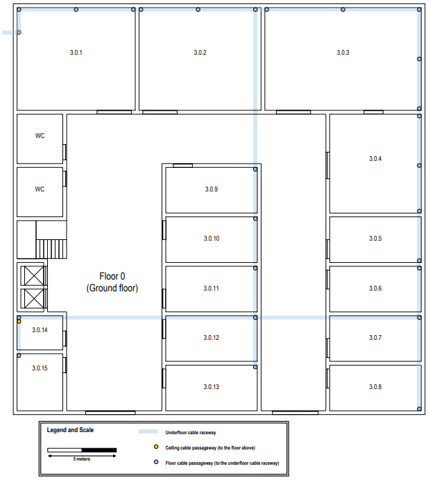

## - Piso 1:

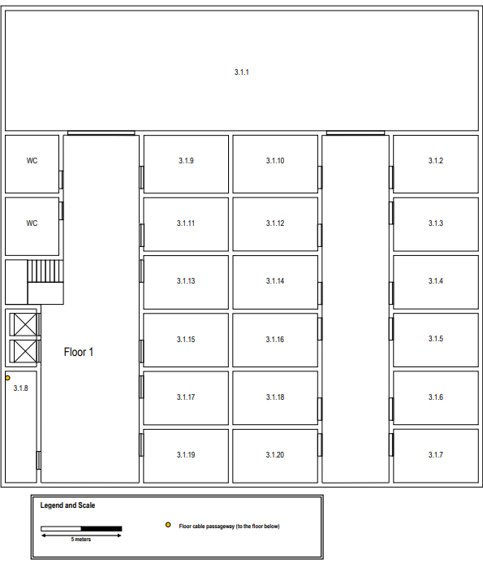

## Medições (Piso 0)

|  Sala  | Comprimento (m) | Largura (m) | Área (m^2) |
|:------:|:---------------:|:-----------:|:----------:|
| 3.0.1  |      8,46       |    7,31     |   61,85    |
| 3.0.2  |      8,75       |    7,31     |   63,94    |
| 3.0.3  |      11,14      |    7,31     |   81,45    |
| 3.0.4  |      6,51       |    7,08     |   46,11    |
| 3.0.5  |      6,51       |    3,26     |   21,23    |
| 3.0.6  |      6,51       |    3,26     |   21,23    |
| 3.0.7  |      6,51       |    3,26     |   21,23    |
| 3.0.8  |      6,51       |    3,26     |   21,23    |
| 3.0.9  |      6,51       |    3,26     |   21,23    |
| 3.0.10 |      6,51       |    3,26     |   21,23    |
| 3.0.11 |      6,51       |    3,26     |   21,23    |
| 3.0.12 |      6,51       |    3,26     |   21,23    |
| 3.0.13 |      6,51       |    3,26     |   21,23    |
| 3.0.14 |      3,26       |    2,49     |    8,11    |
| 3.0.15 |      3,26       |    4,02     |   13,10    |

## Medições (Piso 1)

|  Sala  | Comprimento (m) | Largura (m) | Área (m^2) |
|:------:|:---------------:|:-----------:|:----------:|
| 3.1.1  |      28,73      |    7,31     |   209,90   |
| 3.1.2  |      5,17       |    3,45     |   17,83    |
| 3.1.3  |      5,17       |    3,26     |   16,86    |
| 3.1.4  |      5,17       |    3,26     |   16,86    |
| 3.1.5  |      5,17       |    3,26     |   16,86    |
| 3.1.6  |      5,17       |    3,26     |   16,86    |
| 3.1.7  |      5,17       |    3,26     |   16,86    |
| 3.1.8  |      1,92       |    6,72     |   12,90    |
| 3.1.9  |      5,17       |    3,45     |   17,83    |
| 3.1.10 |      5,17       |    3,45     |   17,83    |
| 3.1.11 |      5,17       |    3,26     |   16,86    |
| 3.1.12 |      5,17       |    3,26     |   16,86    |
| 3.1.13 |      5,17       |    3,26     |   16,86    |
| 3.1.14 |      5,17       |    3,26     |   16,86    |
| 3.1.15 |      5,17       |    3,26     |   16,86    |
| 3.1.16 |      5,17       |    3,26     |   16,86    |
| 3.1.17 |      5,17       |    3,26     |   16,86    |
| 3.1.18 |      5,17       |    3,26     |   16,86    |
| 3.1.19 |      5,17       |    3,26     |   16,86    |
| 3.1.20 |      5,17       |    3,26     |   16,86    |

## Access Points:

Para garantir uma cobertura ideal nos andares, optou-se por instalar dois access points por andar, embora o alcance de
cada um seja geralmente de 30 metros, o que poderia permitir o uso de apenas um. Devido à estrutura fechada dos andares,
com várias salas e paredes, o sinal de um único access point seria significativamente atenuado, comprometendo a
qualidade da conexão. Assim, para assegurar um bom desempenho da rede, os dois access points são posicionados em lados
opostos de cada andar, minimizando a interferência de obstáculos e garantindo uma cobertura mais eficiente. 
Para além disso, no piso 0, ambos os access points foram colocados relativamente perto da sala 3.1.1 para garantir um
melhor desempenho de rede na mesma.

### Piso 0

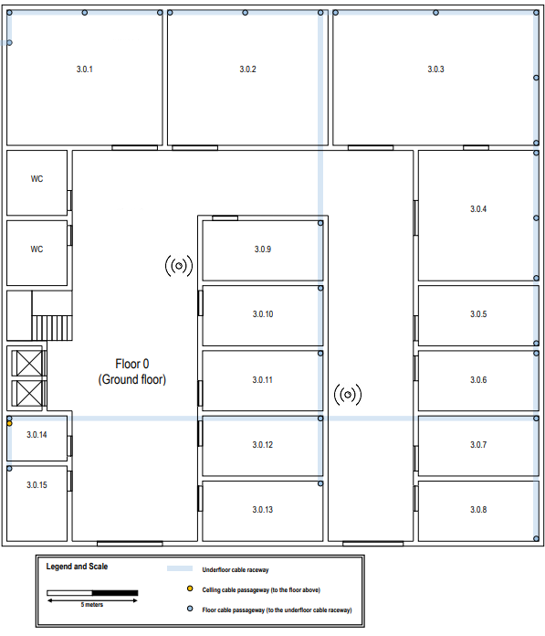

### Piso 1

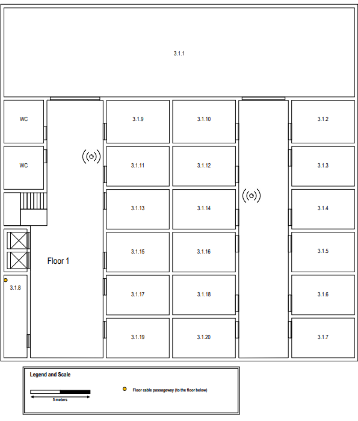

## Network Outlets:

Foi mantida a proporção de duas tomadas a cada 10 metros quadrados de área. 
Nenhuma tomada foi instalada atrás de portas, assegurando praticidade e facilidade de uso. 
A distribuição das tomadas foi planejada de forma eficiente, levando em consideração o tamanho e a funcionalidade de
cada sala.

### Piso 0

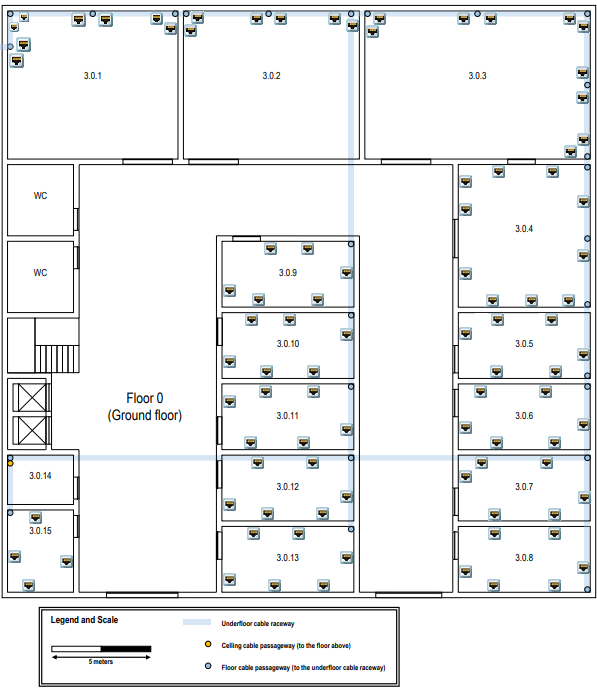

### Piso 1

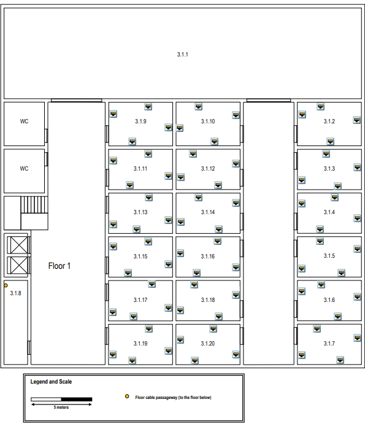

## Locais de cross-connect:

Foi instalado um intermediate cross-connect (IC) na sala 3.0.14 do piso 0, como exigido para cada edifício. 
Este IC está diretamente conectado a dois horizontal cross-connect (HC), localizados um em cada piso (salas 3.0.14 e
3.1.8, correspondendo aos pisos 0 e 1, respetivamente). 
A colocação dos HCs foi realizada de forma a garantir que o comprimento total de cada cabo não ultrapasse os 90 metros e
que nenhum outlet esteja a mais de 80 metros de distância em linha reta do HC. 
Além disso, foram colocados 3 consolidation points (CP) por piso, estrategicamente distribuídos, para otimizar a rede de
cabeamento horizontal, fortalecer o sinal e minimizar a perda de qualidade ao longo do percurso.

### Piso 0

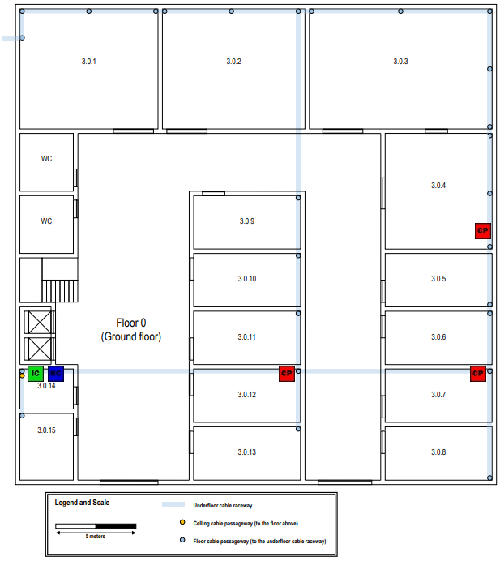

### Piso 1

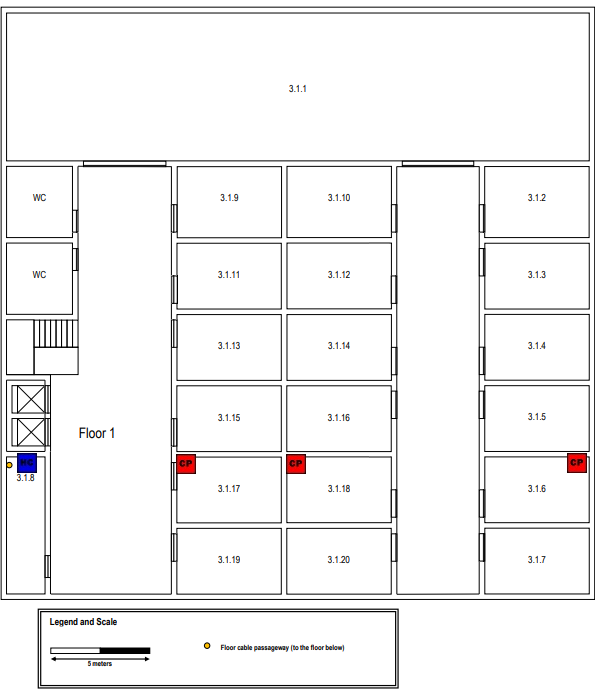

## Disposição dos cabos:

Os caminhos dos cabos foram planejados para otimizar o uso de trajetos compartilhados, reduzindo interferências e
aproveitando melhor o espaço disponível.  Sempre que possível, foi assegurado que vários cabos seguissem o mesmo
percurso, minimizando redundâncias e facilitando manutenções futuras.

### Piso 0

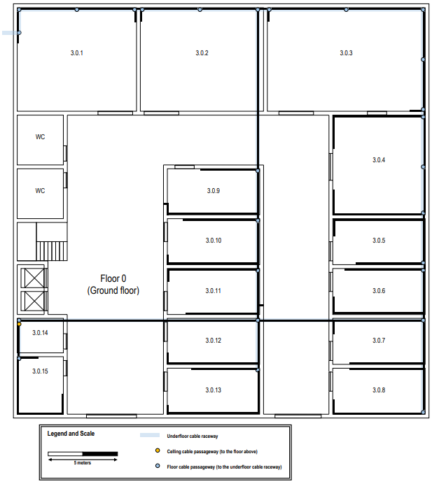

### Piso 1

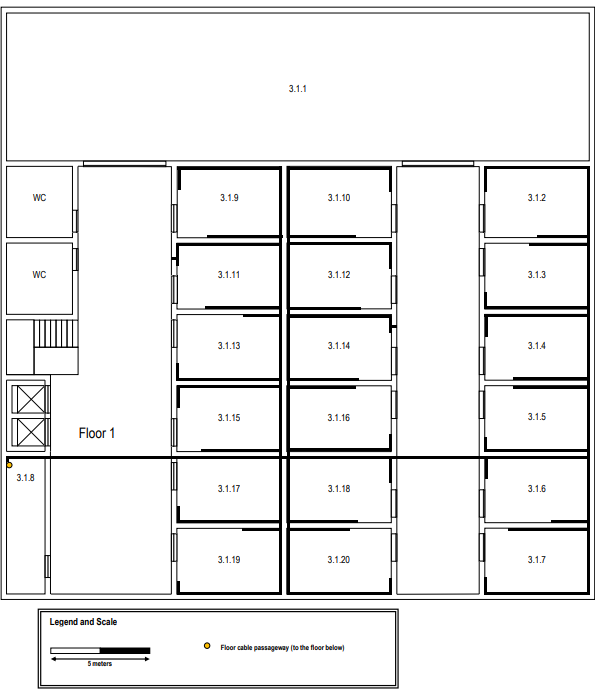

## Inventários de Hardware e Esquema completo:

Comprimento total dos cabos (4909,73m): 
  - Piso 0 - 2847,96 m
  - Piso 1 - 2061,77 m

O tipo de cabo usado é o CAT7 uma vez que o comprimento de cada um destes é reduzido (menor que 90 m).  

A distribuição das conexões dos pontos de rede (network outlets) e access points (APs) nos CPs foi realizada de forma a
otimizar a eficiência do tráfego de rede.  

### Piso 0:

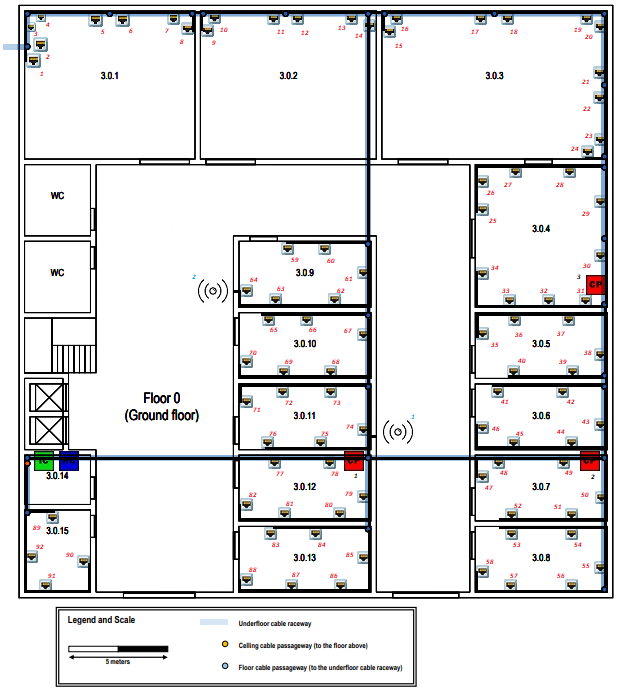

- 92 network outlets;
- 3 CPs;
- 2 APs;
- 1 HC;
- 1 IC.

#### Sala 3.0.1:

| Outlet | Comprimento (m) | Consolidation Point (Nº) | Tipo Cabo |
|:------:|:---------------:|:------------------------:|:---------:|
|   1    |      57,00      |           CP 1           |   CAT7    |
|   2    |      55,57      |           CP 1           |   CAT7    |
|   3    |      54,86      |           CP 1           |   CAT7    |
|   4    |      53,57      |           CP 1           |   CAT7    |
|   5    |      50,71      |           CP 1           |   CAT7    |
|   6    |      49,43      |           CP 1           |   CAT7    |
|   7    |      47,00      |           CP 1           |   CAT7    |
|   8    |      47,00      |           CP 1           |   CAT7    |

#### Sala 3.0.2:

| Outlet | Comprimento (m) | Consolidation Point (Nº) | Tipo Cabo |
|:------:|:---------------:|:------------------------:|:---------:|
|   9    |      46,57      |           CP 1           |   CAT7    |
|   10   |      44,71      |           CP 1           |   CAT7    |
|   11   |      42,14      |           CP 1           |   CAT7    |
|   12   |      40,71      |           CP 1           |   CAT7    |
|   13   |      38,14      |           CP 1           |   CAT7    |
|   14   |      36,29      |           CP 1           |   CAT7    |

#### Sala 3.0.3:

| Outlet | Comprimento (m) | Consolidation Point (Nº) | Tipo Cabo |
|:------:|:---------------:|:------------------------:|:---------:|
|   15   |      61,00      |           CP 3           |   CAT7    |
|   16   |      59,14      |           CP 3           |   CAT7    |
|   17   |      55,43      |           CP 3           |   CAT7    |
|   18   |      53,71      |           CP 3           |   CAT7    |
|   19   |      49,71      |           CP 3           |   CAT7    |
|   20   |      47,26      |           CP 3           |   CAT7    |
|   21   |      46,00      |           CP 3           |   CAT7    |
|   22   |      44,86      |           CP 3           |   CAT7    |
|   23   |      42,57      |           CP 3           |   CAT7    |
|   24   |      42,86      |           CP 3           |   CAT7    |

#### Sala 3.0.4:

| Outlet | Comprimento (m) | Consolidation Point (Nº) | Tipo Cabo |
|:------:|:---------------:|:------------------------:|:---------:|
|   25   |      49,86      |           CP 3           |   CAT7    |
|   26   |      48,43      |           CP 3           |   CAT7    |
|   27   |      45,71      |           CP 3           |   CAT7    |
|   28   |      43,00      |           CP 3           |   CAT7    |
|   29   |      39,57      |           CP 3           |   CAT7    |
|   30   |      36,71      |           CP 3           |   CAT7    |
|   31   |      35,29      |           CP 3           |   CAT7    |
|   32   |      37,14      |           CP 3           |   CAT7    |
|   33   |      39,29      |           CP 3           |   CAT7    |
|   34   |      42,57      |           CP 3           |   CAT7    |

#### Sala 3.0.5:

| Outlet | Comprimento (m) | Consolidation Point (Nº) | Tipo Cabo |
|:------:|:---------------:|:------------------------:|:---------:|
|   35   |      41,29      |           CP 2           |   CAT7    |
|   36   |      38,43      |           CP 2           |   CAT7    |
|   37   |      35,57      |           CP 2           |   CAT7    |
|   38   |      31,86      |           CP 2           |   CAT7    |
|   39   |      32,43      |           CP 2           |   CAT7    |
|   40   |      35,43      |           CP 2           |   CAT7    |

#### Sala 3.0.6:

| Outlet | Comprimento (m) | Consolidation Point (Nº) | Tipo Cabo |
|:------:|:---------------:|:------------------------:|:---------:|
|   41   |      35,86      |           CP 2           |   CAT7    |
|   42   |      32,43      |           CP 2           |   CAT7    |
|   43   |      28,14      |           CP 2           |   CAT7    |
|   44   |      29,00      |           CP 2           |   CAT7    |
|   45   |      31,86      |           CP 2           |   CAT7    |
|   46   |      34,43      |           CP 2           |   CAT7    |

#### Sala 3.0.7:

| Outlet | Comprimento (m) | Consolidation Point (Nº) | Tipo Cabo |
|:------:|:---------------:|:------------------------:|:---------:|
|   47   |      33,86      |           CP 2           |   CAT7    |
|   48   |      32,14      |           CP 2           |   CAT7    |
|   49   |      29,00      |           CP 2           |   CAT7    |
|   50   |      28,86      |           CP 2           |   CAT7    |
|   51   |      31,71      |           CP 2           |   CAT7    |
|   52   |      34,86      |           CP 2           |   CAT7    |

#### Sala 3.0.8:

| Outlet | Comprimento (m) | Consolidation Point (Nº) | Tipo Cabo |
|:------:|:---------------:|:------------------------:|:---------:|
|   53   |      35,29      |           CP 2           |   CAT7    |
|   54   |      32,14      |           CP 2           |   CAT7    |
|   55   |      32,14      |           CP 2           |   CAT7    |
|   56   |      35,29      |           CP 2           |   CAT7    |
|   57   |      38,43      |           CP 2           |   CAT7    |
|   58   |      40,43      |           CP 2           |   CAT7    |

#### Sala 3.0.9:

| Outlet | Comprimento (m) | Consolidation Point (Nº) | Tipo Cabo |
|:------:|:---------------:|:------------------------:|:---------:|
|   59   |      29,00      |           CP 1           |   CAT7    |
|   60   |      27,57      |           CP 1           |   CAT7    |
|   61   |      24,43      |           CP 1           |   CAT7    |
|   62   |      24,29      |           CP 1           |   CAT7    |
|   63   |      27,71      |           CP 1           |   CAT7    |
|   64   |      29,57      |           CP 1           |   CAT7    |

#### Sala 3.0.10:

| Outlet | Comprimento (m) | Consolidation Point (Nº) | Tipo Cabo |
|:------:|:---------------:|:------------------------:|:---------:|
|   65   |      27,43      |           CP 1           |   CAT7    |
|   66   |      25,14      |           CP 1           |   CAT7    |
|   67   |      21,14      |           CP 1           |   CAT7    |
|   68   |      22,14      |           CP 1           |   CAT7    |
|   69   |      24,86      |           CP 1           |   CAT7    |
|   70   |      27,57      |           CP 1           |   CAT7    |

#### Sala 3.0.11:

| Outlet | Comprimento (m) | Consolidation Point (Nº) | Tipo Cabo |
|:------:|:---------------:|:------------------------:|:---------:|
|   71   |      26,14      |           CP 1           |   CAT7    |
|   72   |      23,14      |           CP 1           |   CAT7    |
|   73   |      20,43      |           CP 1           |   CAT7    |
|   74   |      16,43      |           CP 1           |   CAT7    |
|   75   |      17,71      |           CP 1           |   CAT7    |
|   76   |      20,57      |           CP 1           |   CAT7    |

#### Sala 3.0.12:

| Outlet | Comprimento (m) | Consolidation Point (Nº) | Tipo Cabo |
|:------:|:---------------:|:------------------------:|:---------:|
|   77   |      19,71      |           CP 1           |   CAT7    |
|   78   |      16,71      |           CP 1           |   CAT7    |
|   79   |      17,14      |           CP 1           |   CAT7    |
|   80   |      19,57      |           CP 1           |   CAT7    |
|   81   |      22,43      |           CP 1           |   CAT7    |
|   82   |      25,57      |           CP 1           |   CAT7    |

#### Sala 3.0.13:

| Outlet | Comprimento (m) | Consolidation Point (Nº) | Tipo Cabo |
|:------:|:---------------:|:------------------------:|:---------:|
|   83   |      23,43      |           CP 1           |   CAT7    |
|   84   |      21,00      |           CP 1           |   CAT7    |
|   85   |      20,00      |           CP 1           |   CAT7    |
|   86   |      23,40      |           CP 1           |   CAT7    |
|   87   |      25,60      |           CP 1           |   CAT7    |
|   88   |      28,28      |           CP 1           |   CAT7    |

#### Sala 3.0.14:

- Esta sala não apresenta network outlets!

#### Sala 3.0.15:

- Como estes outlets estão muito próximos do HC, são conectados diretamente ao mesmo!

| Outlet | Comprimento (m) | Tipo Cabo |
|:------:|:---------------:|:---------:|
|   89   |      6,43       |   CAT7    |
|   90   |      13,57      |   CAT7    |
|   91   |      10,00      |   CAT7    |
|   92   |      7,00       |   CAT7    |

#### Consolidation Points (CPs):

| Consolidation Point | Comprimento (m) | Número de portas do CP |   Número de portas a ser usadas   | Tipo Cabo |
|:-------------------:|:---------------:|:----------------------:|:---------------------------------:|:---------:|
|        CP 1         |      15,00      |           48           | 46 (44 outlets + 2 access points) |   CAT7    |
|        CP 2         |      26,77      |           24           |          24 (24 outlets)          |   CAT7    |
|        CP 3         |      41,27      |           24           |          20 (20 outlets)          |   CAT7    |

#### Access Points (APs):

| Access Point | Comprimento (m) | Consolidation Point (Nº) | Tipo Cabo |
|:------------:|:---------------:|:------------------------:|:---------:|
|     AP 1     |      16,43      |           CP 1           |   CAT7    |
|     AP 2     |      30,00      |           CP 1           |   CAT7    |

### Piso 1:

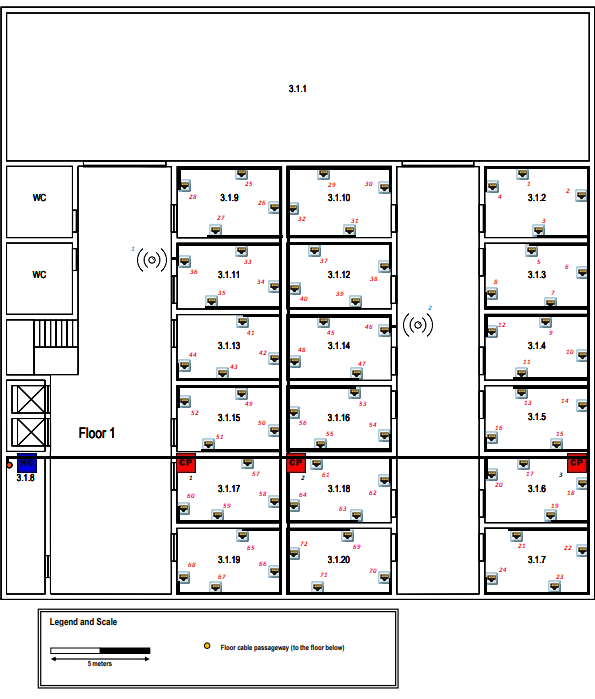

- 72 network outlets;
- 3 CPs;
- 2 APs;
- 1 HC.

#### Sala 3.1.1:

- Esta sala não apresenta network outlets!

#### Sala 3.1.2:

| Outlet | Comprimento (m) | Consolidation Point (Nº) | Tipo Cabo |
|:------:|:---------------:|:------------------------:|:---------:|
|   1    |      46,11      |           CP 3           |   CAT7    |
|   2    |      41,25      |           CP 3           |   CAT7    |
|   3    |      41,67      |           CP 3           |   CAT7    |
|   4    |      49,17      |           CP 3           |   CAT7    |

#### Sala 3.1.3:

| Outlet | Comprimento (m) | Consolidation Point (Nº) | Tipo Cabo |
|:------:|:---------------:|:------------------------:|:---------:|
|   5    |      41,81      |           CP 3           |   CAT7    |
|   6    |      37,36      |           CP 3           |   CAT7    |
|   7    |      37,50      |           CP 3           |   CAT7    |
|   8    |      41,53      |           CP 3           |   CAT7    |

#### Sala 3.1.4:

| Outlet | Comprimento (m) | Consolidation Point (Nº) | Tipo Cabo |
|:------:|:---------------:|:------------------------:|:---------:|
|   9    |      37,50      |           CP 3           |   CAT7    |
|   10   |      33,33      |           CP 3           |   CAT7    |
|   11   |      35,42      |           CP 3           |   CAT7    |
|   12   |      41,67      |           CP 3           |   CAT7    |

#### Sala 3.1.5:

| Outlet | Comprimento (m) | Consolidation Point (Nº) | Tipo Cabo |
|:------:|:---------------:|:------------------------:|:---------:|
|   13   |      35,42      |           CP 3           |   CAT7    |
|   14   |      30,56      |           CP 3           |   CAT7    |
|   15   |      30,28      |           CP 3           |   CAT7    |
|   16   |      34,36      |           CP 3           |   CAT7    |

#### Sala 3.1.6:

| Outlet | Comprimento (m) | Consolidation Point (Nº) | Tipo Cabo |
|:------:|:---------------:|:------------------------:|:---------:|
|   17   |      31,58      |           CP 3           |   CAT7    |
|   18   |      29,58      |           CP 3           |   CAT7    |
|   19   |      33,33      |           CP 3           |   CAT7    |
|   20   |      34,44      |           CP 3           |   CAT7    |

#### Sala 3.1.7:

| Outlet | Comprimento (m) | Consolidation Point (Nº) | Tipo Cabo |
|:------:|:---------------:|:------------------------:|:---------:|
|   21   |      35,83      |           CP 3           |   CAT7    |
|   22   |      33,06      |           CP 3           |   CAT7    |
|   23   |      37,00      |           CP 3           |   CAT7    |
|   24   |      41,33      |           CP 3           |   CAT7    |

#### Sala 3.1.8:

- Esta sala não apresenta network outlets!

#### Sala 3.1.9:

| Outlet | Comprimento (m) | Consolidation Point (Nº) | Tipo Cabo |
|:------:|:---------------:|:------------------------:|:---------:|
|   25   |      29,58      |           CP 1           |   CAT7    |
|   26   |      25,56      |           CP 1           |   CAT7    |
|   27   |      27,50      |           CP 1           |   CAT7    |
|   28   |      34,00      |           CP 1           |   CAT7    |

#### Sala 3.1.10:

| Outlet | Comprimento (m) | Consolidation Point (Nº) | Tipo Cabo |
|:------:|:---------------:|:------------------------:|:---------:|
|   29   |      29,86      |           CP 2           |   CAT7    |
|   30   |      34,17      |           CP 2           |   CAT7    |
|   31   |      27,78      |           CP 2           |   CAT7    |
|   32   |      25,83      |           CP 2           |   CAT7    |

#### Sala 3.1.11:
| Outlet | Comprimento (m) | Consolidation Point (Nº) | Tipo Cabo |
|:------:|:---------------:|:------------------------:|:---------:|
|   33   |      25,69      |           CP 1           |   CAT7    |
|   34   |      21,53      |           CP 1           |   CAT7    |
|   35   |      24,03      |           CP 1           |   CAT7    |
|   36   |      30,00      |           CP 1           |   CAT7    |

#### Sala 3.1.12:

| Outlet | Comprimento (m) | Consolidation Point (Nº) | Tipo Cabo |
|:------:|:---------------:|:------------------------:|:---------:|
|   37   |      25,56      |           CP 2           |   CAT7    |
|   38   |      30,56      |           CP 2           |   CAT7    |
|   39   |      24,44      |           CP 2           |   CAT7    |
|   40   |      21,81      |           CP 2           |   CAT7    |

#### Sala 3.1.13:

| Outlet | Comprimento (m) | Consolidation Point (Nº) | Tipo Cabo |
|:------:|:---------------:|:------------------------:|:---------:|
|   41   |      21,94      |           CP 1           |   CAT7    |
|   42   |      17,92      |           CP 1           |   CAT7    |
|   43   |      19,72      |           CP 1           |   CAT7    |
|   44   |      22,78      |           CP 1           |   CAT7    |

#### Sala 3.1.14:

| Outlet | Comprimento (m) | Consolidation Point (Nº) | Tipo Cabo |
|:------:|:---------------:|:------------------------:|:---------:|
|   45   |      22,50      |           CP 2           |   CAT7    |
|   46   |      26,67      |           CP 2           |   CAT7    |
|   47   |      20,75      |           CP 2           |   CAT7    |
|   48   |      18,19      |           CP 2           |   CAT7    |

#### Sala 3.1.15:

| Outlet | Comprimento (m) | Consolidation Point (Nº) | Tipo Cabo |
|:------:|:---------------:|:------------------------:|:---------:|
|   49   |      18,61      |           CP 1           |   CAT7    |
|   50   |      14,36      |           CP 1           |   CAT7    |
|   51   |      17,00      |           CP 1           |   CAT7    |
|   52   |      22,92      |           CP 1           |   CAT7    |

#### Sala 3.1.16:

| Outlet | Comprimento (m) | Consolidation Point (Nº) | Tipo Cabo |
|:------:|:---------------:|:------------------------:|:---------:|
|   53   |      20,42      |           CP 2           |   CAT7    |
|   54   |      19,58      |           CP 2           |   CAT7    |
|   55   |      15,28      |           CP 2           |   CAT7    |
|   56   |      15,56      |           CP 2           |   CAT7    |

#### Sala 3.1.17:

| Outlet | Comprimento (m) | Consolidation Point (Nº) | Tipo Cabo |
|:------:|:---------------:|:------------------------:|:---------:|
|   57   |      11,25      |           CP 1           |   CAT7    |
|   58   |      15,28      |           CP 1           |   CAT7    |
|   59   |      19,44      |           CP 1           |   CAT7    |
|   60   |      22,42      |           CP 1           |   CAT7    |

#### Sala 3.1.18:

| Outlet | Comprimento (m) | Consolidation Point (Nº) | Tipo Cabo |
|:------:|:---------------:|:------------------------:|:---------:|
|   61   |      14,72      |           CP 2           |   CAT7    |
|   62   |      19,92      |           CP 2           |   CAT7    |
|   63   |      20,28      |           CP 2           |   CAT7    |
|   64   |      15,83      |           CP 2           |   CAT7    |

#### Sala 3.1.19:

| Outlet | Comprimento (m) | Consolidation Point (Nº) | Tipo Cabo |
|:------:|:---------------:|:------------------------:|:---------:|
|   65   |      18,47      |           CP 1           |   CAT7    |
|   66   |      18,75      |           CP 1           |   CAT7    |
|   67   |      23,19      |           CP 1           |   CAT7    |
|   68   |      25,83      |           CP 1           |   CAT7    |

#### Sala 3.1.20:

| Outlet | Comprimento (m) | Consolidation Point (Nº) | Tipo Cabo |
|:------:|:---------------:|:------------------------:|:---------:|
|   69   |      20,14      |           CP 2           |   CAT7    |
|   70   |      26,39      |           CP 2           |   CAT7    |
|   71   |      21,94      |           CP 2           |   CAT7    |
|   72   |      18,19      |           CP 2           |   CAT7    |

#### Consolidation Points (CPs):

| Consolidation Point | Comprimento (m) | Número de portas do CP |   Número de portas a ser usadas   | Tipo Cabo |
|:-------------------:|:---------------:|:----------------------:|:---------------------------------:|:---------:|
|        CP 1         |      8,10       |           48           | 26 (24 outlets + 2 access points) |   CAT7    |
|        CP 2         |      13,75      |           24           |          24 (24 outlets)          |   CAT7    |
|        CP 3         |      28,19      |           24           |          24 (24 outlets)          |   CAT7    |

#### Access Points (APs):

| Access Point | Comprimento (m) | Consolidation Point (Nº) | Tipo Cabo |
|:------------:|:---------------:|:------------------------:|:---------:|
|     AP 1     |      29,86      |           CP 1           |   CAT7    |
|     AP 2     |      26,67      |           CP 1           |   CAT7    |

## Patch Panels and Telecommunication enclosures:

Em nenhum piso foi adicionado tanto telecommunication enclosure como patch panel aos CPs, visto que a sua função é apenas distribuir o cabeamento de forma direta e eficiente, sem precisar de uma estrutura adicional para gerenciar múltiplas conexões. 
Nos HC decidiu-se manter as network outlets e o resto dos equipamentos (CPs, IC e APs) em patch panels separados, para ser mais fácil a gestão e possível manutenção.

### Piso 0:

- IC: 
  - 1 telecommunication enclosure;
  - 1 patch panel com 24 portas para as ligações com os HCs de ambos os pisos.
- HC:
  - 1 telecommunication enclosure;
  - 2 patch panels com 48 portas para as ligações com as network outlets;
  - 1 patch panel com 24 portas para as ligações com os CPs, IC e APs.

### Piso 1:

- HC:
  - 1 telecommunication enclosure;
  - 1 patch panel com 48 portas e outro com 24 portas para as ligações com as network outlets;
  - 1 patch panel com 24 portas para as ligações com os CPs, IC e APs.

## Inventário:

- 176 cabos;
- 164 network outlets;
- 4 APs;
- 6 CPs;
- 2 HCs;
- 1 IC;
- 3 telecommunication enclosures;
- 7 patch panels:
  - 3 com 48 portas - 48 ISO 8877;
  - 4 com 24 portas - 24 ISO 8877.
