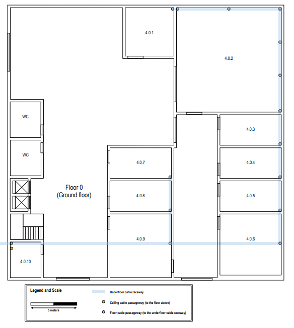
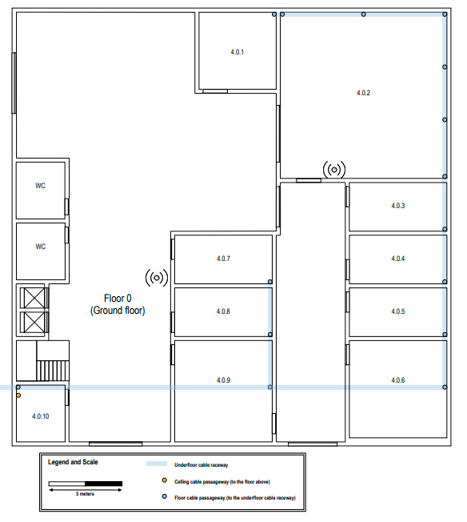
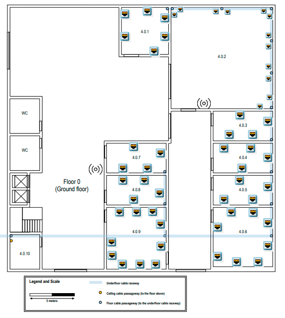
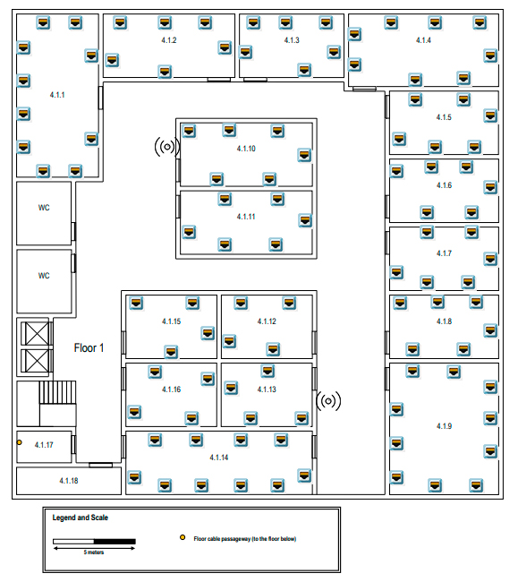
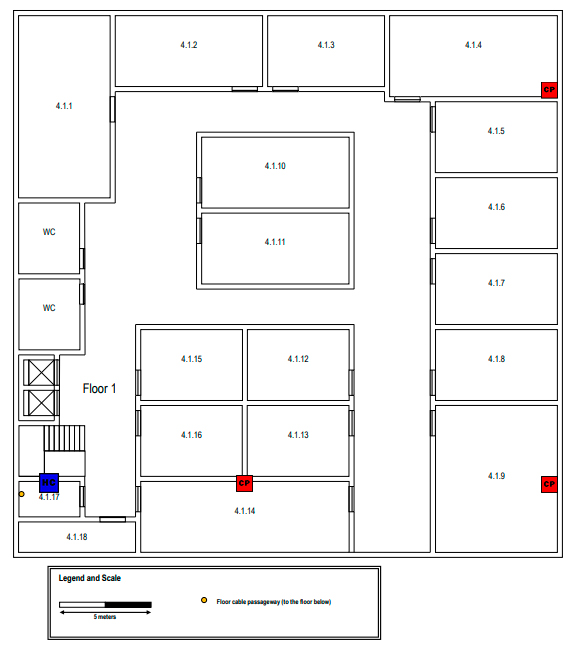
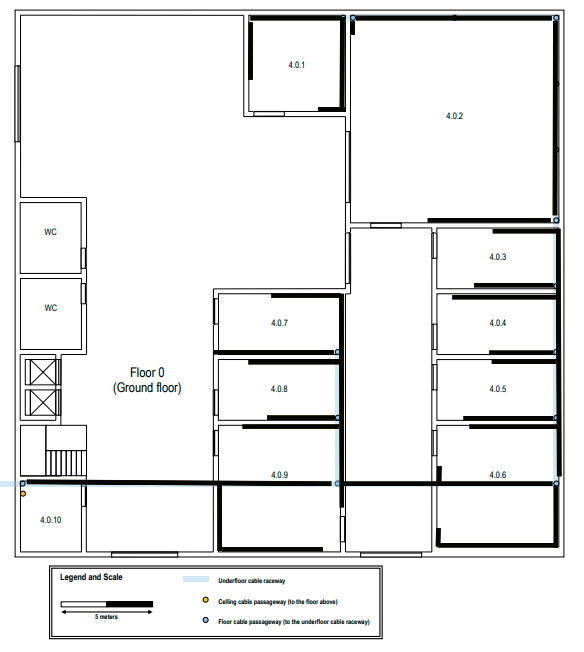
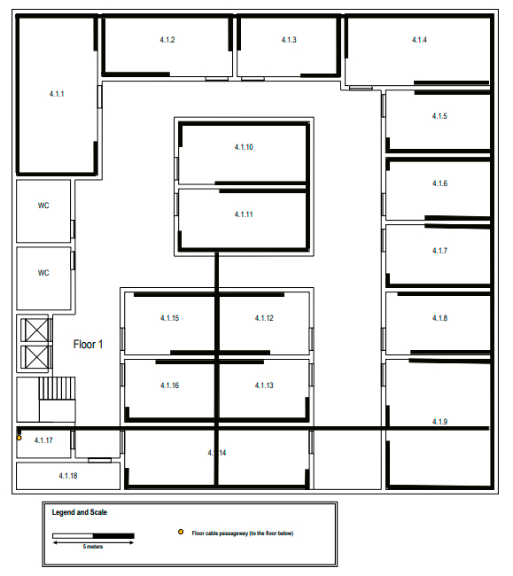
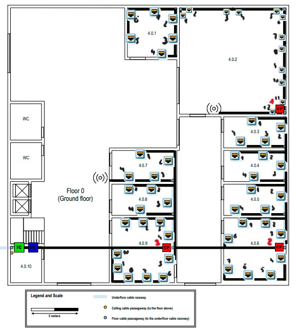
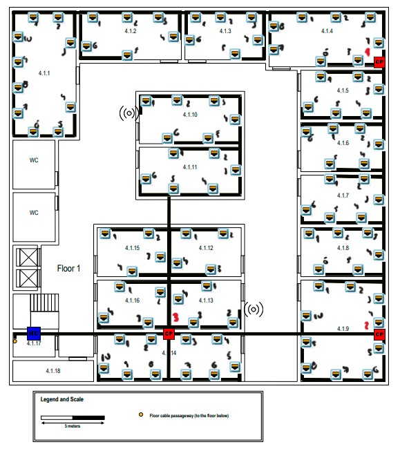

# Building 4

## - Requirements:

- Contains two floors
- Dimensions: 30 x 30 meters
- There is already an underground technical trench with conduits for cable passage
- Floor 0 has a height of 4 meters
- Floor 1 has a height of 3 meters, with part of this (0.5 meters) being a false ceiling to install cables and wireless access points
- Additional information about Floor 0: 
Room 4.0.10 is a storage area that can be used to house network infrastructure hardware and cross-connects, no network outlets are required in this room, and the same applies to bathrooms and shared areas such as the entrance hall and corridors. Rooms 4.0.2 have a specific purpose and the only network outlets required are two near each cable passage on the floor. Elsewhere, the standard number of network outlets per area ratio should be applied
- Additional information about Floor 1: 
Rooms 4.1.17 and 4.1.18 are storage areas that can be used to house a cross-connect and other network infrastructure hardware, no network outlets are required there, the same applies to bathrooms and shared areas such as halls and corridors. Other identified rooms should be provided with the standard number of network outlets per area ratio.

### - Floor 0:

### - Floor 1:

## Measurements (Floor 0)

|  Room   |  Length (m)  | Width (m)  |  Area (m^2)  |
|:-------:|:------------:|:----------:|:------------:|
|  4.0.1  |     5.19     |    5.19    |    26.94     |
|  4.0.2  |    11.35     |   11.35    |    128.82    |
|  4.0.3  |     6.37     |    3.17    |    20.19     |
|  4.0.4  |     6.37     |    3.17    |    20.19     |
|  4.0.5  |     6.37     |    3.17    |    20.19     |
|  4.0.6  |     6.37     |    6.37    |    40.58     |
|  4.0.7  |     6.37     |    3.17    |    20.19     |
|  4.0.8  |     6.37     |    3.17    |    20.19     |
|  4.0.9  |     6.92     |    6.37    |    44.08     |
| 4.0.10  |     3.85     |    3.17    |    12.59     |

## Measurements (Floor 1)

|  Room  | Length (m) | Width (m) | Area (m^2) |
|:------:|:----------:|:---------:|:----------:|
| 4.1.1  |   10,00    |   5,00    |   50,00    |
| 4.1.2  |    8,08    |   3,75    |   30,30    |
| 4.1.3  |    6,35    |   3,75    |   23,81    |
| 4.1.4  |    9,23    |   4,42    |   40,80    |
| 4.1.5  |    6,35    |   3,75    |   23,81    |
| 4.1.6  |    6,35    |   3,75    |   23,81    |
| 4.1.7  |    6,35    |   3,75    |   23,81    |
| 4.1.8  |    6,35    |   3,75    |   23,81    |
| 4.1.9  |    6,35    |   7,88    |   50,04    |
| 4.1.10 |    8,08    |   3,75    |   30,30    |
| 4.1.11 |    8,08    |   3,75    |   30,30    |
| 4.1.12 |    5,58    |   3,75    |   20,93    |
| 4.1.13 |    5,58    |   3,75    |   20,93    |
| 4.1.14 |   11,64    |   3,75    |   43,65    |
| 4.1.15 |    5,58    |   3,75    |   20,93    |
| 4.1.16 |    5,58    |   3,75    |   20,93    |
| 4.1.17 |    3,27    |   1,92    |    6,28    |
| 4.1.18 |    6,35    |   1,54    |    9,78    |

## Access points:

2 access points were placed on each floor of this building 4, strategically placed to ensure efficient coverage and a stable signal in all areas. 
In addition, the access points are not exactly in the same position on both floors, in order to reduce the direct overlap of Wi-Fi cells between floors.  
These decisions were made with the aim of improving signal quality and avoiding unnecessary interference.

### Floor 0:

### Floor 1:

## Outlet layout:

The proportion of two outlets for every 10 square meters of area was respected.  
No outlet was placed behind doors, ensuring practicality and functionality.  
An efficient distribution was ensured according to the area of each room.

### Floor 0:

### Floor 1:

## Cross-connect locations

Since an intermediate cross-connect (IC) is required in each building, it was placed in room 4.0.10 on floor 0.  
In turn, this IC is connected to each of the 2 horizontal cross-connects (HC) that are present one per floor (in rooms 4.0.10 and 4.1.17 respectively).  
Each HC leads to the outlets, being the starting point for the horizontal cabling.  
It was ensured that, in the horizontal cabling subsystems, no outlet is more than 80 meters away from the horizontal connection in a straight line, and that the total length of the cable does not exceed 90 meters. To this end, 3 Consolidation Points (CP) were placed to optimize distribution on each floor, essentially in areas with high outlet density.

### Floor 0:

### Floor 1:

## Cable layout:

The organization of cable paths was done to maximize the use of shared routes, minimizing interference and optimizing space.  
Whenever possible, it was ensured that a greater number of cables share the same route, reducing unnecessary redundancies and facilitating future maintenance.

### Floor 0:

### Floor 1:

## Complete scheme:

### Floor 0:

### Floor 1:

## Hardware inventories:

The type of cable used is CAT7 since the length of each of these is reduced (less than 90 m).   

Total length of cables: 6945.92 m  

Explanation of the tables:  
Outlet Distance -> Consolidation Point + Consolidation Point Distance -> Horizontal Cross-Connect (HC) 

### Floor 0:

#### ROOM: 4.0.1

| Outlet | Length (m) | Consolidation Point (No.) | Cable Type |
|:------:|:----------:|:-------------------------:|:----------:|
|   1    |   25.77    |           CP 1            |    CAT7    |
|   2    |   24.61    |           CP 1            |    CAT7    |
|   3    |   26.54    |           CP 1            |    CAT7    |
|   4    |   29.62    |           CP 1            |    CAT7    |
|   5    |   28.27    |           CP 1            |    CAT7    |
|   6    |   31.54    |           CP 1            |    CAT7    |

#### ROOM: 4.0.2

| Outlet | Length (m) | Consolidation Point (No.) | Cable Type |
|:------:|:----------:|:-------------------------:|:----------:|
|   1    |   24.04    |           CP 1            |    CAT7    |
|   2    |   22.11    |           CP 1            |    CAT7    |
|   3    |   17.69    |           CP 1            |    CAT7    |
|   4    |   16.73    |           CP 1            |    CAT7    |
|   5    |   12.30    |           CP 1            |    CAT7    |
|   6    |   11.35    |           CP 1            |    CAT7    |
|   7    |    8.27    |           CP 1            |    CAT7    |
|   8    |    7.30    |           CP 1            |    CAT7    |
|   9    |    4.42    |           CP 1            |    CAT7    |
|   10   |    3.46    |           CP 1            |    CAT7    |
|   11   |    0.96    |           CP 1            |    CAT7    |
|   12   |    0.96    |           CP 1            |    CAT7    |

#### ROOM: 4.0.3

| Outlet | Length (m) | Consolidation Point (No.) | Cable Type |
|:------:|:----------:|:-------------------------:|:----------:|
|   1    |   17.50    |           CP 2            |    CAT7    |
|   2    |   12.11    |           CP 2            |    CAT7    |
|   3    |   11.73    |           CP 2            |    CAT7    |
|   4    |   14.81    |           CP 2            |    CAT7    |

#### ROOM: 4.0.4

| Outlet | Length (m) | Consolidation Point (No.) | Cable Type |
|:------:|:----------:|:-------------------------:|:----------:|
|   1    |   15.77    |           CP 2            |    CAT7    |
|   2    |   12.50    |           CP 2            |    CAT7    |
|   3    |    8.07    |           CP 2            |    CAT7    |
|   4    |   10.19    |           CP 2            |    CAT7    |

#### ROOM: 4.0.5

| Outlet | Length (m) | Consolidation Point (No.) | Cable Type |
|:------:|:----------:|:-------------------------:|:----------:|
|   1    |   10.38    |           CP 2            |    CAT7    |
|   2    |    5.19    |           CP 2            |    CAT7    |
|   3    |    5.38    |           CP 2            |    CAT7    |
|   4    |    8.85    |           CP 2            |    CAT7    |

#### ROOM: 4.0.6

| Outlet | Length (m) | Consolidation Point (No.) | Cable Type |
|:------:|:----------:|:-------------------------:|:----------:|
|   1    |    5.58    |           CP 2            |    CAT7    |
|   2    |    8.27    |           CP 2            |    CAT7    |
|   3    |    1.73    |           CP 2            |    CAT7    |
|   4    |    1.53    |           CP 2            |    CAT7    |
|   5    |    5.38    |           CP 2            |    CAT7    |
|   6    |    7.69    |           CP 2            |    CAT7    |
|   7    |   10.77    |           CP 2            |    CAT7    |
|   8    |    6.35    |           CP 3            |    CAT7    |

#### ROOM: 4.0.7

| Outlet | Length (m) | Consolidation Point (No.) | Cable Type |
|:------:|:----------:|:-------------------------:|:----------:|
|   1    |   13.27    |           CP 3            |    CAT7    |
|   2    |    8.46    |           CP 3            |    CAT7    |
|   3    |    7.88    |           CP 3            |    CAT7    |
|   4    |   10.58    |           CP 3            |    CAT7    |

#### ROOM: 4.0.8

| Outlet | Length (m) | Consolidation Point (No.) | Cable Type |
|:------:|:----------:|:-------------------------:|:----------:|
|   1    |   10.77    |           CP 3            |    CAT7    |
|   2    |    8.07    |           CP 3            |    CAT7    |
|   3    |    4.62    |           CP 3            |    CAT7    |
|   4    |    6.73    |           CP 3            |    CAT7    |

#### ROOM: 4.0.9

| Outlet | Length (m) | Consolidation Point (No.) | Cable Type |
|:------:|:----------:|:-------------------------:|:----------:|
|   1    |    7.69    |           CP 3            |    CAT7    |
|   2    |    6.73    |           CP 3            |    CAT7    |
|   3    |    4.80    |           CP 3            |    CAT7    |
|   4    |    2.50    |           CP 3            |    CAT7    |
|   5    |    0.96    |           CP 3            |    CAT7    |
|   6    |    5.00    |           CP 3            |    CAT7    |
|   7    |    7.12    |           CP 3            |    CAT7    |
|   8    |    8.46    |           CP 3            |    CAT7    |
|   9    |   11.15    |           CP 3            |    CAT7    |
|   10   |   12.69    |           CP 3            |    CAT7    |

#### ROOM: 4.0.10

- No outlets.

#### Consolidation Point (CPs):

| Consolidation Point | Length (m) |
|:-------------------:|:----------:|
|        CP 1         |   44.61    |
|        CP 2         |   29.23    |
|        CP 3         |   17.30    |

#### Access Point (APs):

|     Access Point     | Length (m) |
|:--------------------:|:----------:|
|          1           |    7.30    |
|          2           |    6.73    |

### Floor 1:

#### ROOM: 4.1.1

| Outlet | Length (m) | Consolidation Point (No.) | Cable Type |
|:------:|:----------:|:-------------------------:|:----------:|
|   1    |   32.69    |           CP 1            |    CAT7    |
|   2    |   30.76    |           CP 1            |    CAT7    |
|   3    |   31.15    |           CP 1            |    CAT7    |
|   4    |   51.53    |           CP 1            |    CAT7    |
|   5    |   47.69    |           CP 1            |    CAT7    |
|   6    |   45.76    |           CP 1            |    CAT7    |
|   7    |   42.30    |           CP 1            |    CAT7    |
|   8    |   40.38    |           CP 1            |    CAT7    |
|   9    |   37.88    |           CP 1            |    CAT7    |
|   10   |   35.96    |           CP 1            |    CAT7    |

#### ROOM: 4.1.2

| Outlet | Length (m) | Consolidation Point (No.) | Cable Type |
|:------:|:----------:|:-------------------------:|:----------:|
|   1    |   28.26    |           CP 1            |    CAT7    |
|   2    |   25.00    |           CP 1            |    CAT7    |
|   3    |   22.50    |           CP 1            |    CAT7    |
|   4    |   22.69    |           CP 1            |    CAT7    |
|   5    |   32.30    |           CP 1            |    CAT7    |
|   6    |   35.96    |           CP 1            |    CAT7    |

#### ROOM: 4.1.3

| Outlet | Length (m) | Consolidation Point (No.) | Cable Type |
|:------:|:----------:|:-------------------------:|:----------:|
|   1    |   19.42    |           CP 1            |    CAT7    |
|   2    |   17.50    |           CP 1            |    CAT7    |
|   3    |   15.57    |           CP 1            |    CAT7    |
|   4    |   16.34    |           CP 1            |    CAT7    |
|   5    |   20.19    |           CP 1            |    CAT7    |
|   6    |   23.07    |           CP 1            |    CAT7    |

#### ROOM: 4.1.4

| Outlet | Length (m) | Consolidation Point (No.) | Cable Type |
|:------:|:----------:|:-------------------------:|:----------:|
|   1    |   11.53    |           CP 1            |    CAT7    |
|   2    |    9.61    |           CP 1            |    CAT7    |
|   3    |    7.11    |           CP 1            |    CAT7    |
|   4    |    2.30    |           CP 1            |    CAT7    |
|   5    |    2.30    |           CP 1            |    CAT7    |
|   6    |    4.80    |           CP 1            |    CAT7    |
|   7    |   17.30    |           CP 1            |    CAT7    |
|   8    |   15.38    |           CP 1            |    CAT7    |

#### ROOM: 4.1.5

| Outlet | Length (m) | Consolidation Point (No.) | Cable Type |
|:------:|:----------:|:-------------------------:|:----------:|
|   1    |   28.84    |           CP 2            |    CAT7    |
|   2    |   26.34    |           CP 2            |    CAT7    |
|   3    |   21.15    |           CP 2            |    CAT7    |
|   4    |   21.15    |           CP 2            |    CAT7    |
|   5    |   23.07    |           CP 2            |    CAT7    |
|   6    |   26.92    |           CP 2            |    CAT7    |

#### ROOM: 4.1.6

| Outlet | Length (m) | Consolidation Point (No.) | Cable Type |
|:------:|:----------:|:-------------------------:|:----------:|
|   1    |   26.92    |           CP 2            |    CAT7    |
|   2    |   23.07    |           CP 2            |    CAT7    |
|   3    |   21.15    |           CP 2            |    CAT7    |
|   4    |   16.34    |           CP 2            |    CAT7    |
|   5    |   16.73    |           CP 2            |    CAT7    |
|   6    |   18.65    |           CP 2            |    CAT7    |

#### ROOM: 4.1.7

| Outlet | Length (m) | Consolidation Point (No.) | Cable Type |
|:------:|:----------:|:-------------------------:|:----------:|
|   1    |   18.65    |           CP 2            |    CAT7    |
|   2    |   16.73    |           CP 2            |    CAT7    |
|   3    |   11.73    |           CP 2            |    CAT7    |
|   4    |   13.07    |           CP 2            |    CAT7    |
|   5    |   14.42    |           CP 2            |    CAT7    |
|   6    |   17.30    |           CP 2            |    CAT7    |

#### ROOM: 4.1.8

| Outlet | Length (m) | Consolidation Point (No.) | Cable Type |
|:------:|:----------:|:-------------------------:|:----------:|
|   1    |   15.96    |           CP 2            |    CAT7    |
|   2    |   13.65    |           CP 2            |    CAT7    |
|   3    |   11.53    |           CP 2            |    CAT7    |
|   4    |    5.77    |           CP 2            |    CAT7    |
|   5    |    7.30    |           CP 2            |    CAT7    |
|   6    |   10.57    |           CP 2            |    CAT7    |

#### ROOM: 4.1.9

| Outlet | Length (m) | Consolidation Point (No.) | Cable Type |
|:------:|:----------:|:-------------------------:|:----------:|
|   1    |   10.00    |           CP 2            |    CAT7    |
|   2    |    8.07    |           CP 2            |    CAT7    |
|   3    |    2.88    |           CP 2            |    CAT7    |
|   4    |    0.96    |           CP 2            |    CAT7    |
|   5    |    0.96    |           CP 2            |    CAT7    |
|   6    |    6.73    |           CP 2            |    CAT7    |
|   7    |    9.42    |           CP 2            |    CAT7    |
|   8    |   12.88    |           CP 2            |    CAT7    |
|   9    |   14.80    |           CP 2            |    CAT7    |
|   10   |   11.54    |           CP 3            |    CAT7    |

#### ROOM: 4.1.10

| Outlet | Length (m) | Consolidation Point (No.) | Cable Type |
|:------:|:----------:|:-------------------------:|:----------:|
|   1    |   32.11    |           CP 3            |    CAT7    |
|   2    |   28.84    |           CP 3            |    CAT7    |
|   3    |   25.57    |           CP 3            |    CAT7    |
|   4    |   21.73    |           CP 3            |    CAT7    |
|   5    |   23.07    |           CP 3            |    CAT7    |
|   6    |   25.96    |           CP 3            |    CAT7    |

#### ROOM: 4.1.11

| Outlet | Length (m) | Consolidation Point (No.) | Cable Type |
|:------:|:----------:|:-------------------------:|:----------:|
|   1    |   26.92    |           CP 3            |    CAT7    |
|   2    |   22.12    |           CP 3            |    CAT7    |
|   3    |   17.69    |           CP 3            |    CAT7    |
|   4    |   14.04    |           CP 3            |    CAT7    |
|   5    |   11.15    |           CP 3            |    CAT7    |
|   6    |   13.65    |           CP 3            |    CAT7    |

#### ROOM: 4.1.12

| Outlet | Length (m) | Consolidation Point (No.) | Cable Type |
|:------:|:----------:|:-------------------------:|:----------:|
|   1    |    9.62    |           CP 3            |    CAT7    |
|   2    |   12.50    |           CP 3            |    CAT7    |
|   3    |    6.54    |           CP 3            |    CAT7    |
|   4    |    4.61    |           CP 3            |    CAT7    |

#### ROOM: 4.1.13

| Outlet | Length (m) | Consolidation Point (No.) | Cable Type |
|:------:|:----------:|:-------------------------:|:----------:|
|   1    |    7.69    |           CP 3            |    CAT7    |
|   2    |    5,77    |           CP 3            |    CAT7    |
|   3    |    1.73    |           CP 3            |    CAT7    |
|   4    |    1.92    |           CP 3            |    CAT7    |

#### ROOM: 4.1.14

| Outlet | Length (m) | Consolidation Point (No.) | Cable Type |
|:------:|:----------:|:-------------------------:|:----------:|
|   1    |    4.42    |           CP 3            |    CAT7    |
|   2    |    1.73    |           CP 3            |    CAT7    |
|   3    |    1.73    |           CP 3            |    CAT7    |
|   4    |    4.42    |           CP 3            |    CAT7    |
|   5    |   10.57    |           CP 3            |    CAT7    |
|   6    |    7.11    |           CP 3            |    CAT7    |
|   7    |    5.57    |           CP 3            |    CAT7    |
|   8    |    5.57    |           CP 3            |    CAT7    |
|   9    |    7.11    |           CP 3            |    CAT7    |
|   10   |   10.57    |           CP 3            |    CAT7    |

#### ROOM: 4.1.15

| Outlet | Length (m) | Consolidation Point (No.) | Cable Type |
|:------:|:----------:|:-------------------------:|:----------:|
|   1    |   12.50    |           CP 3            |    CAT7    |
|   2    |    9.62    |           CP 3            |    CAT7    |
|   3    |    5.38    |           CP 3            |    CAT7    |
|   4    |    6.54    |           CP 3            |    CAT7    |

#### ROOM: 4.1.16

| Outlet | Length (m) | Consolidation Point (No.) | Cable Type |
|:------:|:----------:|:-------------------------:|:----------:|
|   1    |    7.69    |           CP 3            |    CAT7    |
|   2    |    3.27    |           CP 3            |    CAT7    |
|   3    |    1.73    |           CP 3            |    CAT7    |
|   4    |    6,73    |           CP 3            |    CAT7    |

#### ROOM: 4.1.17 

- No outlets.
 
#### ROOM: 4.1.18

- No outlets.

#### Consolidation Point (CPs):

| Consolidation Point | Length (m) |
|:-------------------:|:----------:|
|        CP 1         |   49.96    |
|        CP 2         |   29.80    |
|        CP 3         |   12.50    |

#### Access Point (APs):

| Access Point | Length (m) |
|:------------:|:----------:|
|      1       |   34.61    |
|      2       |    6.73    |

## Patch Panels and Telecommunication enclosures:

- Floor 0:  
Room 4.0.10 contains 2 cabinets (TL1 / TL2).
Since on this floor we have 56 outlets and 2 access points, we will use 2 patch panels.
Of the 2 patch panels, one has 48 connections and the other has 24 connections.

- Floor 1:  
Room 4.1.17 contains 1 cabinet (TL3).
Since on this floor we have 102 outlets and 2 access points, we will use 3 patch panels.
Of the 3 patch panels, two have 48 connections and the other has 24 connections.

All follow the same logic of 1 Patch Panel (1U/2U) + 1 Switch (1U/2U) + reserve → minimum 6U in size, depending on whether 24 or 48 connections are needed.

## Inventory:
- Outlets: 158
- Copper Cables: 168
- Access Point: 4 
- Horizontal Cross-connect: 2
- Intermediate Cross-connect: 1
- Patch Pannels (48 ISO 8877): 3
- Patch Pannels (24 ISO 8877): 2