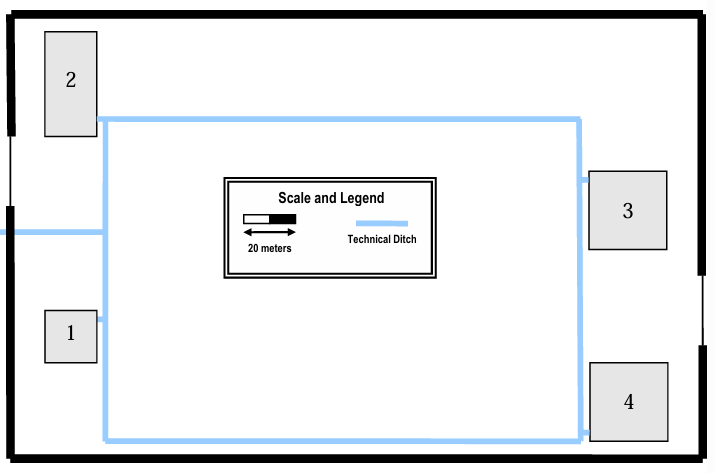
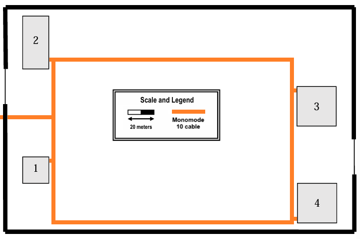

## Buildings Structure

## Campus Backbone

## Global Inventory

|            **Inventory**            | **Building 1** | **Building 2** | **Building 3** | **Building 4** | **Total** |
|:-----------------------------------:|:--------------:|:--------------:|:--------------:|:--------------:|:---------:|
|         **Network Outlets**         |       48       |      142       |      164       |      158       |    512    |
|             **Cables**              |       57       |      152       |      176       |      168       |    553    |
|        **Access Point (AP)**        |       2        |       4        |       4        |       4        |    14     |
|     **Main Cross-connect (MC)**     |       1        |       0        |       0        |       0        |     1     |
|  **Horizontal Cross-connect (HC)**  |       2        |       2        |       2        |       2        |     8     |
| **Intermediate Cross-connect (IC)** |       1        |       1        |       1        |       1        |     4     |
|    **Consolidation Points (CP)**    |       4        |       8        |       6        |       6        |    24     |
|  **Telecommunication Enclosures**   |       4        |       2        |       3        |       3        |    12     |
|   **Patch Panels (48 ISO 8877)**    |       0        |       3        |       3        |       3        |     9     |
|   **Patch Panels (24 ISO 8877)**    |       7        |       0        |       4        |       2        |    13     |
|    **Fiber Optic Patch Panels**     |       0        |       3        |       0        |       0        |     3     |
