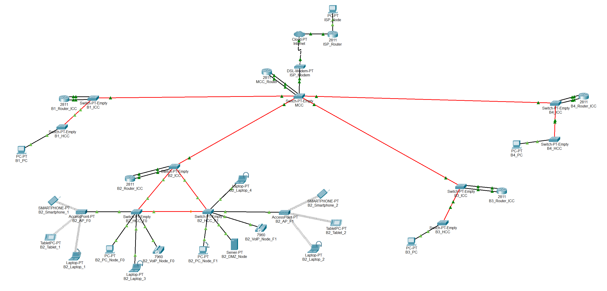

# Building 2

## ⚙️ Packet Tracer Structure

 

## 🧩 Subtasks

|  **Task**  | **Task Description**                                                                     |
|:----------:|------------------------------------------------------------------------------------------|
| **2.2.1**  | Place the devices in Building 2: PCs, laptops, servers, IP phones, switches, routers     |
| **2.2.2**  | Name the devices in Building 2 using the team conventions                                |
| **2.2.3**  | Configure the VTP domain (`r2425ddg2`) on the main switch of Building 2 (server mode)    |
| **2.2.4**  | Add 4 construction VLANs (F0, F1, WiFi, DMZ, VoIP) + backbone VLAN to the main switch    |
| **2.2.5**  | Connect the switches in Building 2 with fiber/copper according to the cabling project    |
| **2.2.6**  | Set all connections between switches to trunk mode (all VLANs allowed)                   |
| **2.2.7**  | Configure the non-main switches in Building 2 as VTP clients                             |
| **2.2.8**  | Assign access ports: VLANs F0/F1 for PCs, VLAN WiFi for AP, VLAN VoIP for phones         |
| **2.2.9**  | Assign static IPv2 addresses to the devices in Building 2                                |
| **2.2.10** | Configure router subinterfaces for each VLAN                                             |
| **2.2.11** | Connect the Building 2 router to the backbone VLAN and assign an IP                      |
| **2.2.12** | Add static routes on the Building 2 router for the backbone and other buildings          |
| **2.2.13** | Simulate backbone connections to other buildings (trunk mode)                            |
| **2.2.14** | Validate redundancy paths between the switches in Building 2                             |
| **2.2.15** | Building 2 document specifications: VLAN IDs, IP ranges, routing tables in `planning.md` |

 

## 🔌 VLANs

- **Floor 0**: VLAN for all outlets.
- **Floor 1**: VLAN for all outlets.
- **Wi-Fi Network**: VLAN for all AP outlets inside the building.
- **DMZ**: VLAN for servers, administration workstations, and infrastructure network devices.
- **VoIP**: VLAN for all IP phones inside the building.

 

| VLAN ID | VLAN name       | VLAN description                                              |
|---------|-----------------|---------------------------------------------------------------|
| 367     | B2_floor0       | Building 2 - Floor 0 (outlets)                                |
| 368     | B2_floor1       | Building 2 - Floor 1 (outlets)                                |
| 369     | B2_wifi_network | Building 2 - Wifi Network (access points)                     |
| 370     | B2_DMZ          | Building 2 - DMZ (Servers, administration and infrastructure) |
| 371     | B2_VoIP         | Building 2 - VoIP (IP-phones)                                 |

 

## 🌐 Addressing Requirements

IPv4 network addresses for each VLAN must be assigned according to the following node requirements for Building 2:

- **Access Points - Floor 0**: 100 nodes
- **Access Points - Floor 1**: 110 nodes
- **Wi-Fi**: 200 nodes
- **DMZ (Servers, administration workstations, and infrastructure network devices)**: 60 nodes
- **VoIP (IP Phones)**: 120 nodes
- **B2**: 690 nodes

 

## 🔧 IPv4 Address Space

| **Subnet address**  |   **Netmask**    |     **Range of addresses**     |        **Useable IPs**         | **Hosts**  | **VLAN**  |
|:-------------------:|:----------------:|:------------------------------:|:------------------------------:|:----------:|:---------:|
|   10.22.100.0/24    |  255.255.255.0   |  10.22.100.0 - 10.22.100.255   |  10.22.100.1 - 10.22.100.254   |    254     |   WIFI    |
|   10.22.101.0/25    | 255.255.255.128  |  10.22.101.0 - 10.22.101.127   |  10.22.101.1 - 10.22.101.126   |    126     |    F0     |
|  10.22.101.128/25   | 255.255.255.128  | 10.22.101.128 - 10.22.101.255  | 10.22.101.129 - 10.22.101.254  |    126     |    F1     |
|   10.22.102.0/25    | 255.255.255.128  |  10.22.102.0 - 10.22.102.127   |  10.22.102.1 - 10.22.102.126   |    126     |   VoIP    |
|  10.22.102.128/26   | 255.255.255.192  | 10.22.102.128 - 10.22.102.191  | 10.22.102.129 - 10.22.102.190  |     62     |    DMZ    |
|  10.22.102.192/26   | 255.255.255.192  | 10.22.102.192 - 10.22.102.255  | 10.22.102.193 - 10.22.102.254  |     62     |     -     |
|   10.22.103.0/24    |  255.255.255.0   |  10.22.103.0 - 10.22.103.255   |  10.22.103.1 - 10.22.103.254   |    254     |     -     |

 

## 💻 End Devices in the Simulation

- PC (floor 0)
- PC (floor 1)
- Laptops
- Smartphones
- Tablets
- Server (DMZ)
- VoIP phones model **7960**
