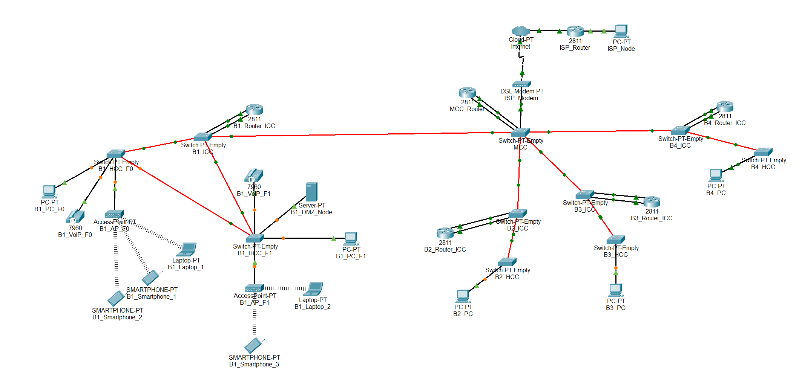

# Building 1

## ⚙️ Packet Tracer Structure

 

## 🧩 Subtasks

|  **Task**  | **Task Description**                                                                     |
|:----------:|------------------------------------------------------------------------------------------|
| **2.1.1**  | Place the devices in Building 1: PCs, laptops, servers, IP phones, switches, routers     |
| **2.1.2**  | Name the devices in Building 1 using the team conventions                                |
| **2.1.3**  | Configure the VTP domain (`r2425ddg2`) on the main switch of Building 1 (server mode)    |
| **2.1.4**  | Add 4 construction VLANs (F0, F1, WiFi, DMZ, VoIP) + backbone VLAN to the main switch    |
| **2.1.5**  | Connect the switches in Building 1 with fiber/copper according to the cabling project    |
| **2.1.6**  | Set all connections between switches to trunk mode (all VLANs allowed)                   |
| **2.1.7**  | Configure the non-main switches in Building 1 as VTP clients                             |
| **2.1.8**  | Assign access ports: F0/F1 VLANs for PCs, WiFi VLAN for AP, VoIP VLAN for phones         |
| **2.1.9**  | Assign static IPv4 addresses to the devices in Building 1                                |
| **2.1.10** | Configure router subinterfaces for each VLAN                                             |
| **2.1.11** | Connect the Building 1 router to the backbone VLAN and assign an IP                      |
| **2.1.12** | Add static routes on the Building 1 router for the backbone and other buildings          |
| **2.1.13** | Simulate backbone connections to other buildings (trunk mode)                            |
| **2.1.14** | Validate redundancy paths between the switches in Building 1                             |
| **2.1.15** | Building 1 document specifications: VLAN IDs, IP ranges, routing tables in `planning.md` |

 

## 🔌 VLANs

- **Floor 0**: VLAN for all outlets.
- **Floor 1**: VLAN for all outlets.
- **Wi-Fi**: VLAN for all APs outlets inside the building.
- **DMZ**: VLAN for servers, administrative workstations, and network infrastructure devices.
- **VoIP**: VLAN for all IP phones inside the building.

 

| VLAN ID | VLAN name       | VLAN description                                              |
|---------|-----------------|---------------------------------------------------------------|
| 362     | B1_floor0       | Building 1 - Floor 0 (outlets)                                |
| 363     | B1_floor1       | Building 1 - Floor 1 (outlets)                                |
| 364     | B1_wifi_network | Building 1 - Wifi Network (access points)                     |
| 365     | B1_DMZ          | Building 1 - DMZ (Servers, administration and infrastructure) |
| 366     | B1_VoIP         | Building 1 - VoIP (IP-phones)                                 |

 

## 🌐 Addressing Requirements

The IPv4 network addresses for each VLAN must be assigned according to the following Building 1 node count requirements:

- **Access points - Floor 0**: 40 nodes 
- **Access points - Floor 1**: 45 nodes
- **Wi-Fi**: 95 nodes
- **DMZ (Servers, administrative workstations, and network infrastructure devices)**: 110 nodes
- **VoIP (IP Phones)**: 70 nodes
- **B1**: 360 nodes

 

## 🔧 IPv4 Address Space

|  **Subnet address**  |     Netmask     |      Range of addresses      |         Useable IPs          | Hosts  | VLAN |
|:--------------------:|:---------------:|:----------------------------:|:----------------------------:|:------:|:----:|
|  **10.22.98.0/26**   | 255.255.255.192 |   10.22.98.0 - 10.22.98.63   |   10.22.98.1 - 10.22.98.62   |   62   |  F0  |
|  **10.22.98.64/26**  | 255.255.255.192 |  10.22.98.64 - 10.22.98.127  |  10.22.98.65 - 10.22.98.126  |   62   |  F1  |
| **10.22.98.128/25**  | 255.255.255.128 | 10.22.98.128 - 10.22.98.255  | 10.22.98.129 - 10.22.98.254  |  126   | WIFI |
|  **10.22.99.0/25**   | 255.255.255.128 |  10.22.99.0 - 10.22.99.127   |  10.22.99.1 - 10.22.99.126   |  126   | VoIP |
| **10.22.99.128/25**  | 255.255.255.128 | 10.22.99.128 - 10.22.99.255  | 10.22.99.129 - 10.22.99.254  |  126   | DMZ  |

 

## 💻 End Devices in the Simulation

- PC (floor 0)
- PC (floor 1)
- Laptops
- Smartphones
- Server (DMZ)
- VoIP phones model **7960**
