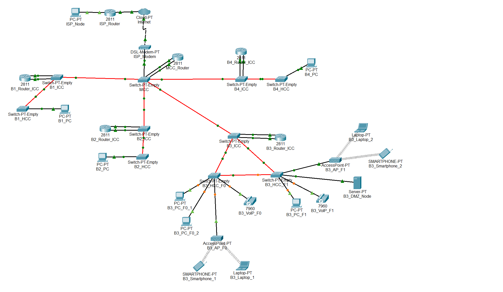

# Building 3

## ⚙️ Packet Tracer Structure

 

## 🧩 Subtasks

|  **Task**  | **Task Description**                                                                     |
|:----------:|------------------------------------------------------------------------------------------|
| **2.3.1**  | Place the devices in Building 3: PCs, laptops, servers, IP phones, switches, routers     |
| **2.3.2**  | Name the devices in Building 3 using the team conventions                                |
| **2.3.3**  | Configure the VTP domain (`r2425ddg2`) on the main switch of Building 3 (server mode)    |
| **2.3.4**  | Add 4 construction VLANs (F0, F1, WiFi, DMZ, VoIP) + backbone VLAN to the main switch    |
| **2.3.5**  | Connect the switches in Building 3 with fiber/copper according to the cabling project    |
| **2.3.6**  | Set all connections between switches to trunk mode (all VLANs allowed)                   |
| **2.3.7**  | Configure the non-main switches in Building 3 as VTP clients                             |
| **2.3.8**  | Assign access ports: F0/F1 VLANs for PCs, WiFi VLAN for AP, VoIP VLAN for phones         |
| **2.3.9**  | Assign static IPv4 addresses to the devices in Building 3                                |
| **2.3.10** | Configure router subinterfaces for each VLAN                                             |
| **2.3.11** | Connect the Building 3 router to the backbone VLAN and assign an IP                      |
| **2.3.12** | Add static routes on the Building 3 router for the backbone and other buildings          |
| **2.3.13** | Simulate backbone connections to other buildings (trunk mode)                            |
| **2.3.14** | Validate redundancy paths between the switches in Building 3                             |
| **2.3.15** | Building 3 document specifications: VLAN IDs, IP ranges, routing tables in `planning.md` |

 

## 🔌 VLANs

- **Floor 0**: VLAN for all outlets.
- **Floor 1**: VLAN for all outlets.
- **Wi-Fi**: VLAN for all APs' outlet within the building.
- **DMZ**: VLAN for servers, administrative workstations, and network infrastructure devices.
- **VoIP**: VLAN for all IP phones within the building.

 

| VLAN ID | VLAN name       | VLAN description                                              |
|---------|-----------------|---------------------------------------------------------------|
| 372     | B3_floor0       | Building 3 - Floor 0 (outlets)                                |
| 373     | B3_floor1       | Building 3 - Floor 1 (outlets)                                |
| 374     | B3_wifi_network | Building 3 - Wifi Network (access points)                     |
| 375     | B3_DMZ          | Building 3 - DMZ (Servers, administration and infrastructure) |
| 376     | B3_VoIP         | Building 3 - VoIP (IP-phones)                                 |

## 🌐 IPv4 Addressing Requirements

The IPv4 network addresses for each VLAN must be assigned according to the following Building 3 node count requirements:

- **Access Points - Floor 0**: 115 nodes
- **Access Points - Floor 1**: 135 nodes
- **Wi-Fi**: 220 nodes
- **DMZ (Servers, administrative workstations, and network infrastructure devices)**: 50 nodes
- **VoIP (IP Phones)**: 170 nodes
- **B3**: 690 nodes

 

## 🔧 IPv4 Address Space

| **Subnet address**  |   **Netmask**    |     **Range of addresses**     |        **Useable IPs**         | **Hosts**  | **VLAN**  |
|:-------------------:|:----------------:|:------------------------------:|:------------------------------:|:----------:|:---------:|
|   10.22.104.0/24    |  255.255.255.0   |  10.22.104.0 - 10.22.104.255   |  10.22.104.1 - 10.22.104.254   |    254     |   WIFI    |
|   10.22.105.0/24    |  255.255.255.0   |  10.22.105.0 - 10.22.105.255   |  10.22.105.1 - 10.22.105.254   |    254     |   VoIP    |
|   10.22.106.0/24    |  255.255.255.0   |  10.22.106.0 - 10.22.106.255   |  10.22.106.1 - 10.22.106.254   |    254     |    F1     |
|   10.22.107.0/25    | 255.255.255.128  |  10.22.107.0 - 10.22.107.127   |  10.22.107.1 - 10.22.107.126   |    126     |    F0     |
|  10.22.107.128/26   | 255.255.255.192  | 10.22.107.128 - 10.22.107.191  | 10.22.107.129 - 10.22.107.190  |     62     |    DMZ    |
|  10.22.107.192/26   | 255.255.255.192  | 10.22.107.192 - 10.22.107.255  | 10.22.107.193 - 10.22.107.254  |     62     |     -     |

 

## 💻 End Devices in the Simulation

- PCs (floor 0)
- PC (floor 1)
- Laptops
- Smartphones
- Server (DMZ)
- VoIP phones model **7960**
