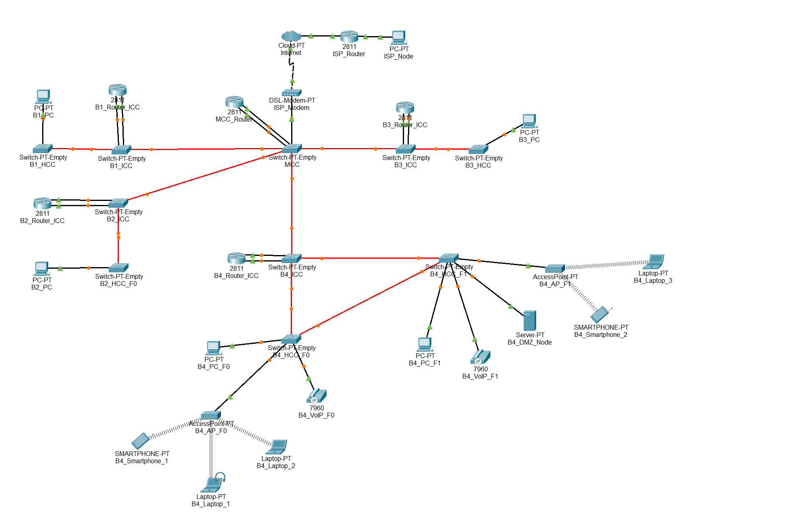

# Building 4

## ⚙️ Packet Tracer Structure

 

## 🧩 Subtasks

|  **Task**  | **Task Description**                                                                     |
|:----------:|------------------------------------------------------------------------------------------|
| **2.4.1**  | Place the devices in Building 4: PCs, laptops, servers, IP phones, switches, routers     |
| **2.4.2**  | Name the devices in Building 4 using the team conventions                                |
| **2.4.3**  | Configure the VTP domain (`r2425ddg2`) on the main switch of Building 4 (server mode)    |
| **2.4.4**  | Add 4 construction VLANs (F0, F1, WiFi, DMZ, VoIP) + backbone VLAN to the main switch    |
| **2.4.5**  | Connect the switches in Building 4 with fiber/copper according to the cabling project    |
| **2.4.6**  | Set all connections between switches to trunk mode (all VLANs allowed)                   |
| **2.4.7**  | Configure the non-main switches in Building 4 as VTP clients                             |
| **2.4.8**  | Assign access ports: F0/F1 VLANs for PCs, WiFi VLAN for AP, VoIP VLAN for phones         |
| **2.4.9**  | Assign static IPv4 addresses to the devices in Building 4                                |
| **2.4.10** | Configure router subinterfaces for each VLAN                                             |
| **2.4.11** | Connect the Building 4 router to the backbone VLAN and assign an IP                      |
| **2.4.12** | Add static routes on the Building 4 router for the backbone and other buildings          |
| **2.4.13** | Simulate backbone connections to other buildings (trunk mode)                            |
| **2.4.14** | Validate redundancy paths between the switches in Building 4                             |
| **2.4.15** | Building 4 document specifications: VLAN IDs, IP ranges, routing tables in `planning.md` |

 

## 🔌 VLANs

- **Floor 0**: VLAN for all outlets.
- **Floor 1**: VLAN for all outlets.
- **Wi-Fi**: VLAN for all APs' outlet within the building.
- **DMZ**: VLAN for servers, administrative workstations, and network infrastructure devices.
- **VoIP**: VLAN for all IP phones within the building.

 

| VLAN ID | VLAN name       | VLAN description                                              |
|---------|-----------------|---------------------------------------------------------------|
| 377     | B4_floor0       | Building 4 - Floor 0 (outlets)                                |
| 378     | B4_floor1       | Building 4 - Floor 1 (outlets)                                |
| 379     | B4_wifi_network | Building 4 - Wifi Network (access points)                     |
| 380     | B4_DMZ          | Building 4 - DMZ (Servers, administration and infrastructure) |
| 381     | B4_VoIP         | Building 4 - VoIP (IP-phones)                                 |

 

## 🌐 Addressing Requirements

The IPv4 network addresses for each VLAN must be assigned according to the following Building 4 node count requirements:

- **Access Points - Floor 0**: 125 nodes
- **Access Points - Floor 1**: 170 nodes
- **Wi-Fi**: 200 nodes
- **DMZ (Servers, administrative workstations, and network infrastructure devices)**: 45 nodes
- **VoIP (IP Phones)**: 160 nodes
- **B4**: 700 nodes

 

## 🔧 IPv4 Address Space

| **Subnet address**  |   **Netmask**    |     **Range of addresses**     |        **Useable IPs**         | **Hosts**  | **VLAN**  |
|:-------------------:|:----------------:|:------------------------------:|:------------------------------:|:----------:|:---------:|
|   10.22.108.0/24    |  255.255.255.0   |  10.22.108.0 - 10.22.108.255   |  10.22.108.1 - 10.22.108.254   |    254     |   WIFI    |
|   10.22.109.0/24    |  255.255.255.0   |  10.22.109.0 - 10.22.109.255   |  10.22.109.1 - 10.22.109.254   |    254     |   VoIP    |
|   10.22.110.0/24    |  255.255.255.0   |  10.22.110.0 - 10.22.110.255   |  10.22.110.1 - 10.22.110.254   |    254     |    F1     |
|   10.22.111.0/25    | 255.255.255.128  |  10.22.111.0 - 10.22.111.127   |  10.22.111.1 - 10.22.111.126   |    126     |    F0     |
|  10.22.111.128/26   | 255.255.255.192  | 10.22.111.128 - 10.22.111.191  | 10.22.111.129 - 10.22.111.190  |     62     |    DMZ    |
|  10.22.111.192/26   | 255.255.255.192  | 10.22.111.192 - 10.22.111.255  | 10.22.111.193 - 10.22.111.254  |     62     |     -     |

 

## 💻 End Devices in the Simulation

- PC (floor 0)
- PC (floor 1)
- Laptops
- Smartphones
- Server (DMZ)
- VoIP phones model **7960**
