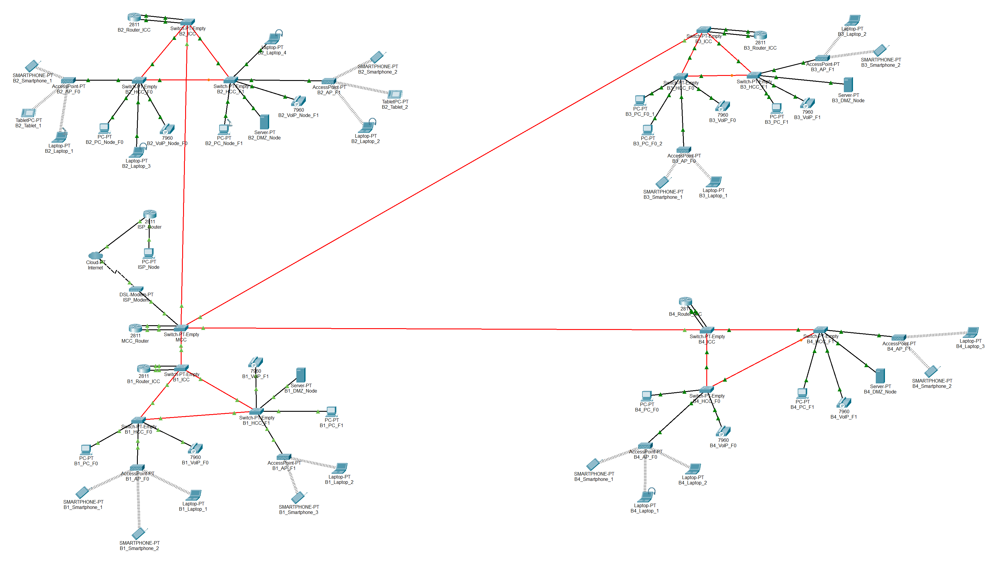

# Campus Backbone

## 🏢 Estrutura dos Edifícios

 

## ⚙️ Estrutura Packet Tracer 

 

## 🌐 Requisitos de Endereçamento

Os endereços de rede IPv4 para cada VLAN devem ser atribuídos de acordo com os seguintes requisitos de número de nós do Building Campus Backbone:

- **Backbone**: 220 nós