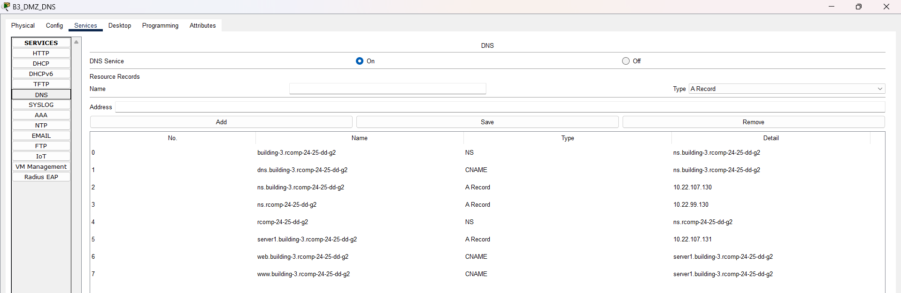

# 🏢 Building 3

### Configuration and Implementation Details

-----------------------------------------------------------------------------------------------------------------------------------------------------------------------------------------

## 🧩 Subtasks

|   **Task**   | **Task Description**                                                                                  | **Status** |
|:------------:|-------------------------------------------------------------------------------------------------------|:----------:|
| OSPF Routing | Configure OSPF with a dedicated area for the building.                                                |     ✅      |
| HTTP Server  | Add a second HTTP/HTTPS server in the DMZ with a static IP and an HTML page identifying the building. |     ✅      |
|    DHCPv4    | Configure DHCPv4 for all VLANs except DMZ and backbone; include option 150 for VoIP.                  |     ✅      |
|     VoIP     | Configure VoIP service with two 7960 IP phones and voice VLANs on the switches.                       |     ✅      |
|     DNS      | Create subdomain, configure DNS server. Know the IP of the DNS server in building 1.                  |     ✅      |
|   Firewall   | Configure ACLs to implement a static firewall.                                                        |     ✅      |

---


## 🔄 OSPF Dynamic Routing

**Implemented configuration:**
- **OSPF Area:** 3 (0.0.0.3)
- **Router-ID:** 3.3.3.3

**Networks advertised in OSPF:**
- 10.22.104.0/24 (VLAN 374 - WiFi)
- 10.22.105.0/24 (VLAN 376 - VoIP)
- 10.22.106.0/24 (VLAN 373 - F1)
- 10.22.107.0/25 (VLAN 372 - F0)
- 10.22.107.128/26 (VLAN 375 - DMZ)
- 10.22.97.0/24 (VLAN 382 - Backbone - Area 0)

---

## 🖥️ HTTP Server (Server 1)

**Server added:** 10.22.107.131
- **Active services:** HTTP (port 80) and HTTPS (port 443)
- **HTML page:** Identifies Building 3
- **Configuration:** Static IP in the DMZ

---

## 🏠 DHCPv4 Service

| DHCP Pool | Subnet        | Netmask         | Default Router | Excluded Addresses                        | DHCP Options            | VLAN |
|-----------|---------------|-----------------|----------------|-------------------------------------------|-------------------------|------|
| WIFI_B3   | 10.22.104.0   | 255.255.255.0   | 10.22.104.1    | 10.22.104.1 - 10.22.104.10                | None                    | WIFI |
| VOIP_B3   | 10.22.105.0   | 255.255.255.0   | 10.22.105.1    | 10.22.105.1 - 10.22.105.10, 10.22.105.100 | Option 150: 10.22.105.1 | VoIP |
| F1_B3     | 10.22.106.0   | 255.255.255.0   | 10.22.106.1    | 10.22.106.1 - 10.22.106.10                | None                    | F1   |
| F0_B3     | 10.22.107.0   | 255.255.255.128 | 10.22.107.1    | 10.22.107.1 - 10.22.107.10                | None                    | F0   |

**Additional configurations:**
- **Domain-name:** building-3.rcomp-24-25-dd-g2 (configured in all pools)
- **DNS Server:** 10.22.107.130 (local DNS server)

---

## ☎️ VoIP Service

**Implemented configuration:**
- **Phone prefix:** 3xxx
- **Assigned numbers:** 3001, 3002
- **TFTP Server:** 10.22.105.1 (Router IP in VoIP VLAN)
- **Phones installed:** 2x Cisco IP Phone 7960
- **MACs configured:**
    - ephone 1: 00D0.97DA.C6E1 (number 3001)
    - ephone 2: 00D0.97E7.DA3A (number 3002)

**Telephony-service configuration:**
- **Max ephones:** 17
- **Max dn:** 17
- **IP source-address:** 10.22.105.1 port 2000
- **Auto assign:** 1 to 17

**Switch configuration:**
- **Access VLAN:** Disabled (`no switchport access vlan`)
- **Voice VLAN:** VLAN 376 (`switchport voice vlan 376`)

**Dial-peers for other buildings:**
- **Prefix 1xxx → 10.22.99.1** (Building 1)
- **Prefix 2xxx → 10.22.102.1** (Building 2)
- **Prefix 4xxx → 10.22.109.1** (Building 4)

---

## 🌐 DNS Configuration

**DNS Server:** 10.22.107.130 (ns.building-3.rcomp-24-25-dd-g2)
**Subdomain:** building-3.rcomp-24-25-dd-g2

### DNS Database

| No. |                 Name                 |   Type   |                Detail                |
|:---:|:------------------------------------:|:--------:|:------------------------------------:|
|  0  |     building-3.rcomp-24-25-dd-g2     |    NS    |   ns.building-3.rcomp-23-24-dd-g2    |
|  1  |   dns.building-3.rcomp-24-25-dd-g2   |  CNAME   |   ns.building-3.rcomp-24-24-dd-g2    |
|  2  |   ns.building-3.rcomp-24-25-dd-g2    | A Record |            10.22.107.130             |
|  3  |         ns.rcomp-24-25-dd-g2         | A Record |             10.22.99.130             |
|  4  |          rcomp-24-25-dd-g2           |    NS    |         ns.rcomp-23-24-dd-g2         |
|  5  | server1.building-3.rcomp-24-25-dd-g2 | A Record |            10.22.107.131             |
|  6  |   web.building-3.rcomp-24-25-dd-g2   |  CNAME   | server1.building-3.rcomp-23-24-dd-g2 |
|  7  |   www.building-3.rcomp-24-25-dd-g2   |  CNAME   | server1.building-3.rcomp-23-24-dd-g2 |

<br>




**Client configuration:**
- **Servers (static IP):** DNS manually configured to 10.22.107.130
- **DHCP clients:** DNS automatically configured via DHCP

---

## 🔀 NAT (Network Address Translation)

**Implemented rules:**
```cisco
ip nat inside source static tcp 10.22.107.130 80 10.22.97.4 80
ip nat inside source static tcp 10.22.107.130 443 10.22.97.4 443
```

**Interfaces:**
- **DMZ (Fa0/0.375):** `ip nat inside`
- **Backbone (Fa0/0.382):** `ip nat outside`

**Result:** HTTP/HTTPS requests received on the backbone interface (10.22.97.4) are redirected to the DNS server (10.22.107.130).

---

## 🔒 Static Firewall (ACLs)

### Implemented ACLs

#### **INTERNET_ACL_B3** (applied to VLAN 382 - Backbone - inbound)
**Objective:** Control traffic coming from the internet/backbone

```cisco
ip access-list extended INTERNET_ACL_B3
 permit tcp any host 10.22.105.1 eq 2000
 permit udp any host 10.22.105.1 eq 5060
 permit tcp any host 10.22.105.1 eq 5060
 permit ip any 10.22.105.0 0.0.0.255
 permit ip any 10.22.104.0 0.0.0.255
 permit ip any 10.22.106.0 0.0.0.255
 permit ip any 10.22.107.0 0.0.0.127
 permit icmp any any
 permit tcp any host 10.22.97.4 eq www
 permit tcp any host 10.22.97.4 eq 443
 permit tcp any host 10.22.97.4 eq domain
 permit udp any host 10.22.97.4 eq domain
 permit ospf any any
 permit ip any any
 deny ip any any
```

#### **WIFI_ACL_B3** (applied to VLAN 374 - WiFi - inbound)
**Objective:** Restrict WiFi network access to internal resources

```cisco
ip access-list extended WIFI_ACL_B3
 deny ip any host 10.22.107.1
 deny ip any host 10.22.106.1
 deny ip any host 10.22.104.1
 deny ip any host 10.22.107.129
 deny ip any host 10.22.105.1
 deny ip any host 10.22.97.4
 permit icmp any any
 permit tcp any host 10.22.107.130 eq www
 permit tcp any host 10.22.107.130 eq 443
 permit udp any host 10.22.107.130 eq domain
 permit tcp any host 10.22.107.130 eq domain
 deny ip any 10.22.107.128 0.0.0.63
 permit ip 10.22.107.128 0.0.0.63 any
 permit ip 10.22.106.0 0.0.0.255 any
 permit ip 10.22.107.0 0.0.0.127 any
 permit udp any eq bootpc any eq bootps
 permit udp any eq tftp any eq tftp
 permit ospf any any
 deny ip any any
```

#### **VOIP_ACL_B3** (applied to VLAN 376 - VoIP - inbound)
**Objective:** Allow VoIP traffic and restrict access to other resources

```cisco
ip access-list extended VOIP_ACL_B3
 permit udp any host 10.22.105.1 eq bootps
 permit udp any host 10.22.105.1 eq tftp
 permit tcp any host 10.22.105.1 eq 2000
 permit udp any host 10.22.105.1 eq 5060
 permit tcp any host 10.22.105.1 eq 5060
 deny ip any host 10.22.107.1
 deny ip any host 10.22.106.1
 deny ip any host 10.22.104.1
 deny ip any host 10.22.107.129
 deny ip any host 10.22.105.1
 deny ip any host 10.22.97.4
 permit icmp any any
 permit tcp any host 10.22.107.130 eq www
 permit tcp any host 10.22.107.130 eq 443
 permit udp any host 10.22.107.130 eq domain
 permit tcp any host 10.22.107.130 eq domain
 deny ip any 10.22.107.128 0.0.0.63
 permit ip 10.22.107.128 0.0.0.63 any
 permit ip 10.22.105.0 0.0.0.255 any
 permit udp any eq bootpc any eq bootps
 permit udp any eq tftp any eq tftp
 permit ospf any any
 deny ip any any
```

#### **GROUND_FLOOR_ACL_B3** (applied to VLAN 372 - F0 - inbound)
**Objective:** Control access from the ground floor

```cisco
ip access-list extended GROUND_FLOOR_ACL_B3
 deny ip any host 10.22.107.1
 deny ip any host 10.22.106.1
 deny ip any host 10.22.104.1
 deny ip any host 10.22.107.129
 deny ip any host 10.22.105.1
 deny ip any host 10.22.97.4
 permit icmp any any
 permit tcp any host 10.22.107.130 eq www
 permit tcp any host 10.22.107.130 eq 443
 permit udp any host 10.22.107.130 eq domain
 permit tcp any host 10.22.107.130 eq domain
 deny ip any 10.22.107.128 0.0.0.63
 permit ip 10.22.107.128 0.0.0.63 any
 permit ip 10.22.107.0 0.0.0.127 any
 permit udp any eq bootpc any eq bootps
 permit udp any eq tftp any eq tftp
 permit ospf any any
 deny ip any any
```

#### **FLOOR1_ACL_B3** (applied to VLAN 373 - F1 - inbound)
**Objective:** Control access from the first floor

```cisco
ip access-list extended FLOOR1_ACL_B3
 deny ip any host 10.22.107.1
 deny ip any host 10.22.106.1
 deny ip any host 10.22.104.1
 deny ip any host 10.22.107.129
 deny ip any host 10.22.105.1
 deny ip any host 10.22.97.4
 permit icmp any any
 permit tcp any host 10.22.107.130 eq www
 permit tcp any host 10.22.107.130 eq 443
 permit udp any host 10.22.107.130 eq domain
 permit tcp any host 10.22.107.130 eq domain
 deny ip any 10.22.107.128 0.0.0.63
 permit ip 10.22.107.128 0.0.0.63 any
 permit ip 10.22.106.0 0.0.0.255 any
 permit udp any eq bootpc any eq bootps
 permit udp any eq tftp any eq tftp
 permit ospf any any
 deny ip any any
```

### Security Policy Summary

**Applied principles:**
1. **Deny by default:** All ACLs end with `deny ip any any`
2. **Infrastructure protection:** IPs of routers/gateways are protected
3. **Essential services:** DHCP, DNS, TFTP, and OSPF are always allowed
4. **Segmentation:** Each VLAN has specific control based on its function
5. **VoIP segregated:** VoIP VLAN has specific rules for telephony
6. **DMZ protected:** Direct access to the DMZ is denied, only responses are allowed

---

## 📊 Configured Interfaces and VLANs

| **Interface** | **VLAN** | **IP/Mask**      | **Description**   | **Applied ACL**     |
|---------------|----------|------------------|-------------------|---------------------|
| Fa0/0.372     | 372      | 10.22.107.1/25   | Ground Floor (F0) | GROUND_FLOOR_ACL_B3 |
| Fa0/0.373     | 373      | 10.22.106.1/24   | Floor 1 (F1)      | FLOOR1_ACL_B3       |
| Fa0/0.374     | 374      | 10.22.104.1/24   | WiFi              | WIFI_ACL_B3         |
| Fa0/0.375     | 375      | 10.22.107.129/26 | DMZ               | -                   |
| Fa0/0.376     | 376      | 10.22.105.1/24   | VoIP              | VOIP_ACL_B3         |
| Fa0/0.382     | 382      | 10.22.97.4/24    | Backbone          | INTERNET_ACL_B3     |

---
