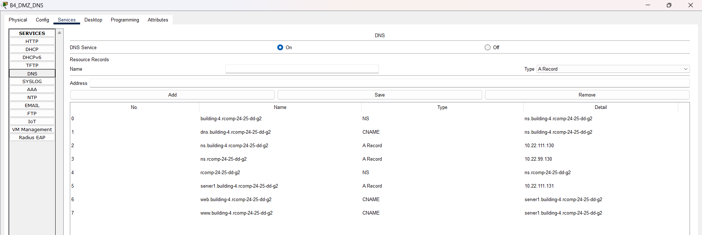

# 🏢 Building 4

### Detalhes de Configuração e Implementação

-----------------------------------------------------------------------------------------------------------------------------------------------------------------------------------------

## 🧩 Sub-tarefas

|  **Tarefa**  | **Descrição da tarefa**                                                                                | **Status** |
|:------------:|--------------------------------------------------------------------------------------------------------|:----------:|
| OSPF Routing | Configurar OSPF com área própria para o edifício.                                                      |     ✅      |
| HTTP Server  | Adicionar segundo servidor HTTP/HTTPS na DMZ com IP estático e página HTML que identifique o edifício. |     ✅      |
|    DHCPv4    | Configurar DHCPv4 para todas as VLANs exceto DMZ e backbone; incluir a opção 150 para VoIP.            |     ✅      |
|     VoIP     | Configurar serviço de VoIP com dois telefones IP modelo 7960 e VLAN de voz nos switches.               |     ✅      |
|     DNS      | Criar subdomínio, configurar servidor DNS. Conhecer IP do servidor DNS de building 1.                  |     ✅      |
|   Firewall   | Configurar ACLs para implementar firewall estático.                                                    |     ✅      |

---


## 🔄 OSPF Dynamic Routing

**Configuração implementada:**
- **Área OSPF:** 4 (0.0.0.4)
- **Router-ID:** 4.4.4.4

**Redes anunciadas no OSPF:**
- 10.22.108.0/24 (VLAN 379 - WiFi)
- 10.22.109.0/24 (VLAN 381 - VoIP)
- 10.22.110.0/24 (VLAN 378 - F1)
- 10.22.111.0/25 (VLAN 377 - F0)
- 10.22.111.128/26 (VLAN 380 - DMZ)
- 10.22.97.0/24 (VLAN 382 - Backbone - Área 0)

---

## 🖥️ HTTP Server (Server 1)

**Servidor adicionado:** 10.22.111.131
- **Serviços ativos:** HTTP (porta 80) e HTTPS (porta 443)
- **Página HTML:** Identifica o Edifício 4
- **Configuração:** IP estático na DMZ

---

## 🏠 DHCPv4 Service

| DHCP Pool | Subnet        | Netmask         | Default Router | Excluded Addresses                        | DHCP Options            | VLAN |
|-----------|---------------|-----------------|----------------|-------------------------------------------|-------------------------|------|
| WIFI_B4   | 10.22.108.0   | 255.255.255.0   | 10.22.108.1    | 10.22.108.1 - 10.22.108.10                | None                    | WIFI |
| VOIP_B4   | 10.22.109.0   | 255.255.255.0   | 10.22.109.1    | 10.22.109.1 - 10.22.109.10, 10.22.109.100 | Option 150: 10.22.109.1 | VoIP |
| F1_B4     | 10.22.110.0   | 255.255.255.0   | 10.22.110.1    | 10.22.110.1 - 10.22.110.10                | None                    | F1   |
| F0_B4     | 10.22.111.0   | 255.255.255.128 | 10.22.111.1    | 10.22.111.1 - 10.22.111.10                | None                    | F0   |

**Configurações adicionais:**
- **Domain-name:** building-4.rcomp-24-25-dd-g2 (configurado em todas as pools)
- **DNS Server:** 10.22.111.130 (servidor DNS local)

---

## ☎️ VoIP Service

**Configuração implementada:**
- **Prefixo telefónico:** 4xxx
- **Números atribuídos:** 4001, 4002
- **TFTP Server:** 10.22.109.1 (IP do router na VLAN VoIP)
- **Telefones instalados:** 2x Cisco IP Phone 7960
- **MACs configurados:**
    - ephone 1: 000A.41E2.955C (número 4002)
    - ephone 2: 0001.C7EC.E249 (número 4001)

**Configuração telephony-service:**
- **Max ephones:** 18
- **Max dn:** 18
- **IP source-address:** 10.22.109.1 port 2000
- **Auto assign:** 1 to 18

**Configuração dos switches:**
- **Access VLAN:** Desabilitada (`no switchport access vlan`)
- **Voice VLAN:** VLAN 381 (`switchport voice vlan 381`)

**Dial-peers para outros edifícios:**
- **Prefixo 1xxx → 10.22.99.1** (Building 1)
- **Prefixo 2xxx → 10.22.102.1** (Building 2)
- **Prefixo 3xxx → 10.22.105.1** (Building 3)

---

## 🌐 DNS Configuration

**Servidor DNS:** 10.22.111.130 (ns.building-4.rcomp-24-25-dd-g2)
**Subdomínio:** building-4.rcomp-24-25-dd-g2

### Base de Dados DNS

| No. |                 Name                 |   Type   |                Detail                |
|:---:|:------------------------------------:|:--------:|:------------------------------------:|
|  0  |     building-4.rcomp-24-25-dd-g2     |    NS    |   ns.building-4.rcomp-24-25-dd-g2    |
|  1  |   dns.building-4.rcomp-24-25-dd-g2   |  CNAME   |   ns.building-4.rcomp-24-25-dd-g2    |
|  2  |   ns.building-4.rcomp-24-25-dd-g2    | A Record |            10.22.111.130             |
|  3  |         ns.rcomp-24-25-dd-g2         | A Record |             10.22.99.130             |
|  4  |          rcomp-24-25-dd-g2           |    NS    |         ns.rcomp-24-25-dd-g2         |
|  5  | server1.building-4.rcomp-24-25-dd-g2 | A Record |            10.22.111.131             |
|  6  |   web.building-4.rcomp-24-25-dd-g2   |  CNAME   | server1.building-4.rcomp-24-25-dd-g2 |
|  7  |   www.building-4.rcomp-24-25-dd-g2   |  CNAME   | server1.building-4.rcomp-24-25-dd-g2 |

<br>




**Configuração dos clientes:**
- **Servidores (IP estático):** DNS configurado manualmente para 10.22.111.130
- **Clientes DHCP:** DNS configurado automaticamente via DHCP

---

## 🔀 NAT (Network Address Translation)

**Regras implementadas:**
```cisco
ip nat inside source static tcp 10.22.111.130 80 10.22.97.5 80
ip nat inside source static tcp 10.22.111.130 443 10.22.97.5 443
```

**Interfaces:**
- **DMZ (Fa0/0.380):** `ip nat inside`
- **Backbone (Fa0/0.382):** `ip nat outside`

**Resultado:** Pedidos HTTP/HTTPS recebidos na interface backbone (10.22.97.5) são redirecionados para o servidor DNS (10.22.111.130).

---

## 🔒 Static Firewall (ACLs)

### ACLs Implementadas

#### **INTERNET_ACL_B4** (aplicada à VLAN 382 - Backbone - entrada)
**Objetivo:** Controlar tráfego vindo da internet/backbone

```cisco
ip access-list extended INTERNET_ACL_B4
 permit tcp any host 10.22.109.1 eq 2000
 permit udp any host 10.22.109.1 eq 5060
 permit tcp any host 10.22.109.1 eq 5060
 permit ip any 10.22.109.0 0.0.0.255
 permit ip any 10.22.108.0 0.0.0.255
 permit ip any 10.22.110.0 0.0.0.255
 permit ip any 10.22.111.0 0.0.0.127
 permit icmp any any
 permit tcp any host 10.22.97.5 eq www
 permit tcp any host 10.22.97.5 eq 443
 permit tcp any host 10.22.97.5 eq domain
 permit udp any host 10.22.97.5 eq domain
 permit ospf any any
 permit ip any any
 deny ip any any
```

#### **WIFI_ACL_B4** (aplicada à VLAN 379 - WiFi - entrada)
**Objetivo:** Restringir acesso da rede WiFi a recursos internos

```cisco
ip access-list extended WIFI_ACL_B4
 deny ip any host 10.22.111.1
 deny ip any host 10.22.110.1
 deny ip any host 10.22.108.1
 deny ip any host 10.22.111.129
 deny ip any host 10.22.109.1
 deny ip any host 10.22.97.5
 permit icmp any any
 permit tcp any host 10.22.111.130 eq www
 permit tcp any host 10.22.111.130 eq 443
 permit udp any host 10.22.111.130 eq domain
 permit tcp any host 10.22.111.130 eq domain
 deny ip any 10.22.111.128 0.0.0.63
 permit ip 10.22.111.128 0.0.0.63 any
 permit ip 10.22.110.0 0.0.0.255 any
 permit ip 10.22.111.0 0.0.0.127 any
 permit udp any eq bootpc any eq bootps
 permit udp any eq tftp any eq tftp
 permit ospf any any
 deny ip any any
```

#### **VOIP_ACL_B4** (aplicada à VLAN 381 - VoIP - entrada)
**Objetivo:** Permitir tráfego VoIP e restringir acesso a outros recursos

```cisco
ip access-list extended VOIP_ACL_B4
 permit udp any host 10.22.109.1 eq bootps
 permit udp any host 10.22.109.1 eq tftp
 permit tcp any host 10.22.109.1 eq 2000
 permit udp any host 10.22.109.1 eq 5060
 permit tcp any host 10.22.109.1 eq 5060
 deny ip any host 10.22.111.1
 deny ip any host 10.22.110.1
 deny ip any host 10.22.108.1
 deny ip any host 10.22.111.129
 deny ip any host 10.22.109.1
 deny ip any host 10.22.97.5
 permit icmp any any
 permit tcp any host 10.22.111.130 eq www
 permit tcp any host 10.22.111.130 eq 443
 permit udp any host 10.22.111.130 eq domain
 permit tcp any host 10.22.111.130 eq domain
 deny ip any 10.22.111.128 0.0.0.63
 permit ip 10.22.111.128 0.0.0.63 any
 permit ip 10.22.109.0 0.0.0.255 any
 permit udp any eq bootpc any eq bootps
 permit udp any eq tftp any eq tftp
 permit ospf any any
 deny ip any any
```

#### **GROUND_FLOOR_ACL_B4** (aplicada à VLAN 377 - F0 - entrada)
**Objetivo:** Controlar acesso do piso térreo

```cisco
ip access-list extended GROUND_FLOOR_ACL_B4
 deny ip any host 10.22.111.1
 deny ip any host 10.22.110.1
 deny ip any host 10.22.108.1
 deny ip any host 10.22.111.129
 deny ip any host 10.22.109.1
 deny ip any host 10.22.97.5
 permit icmp any any
 permit tcp any host 10.22.111.130 eq www
 permit tcp any host 10.22.111.130 eq 443
 permit udp any host 10.22.111.130 eq domain
 permit tcp any host 10.22.111.130 eq domain
 deny ip any 10.22.111.128 0.0.0.63
 permit ip 10.22.111.128 0.0.0.63 any
 permit ip 10.22.111.0 0.0.0.127 any
 permit udp any eq bootpc any eq bootps
 permit udp any eq tftp any eq tftp
 permit ospf any any
 deny ip any any
```

#### **FLOOR1_ACL_B4** (aplicada à VLAN 378 - F1 - entrada)
**Objetivo:** Controlar acesso do primeiro andar

```cisco
ip access-list extended FLOOR1_ACL_B4
 deny ip any host 10.22.111.1
 deny ip any host 10.22.110.1
 deny ip any host 10.22.108.1
 deny ip any host 10.22.111.129
 deny ip any host 10.22.109.1
 deny ip any host 10.22.97.5
 permit icmp any any
 permit tcp any host 10.22.111.130 eq www
 permit tcp any host 10.22.111.130 eq 443
 permit udp any host 10.22.111.130 eq domain
 permit tcp any host 10.22.111.130 eq domain
 deny ip any 10.22.111.128 0.0.0.63
 permit ip 10.22.111.128 0.0.0.63 any
 permit ip 10.22.110.0 0.0.0.255 any
 permit udp any eq bootpc any eq bootps
 permit udp any eq tftp any eq tftp
 permit ospf any any
 deny ip any any
```

### Resumo da Política de Segurança

**Princípios aplicados:**
1. **Negação por padrão:** Todas as ACLs terminam com `deny ip any any`
2. **Proteção de infraestrutura:** IPs dos routers/gateways são protegidos
3. **Serviços essenciais:** DHCP, DNS, TFTP e OSPF são sempre permitidos
4. **Segmentação:** Cada VLAN tem controle específico baseado na sua função
5. **VoIP segregado:** VLAN VoIP tem regras específicas para telefonia
6. **DMZ protegida:** Acesso direto à DMZ é negado, apenas respostas são permitidas

---

## 📊 Interfaces e VLANs Configuradas

| **Interface** | **VLAN** | **IP/Máscara**        | **Descrição**       | **ACL Aplicada**    |
|---------------|----------|-----------------------|---------------------|---------------------|
| Fa0/0.377     | 377      | 10.22.111.1/25        | Ground Floor (F0)   | GROUND_FLOOR_ACL_B4 |
| Fa0/0.378     | 378      | 10.22.110.1/24        | Floor 1 (F1)        | FLOOR1_ACL_B4       |
| Fa0/0.379     | 379      | 10.22.108.1/24        | WiFi                | WIFI_ACL_B4         |
| Fa0/0.380     | 380      | 10.22.111.129/26      | DMZ                 | -                   |
| Fa0/0.381     | 381      | 10.22.109.1/24        | VoIP                | VOIP_ACL_B4         |
| Fa0/0.382     | 382      | 10.22.97.5/24         | Backbone            | INTERNET_ACL_B4     |

---
